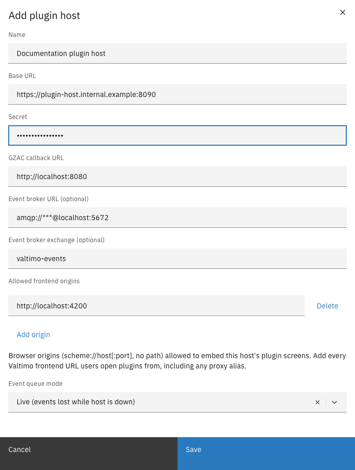

# Add a plugin host

A plugin host is a service that stores plugin packages and runs them in a sandbox. Adding one
connects it to Valtimo: from then on Valtimo discovers the plugins it serves, and administrators
can upload packages to it and activate configurations.

Before starting, have the following details from the team operating the host:

| Detail | Description |
|--------|-------------|
| Base URL | The URL where Valtimo can reach the host (for example `https://plugin-host.internal:8090`). |
| Secret | The host's admin token (its `ADMIN_TOKEN`). Valtimo uses it to sign every request to the host. |

---

## Adding a plugin host



Expand **Admin** in the left sidebar and click **Plugin hosts**


Click **Add plugin host**


Fill in the connection details

<figure><figcaption>Add plugin host</figcaption></figure>


Click **Save**



| Property | Description |
|----------|-------------|
| Name | Display name for this host. |
| Base URL | URL where Valtimo reaches the host. |
| Secret | The host's admin token. Stored encrypted; never shown again. |
| GZAC callback URL | The URL plugins on this host use to call back into this Valtimo environment. Pre-filled with a sensible default; change it when the host reaches Valtimo on a different address (for example between containers). |
| Event broker URL (optional) | The message broker (AMQP) address plugins receive events from. Pre-filled from the platform's own broker with the credentials masked as `***` — leaving the masked value in place uses the platform credentials. Leave empty to disable events for this host. |
| Event broker exchange (optional) | The exchange events are read from. The pre-filled default matches what Valtimo publishes to. |
| Allowed frontend origins | The browser origins (`scheme://host[:port]`, no path) allowed to embed this host's plugin screens. Add every URL users open the Valtimo frontend from, including proxy aliases. With no origins listed, no page can embed this host's plugin screens. |
| Event queue mode | **Live** — events published while the host is down are lost. **Durable** — events are retained for a configurable time while the host is down, and delivered when it returns. Durable mode asks for an inactivity TTL (default 72 hours, between 1 hour and 30 days). |


An event broker URL is only accepted when the host's base URL uses HTTPS (or points at localhost
during development). This protects the broker credentials, which travel to the host with every
configuration.



If a value is rejected — for example a broker on a plain-HTTP host, or a base URL Valtimo cannot
dial — the reason appears inside the form and nothing you typed is lost.


After saving, the host appears in the list. Within one polling cycle its status becomes
**Connected** and its plugins appear when [configuring a plugin](configure-a-plugin.md). Continue
with [uploading a plugin](upload-a-plugin.md) if the host does not have its packages yet.

---

## Ways to provision without clicks

Plugin hosts and their plugins can also be provisioned automatically:

- The host installs every plugin package found in its pre-install folder at startup.
- An application can declare its integrations, packages, and configurations in a deployment
  descriptor that Valtimo applies at startup.

Both are developer/operator tasks — see the developer documentation in the `plugin-host/docs/`
folder of the Valtimo repository.
