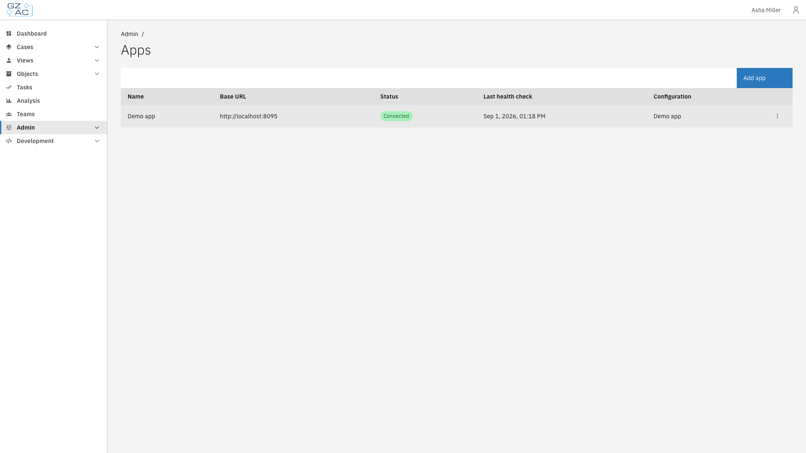
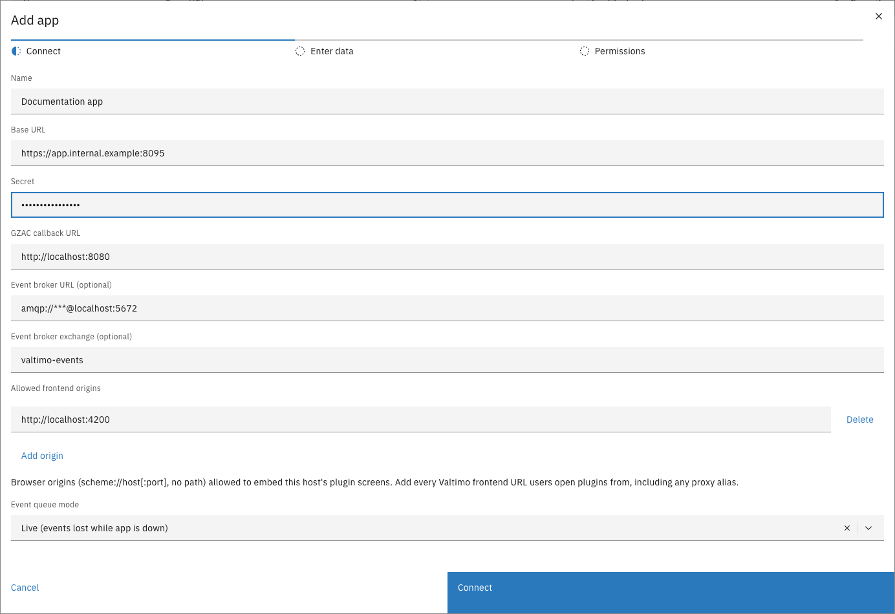

# Add an app

An app is a remote service that provides exactly one plugin, built in. Unlike a plugin host it
accepts no uploads — connecting the app *is* installing the plugin. Because of that, adding an app
is a single guided flow: connect, enter the plugin's settings, and accept its permissions.

Before starting, have the app's **base URL** and **secret** (its admin token) from the team
operating the app.

---

## Adding an app



Expand **Admin** in the left sidebar and click **Apps**

<figure><figcaption>Apps page</figcaption></figure>


Click **Add app**


Fill in the connection details and click **Connect**

<figure><figcaption>Add app — Connect step</figcaption></figure>

The connection fields are the same as for a plugin host — see the property table in
[Add a plugin host](add-a-plugin-host.md#adding-a-plugin-host). Valtimo connects to the app and
retrieves its plugin immediately.


In the **Enter data** step, name the configuration and fill in the plugin's settings


In the **Permissions** step, review what the plugin requests, tick the acceptance checkbox, and
click **Save configuration**

The permissions step is identical to activating any external plugin — see
[Configure a plugin](configure-a-plugin.md#reviewing-permissions) for what each section means.



After saving, the app appears on the Apps page with its linked configuration, and the
configuration appears on the Plugins page like any other.


If the app cannot be connected, check the base URL and secret and use **Retry**. If the app was
added but its plugin is not ready yet, the app is saved anyway — Valtimo finishes the job
automatically once the app becomes reachable, and the configuration can be completed later from
the Apps page.



When an app serves plugin screens (such as a case tab), the page may ask for a refresh before the
configuration step — security policy for a newly connected app's screens is applied when the page
loads.

