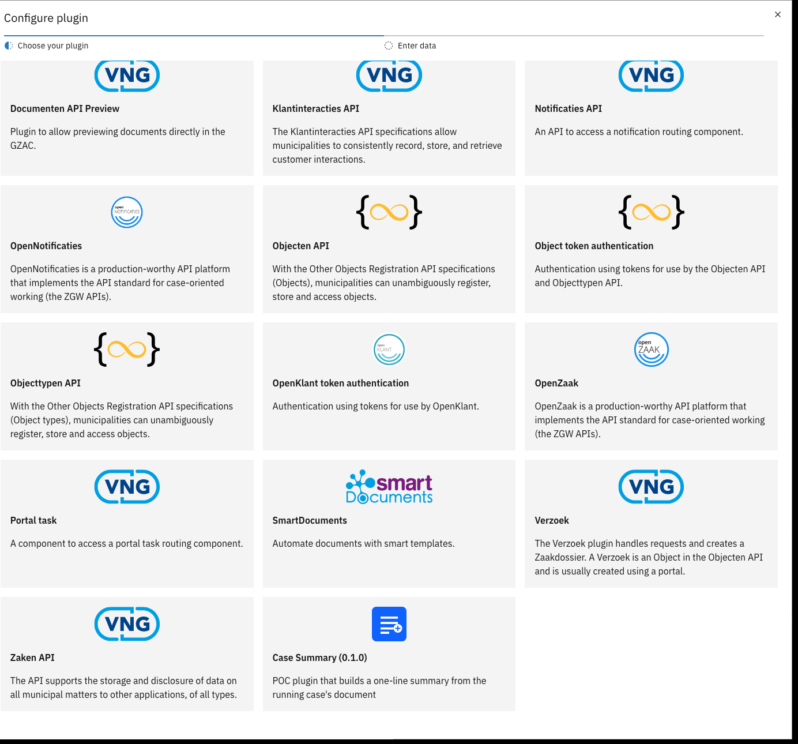
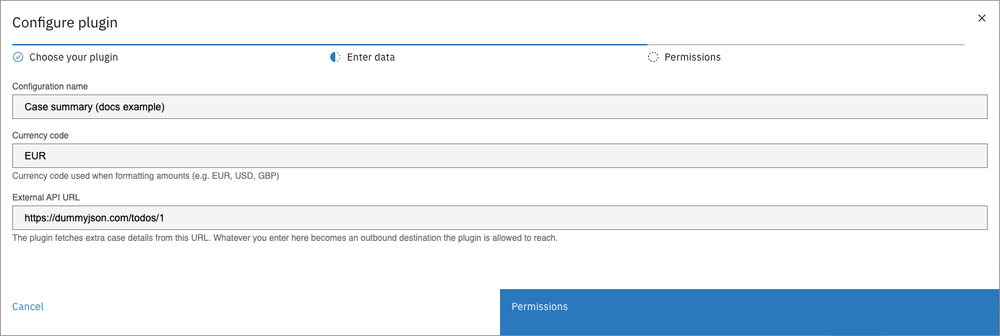
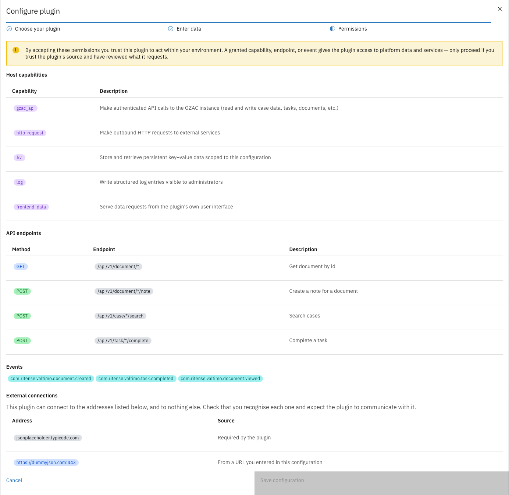
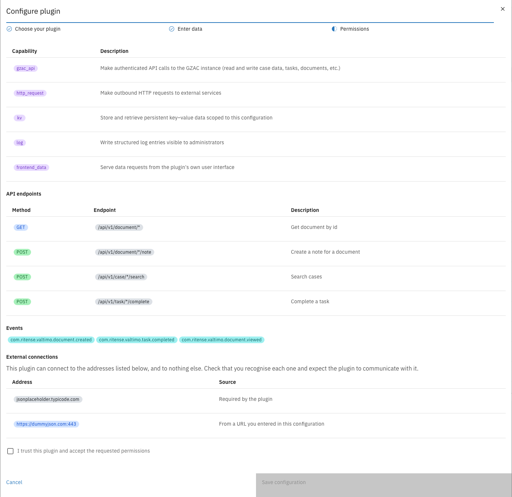
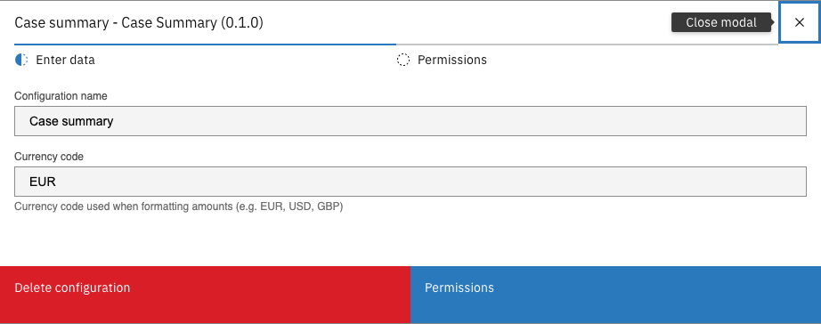

# Configure a plugin

Configuring (activating) a plugin creates a named configuration of a discovered plugin version:
its settings, plus the permissions accepted for it. Only configured plugins can be used in
processes, tabs, widgets, and forms.

The same plugin — even the same version — can be configured multiple times with different
settings; each configuration is independent and separately permissioned.

---

## Configuring a plugin



Expand **Admin** in the left sidebar and click **Plugins**


Click **Configure plugin**


In **Choose your plugin**, select the plugin

External plugins appear alongside embedded ones, with their logo, version, and description.

<figure><figcaption>Choosing an external plugin</figcaption></figure>


In **Enter data**, name the configuration and fill in the plugin's settings

When the plugin ships its own settings screen, this step shows it, so the plugin can explain and
validate its own fields. A plugin without one gets a generic form instead: a configuration name
plus the settings as JSON.

<figure><figcaption>Enter data</figcaption></figure>


In **Permissions**, review everything the plugin requests, tick **I trust this plugin and accept
the requested permissions**, and click **Save configuration**

<figure><figcaption>Permissions</figcaption></figure>

<figure><figcaption>Acceptance checkbox</figcaption></figure>



---

## Reviewing permissions

The permissions step is the security decision of the whole flow: everything listed becomes
available to the plugin, and nothing else ever is. It shows up to four sections:

| Section | Meaning |
|---------|---------|
| **Host capabilities** | Broad abilities, such as calling the Valtimo API (`gzac_api`), making outbound HTTP requests (`http_request`), storing key–value data (`kv`), writing logs (`log`), and serving data to its own screens (`frontend_data`). |
| **API endpoints** | Exactly which Valtimo API endpoints the plugin may call, with a description of each. This list bounds everything the plugin can read or change in Valtimo. |
| **Events** | The platform events the plugin will receive. |
| **External connections** | The outside addresses the plugin can connect to — and nothing else. Addresses come from the plugin package itself ("Required by the plugin") or from a URL entered in this configuration's settings. Check that you recognize each one. |


Accepting is all-or-nothing and must match what the plugin declares — the request list cannot be
edited. If a plugin asks for more than it should need, do not activate it; contact the plugin's
supplier.



Accepted permissions are enforced at runtime on every call, not just checked at activation. A new
plugin version that requests more permissions does not receive them until an administrator
reviews and accepts again.


---

## Editing a configuration



On the **Plugins** page, open the row menu (⋮) of the configuration and click **Edit**


Change the name or the plugin's settings

<figure><figcaption>Edit configuration</figcaption></figure>


Review the **Permissions** step (shown read-only) and save



Editing changes the name and settings only — the accepted permissions cannot be widened or
narrowed through the edit flow. Secret values are never shown when editing; leaving a secret
field untouched keeps the stored value.

Deleting a configuration is covered in
[Manage an integration](manage-an-integration.md#deleting-configurations-and-integrations).
