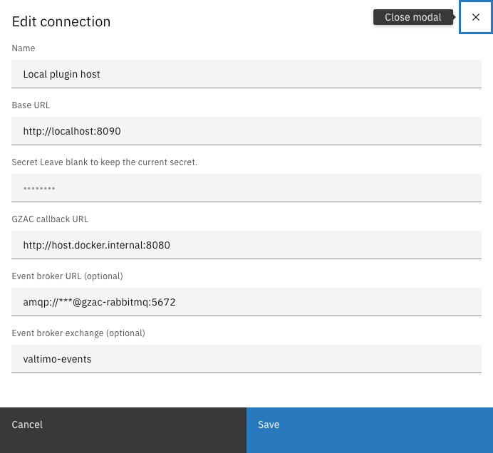
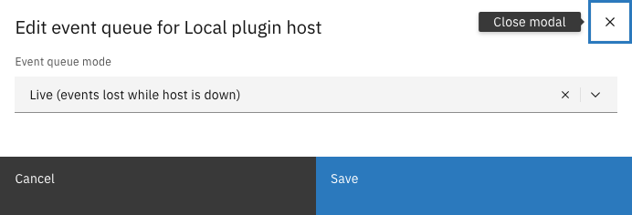
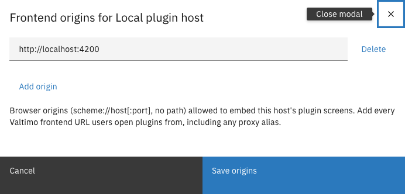
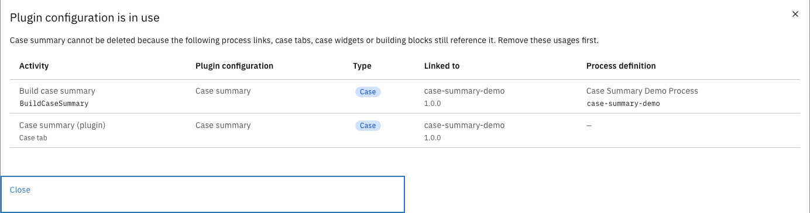

# Manage an integration

Connected plugin hosts and apps are managed from their row menu (⋮) on the **Plugin hosts** and
**Apps** pages. Each concern has its own small dialog, so a change touches exactly one thing.

---

## Editing the connection

Use **Edit connection** when a host moved to a new address, its admin token was rotated, the
callback URL changed, or the event broker moved. This keeps the integration and everything
configured on it — configurations, process links, tabs — intact.



Open the integration's row menu (⋮) and click **Edit connection**


Change only the fields that changed

<figure><figcaption>Edit connection</figcaption></figure>


Click **Save**



Field behavior in this dialog:

| Field | Behavior |
|-------|----------|
| Secret | Shown empty — leave blank to keep the current secret; type a value to replace it. Re-entering the current secret counts as unchanged. |
| Event broker URL | Shown with the credentials masked (`***`). Leaving the masked value untouched keeps the stored broker; clearing the field disables events for this integration. |
| Other fields | An unchanged field is simply not sent; a changed field is validated exactly like during registration — including the deployment's allowed-address list, when one is configured. |

After saving, Valtimo immediately re-checks the integration and re-sends every configuration —
this is also what reconnects event delivery after a broker change.

Changing the address, the secret, or the event broker URL is also treated as a security event:
every access token previously issued for this integration's configurations is revoked on the
spot. The re-send delivers fresh tokens, so a healthy integration recovers immediately, while
anything that still holds an old token is locked out. When the address changed, Valtimo also
removes the configurations from the old address, so nothing usable stays behind there.

Right after an address or secret change the integration briefly shows **Unreachable** — the old
status vouched for the old connection — and turns **Connected** again on the first successful
check-in. Every connection change is recorded in the application log with who made it; secrets and
broker credentials are never written out.


Rotating the secret is two-sided: the host must be restarted with the matching admin token. Until
both sides match, Valtimo cannot reach the host (its status becomes Unreachable); everything
recovers on the first check-in after they match again.



After a base URL change the page asks for a reload — the security policy that allows embedding
plugin screens is applied when the page loads.


---

## Event queue settings

**Edit event queue** controls what happens to events while the integration is down:

<figure><figcaption>Edit event queue</figcaption></figure>

| Mode | Behavior |
|------|----------|
| **Live** (default) | Events published while the integration is down are lost. No queue cleanup ever needed. |
| **Durable** | Events are retained while the integration is down and delivered when it returns. The **inactivity TTL** (default 72 hours, between 1 hour and 30 days) removes the queue after that long without a connected integration, so a decommissioned one does not accumulate events forever. |

A mode or TTL change takes effect immediately — no restart of either side.

---

## Frontend origins

**Edit frontend origins** maintains the list of browser origins allowed to embed this
integration's plugin screens (case tabs, task forms, widgets, pages).

<figure><figcaption>Edit frontend origins</figcaption></figure>

Add every URL users open the Valtimo frontend from — including reverse-proxy aliases — as a bare
origin (`scheme://host[:port]`, no path, no wildcards). With no origins listed, no page can embed
this integration's plugin screens: they render an unavailable state instead.

---

## Deleting configurations and integrations

Deletion is strict by design: anything still in use cannot be deleted, and there is no force
override.

- A **plugin configuration** cannot be deleted while any process link, case tab, case widget, or
  building block references it. The dialog lists every usage so it can be unbound first.

  <figure><figcaption>Configuration in use</figcaption></figure>

- An **integration** cannot be deleted while any of its configurations is still referenced. Its
  unreferenced configurations are removed along with it.


Deleting a configuration that is not in use is permanent: its accepted permissions and settings
are removed, and every token issued for it stops working immediately.



This mirrors why published case definitions are immutable: a process that ran yesterday must
still be explainable tomorrow. Remove the references first — then the delete is allowed.

