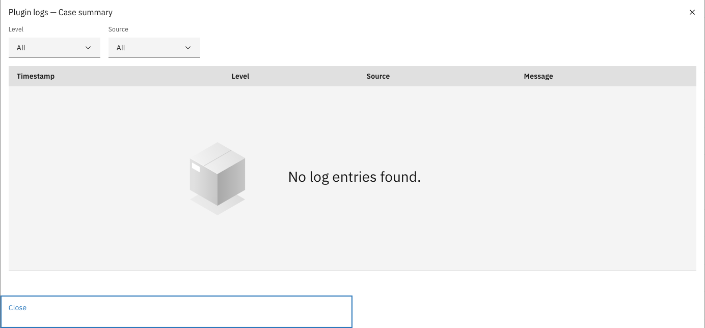

# Plugin logs

Every external plugin configuration keeps a log administrators can inspect: entries the plugin
wrote itself, and a record of every outbound HTTP call it made to an external address. This is the first place to look
when a plugin misbehaves — and a quick way to verify that its outbound traffic matches what was
accepted.

---

## Viewing a configuration's logs



Expand **Admin** in the left sidebar and click **Plugins**


Open the row menu (⋮) of an external plugin configuration and click **Logs**

<figure><figcaption>Plugin logs</figcaption></figure>



The list shows the timestamp, level, source, and message of each entry, newest first. Click a row
to see the entry's structured details. Two filters narrow the list:

| Filter | Values |
|--------|--------|
| **Level** | Debug, Info, Warn, Error |
| **Source** | **Plugin** — entries the plugin wrote itself. **HTTP request** — the automatic record of every outbound call the plugin made to an external address: method, address (with credentials and query parameters stripped), response status, and duration. **GZAC API** — reserved for the plugin's calls back into Valtimo; integrations currently record those in their own service logs, so this filter matches no entries yet. |


Because a plugin can only reach the external addresses that were accepted for it, the HTTP
request records are auditable: an address you do not recognize in this log is a finding, not
noise. Log entries are kept for a limited time (30 days by default, configurable on the plugin
host).

