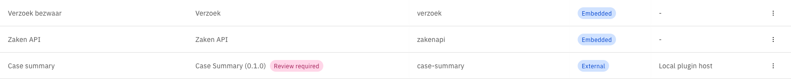
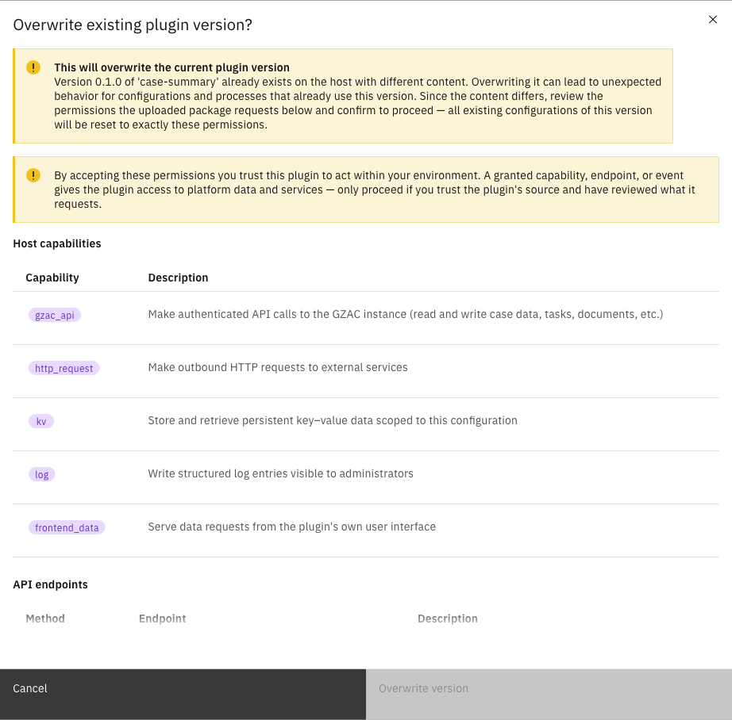
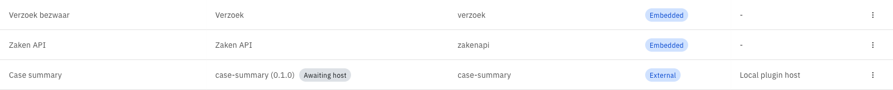
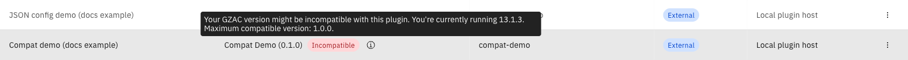

# Plugin status and reviews

The **Plugins** and **Apps** pages show a status tag next to an entry when it needs attention. Most
tags are informational, but one — **Review required** — means it has stopped working and is waiting
on an administrator. This page explains each tag and what to do about it.

---

## Status tags

| Tag | Meaning | Plugin runs? |
|-----|---------|--------------|
| *(no tag)* | Normal. The plugin was discovered on its integration and its configurations are active. | Yes |
| **Review required** | What the integration serves under this version is no longer what was accepted — a changed package on a plugin host, or a changed manifest on an app. | **No** |
| **Awaiting host** | The configuration was declared in a deployment descriptor, but its integration has not served the plugin yet. | No, not yet |
| **Incompatible** | The plugin declares a Valtimo version range that this environment falls outside of. | Yes, but untested against this version |

A plugin its integration has stopped serving altogether carries no tag of its own, but stops running
just the same — see [No longer served](#no-longer-served).

On the **Apps** page, an app whose plugin has not been configured yet shows **Not configured** in
the Configuration column. Continue with [Add an app](add-an-app.md) to finish it, or
[Configure a plugin](configure-a-plugin.md) for the general activation flow.

---

## Review required

Valtimo records a fingerprint at the moment a plugin is accepted. From then on, that plugin version
means exactly that. When an integration starts serving something different under the same version,
Valtimo does not adopt it: it flags the plugin and stops using it.

What is fingerprinted depends on the kind of integration:

| Integration | Fingerprint | Trips when |
|-------------|-------------|------------|
| Plugin host | The contents of the uploaded package | The package on the host changes under the same version |
| App | The app's manifest | The app changes its manifest in place under the same version |

An app serves no package, so there is nothing to upload and nothing to hash — its manifest *is* its
footprint. Changing it in place therefore trips exactly the same freeze as a changed package.

While a plugin is flagged:

- its actions fail, so processes that reach them stop on an error;
- its screens — case tabs, widgets, task forms, menu pages — no longer load;
- no access tokens are issued for it, and nothing is sent to the integration;
- existing configurations keep their settings and accepted permissions untouched.

On the **Plugins** page, hover the tag to see which of the two situations applies:

| Situation | What it means |
|-----------|---------------|
| The package changed and requests **different permissions** | Read this one carefully. The new code wants access that nobody approved. |
| The package changed but requests **the same permissions** | The code is not the code that was accepted, even though its requested access is unchanged. |

On the **Apps** page the tag carries no tooltip — open **Review changes** to see the full pending
footprint instead.

<figure><figcaption>Review required tag</figcaption></figure>


A plugin or app that changes underneath an approved configuration is exactly what this check exists
to catch. Before accepting anything, confirm with the team that operates the integration that the
change was intentional. If it was not, treat it as a security incident rather than a configuration
problem.


### Resolving it on a plugin host

Resolution happens through the upload flow, not from the plugin's row — uploading the package is
how an administrator states which contents are approved.



Obtain the plugin package (`.zip`) that the integration should be serving from its supplier


On the **Plugins** page, click **Upload plugin** and upload that package to the integration

See [Upload a plugin](upload-a-plugin.md) for the full flow.


Confirm the overwrite when prompted, after reviewing the permissions the package requests

The review dialog lists the complete set — the same review as during activation.

<figure><figcaption>Overwrite review dialog</figcaption></figure>



Confirming re-pins the package contents and re-applies the reviewed permissions to every existing
configuration of that plugin version. Within one polling cycle the tag disappears and the plugin
resumes.


If the change was not intended, uploading the *original* package restores the accepted contents and
clears the flag the same way.


### Resolving it on an app

An app has no upload, so it is reviewed in place from the **Apps** page.



Expand **Admin** in the left sidebar and click **Apps**

The changed app carries the **Review required** tag.


Open the app's row menu and click **Review changes**

Clicking the row itself does the same — while an app is flagged, nothing of it runs, so this flow
takes precedence over editing its configuration.


Read the **Review changed app** dialog, which lists the app's full pending footprint — the same
review shown when the app was first activated


Click **Accept changes**



Accepting pins the new manifest and re-applies the reviewed permissions to every configuration of
the app in one step, so no configuration is left on the permissions that were replaced. The tag
clears and the app resumes.


There is no way to accept a changed app without reviewing it, and no partial acceptance: the dialog
approves the whole footprint. If the change was not intended, have the team operating the app put
the original manifest back rather than accepting.


---

## No longer served

Discovery can also find that an integration no longer offers a plugin at all — it was removed, or
replaced by a different version. Valtimo then stops using it, for the same reason as a changed
package: whatever answers on the integration is not what was accepted.

While a plugin is in this state:

- its actions fail and processes that reach them stop on an error;
- task-form submissions are refused and no access tokens are issued;
- nothing is sent to the integration for it;
- its configurations keep their settings, ready for the plugin to come back.


This is not what happens when an integration is merely down. Valtimo only concludes that a plugin is
gone after the integration has answered several polls *successfully* without offering it, so a host
that is unreachable for a while never trips this — it recovers on its own. A configuration still
waiting for its first appearance shows **Awaiting host** instead.


Resolving it means making the integration serve that plugin version again: re-upload the package on
a plugin host, or have the app publish that version again. Discovery picks it up on the next cycle.

---

## Awaiting host

A configuration declared in a deployment descriptor exists from the moment Valtimo starts, even
before its integration has been reached. That is deliberate: process links, case tabs and menu
pages that reference the configuration resolve immediately instead of failing to import.

Until the integration serves the plugin:

- the plugin shows as unavailable and the configuration carries the **Awaiting host** tag;
- the configuration cannot be edited — its settings and permissions are not known yet. It becomes
  editable automatically once the plugin arrives;
- it can still be deleted;
- anything that actually invokes the plugin fails, which is the accurate state of the world.

<figure><figcaption>Awaiting host tag</figcaption></figure>

No action is needed beyond making the integration reachable. Discovery completes the setup on its
own within one polling cycle — see [Manage an integration](manage-an-integration.md) if the
integration is unreachable.

---

## Incompatible

A plugin package can declare the range of Valtimo versions it supports. When the running
environment falls outside that range, the plugin keeps working but is tagged **Incompatible**, and
the tooltip names the current version alongside the range the plugin expects.

<figure><figcaption>Incompatible tag and tooltip</figcaption></figure>

Compatibility is advice from the plugin's supplier, not a technical limit — Valtimo does not block
an incompatible plugin, at upload or afterwards. Treat the tag as a prompt to check with the
supplier whether a version matching this environment is available, particularly before relying on
the plugin in production.
