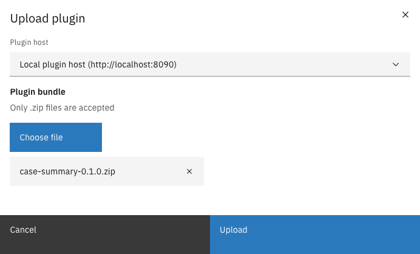
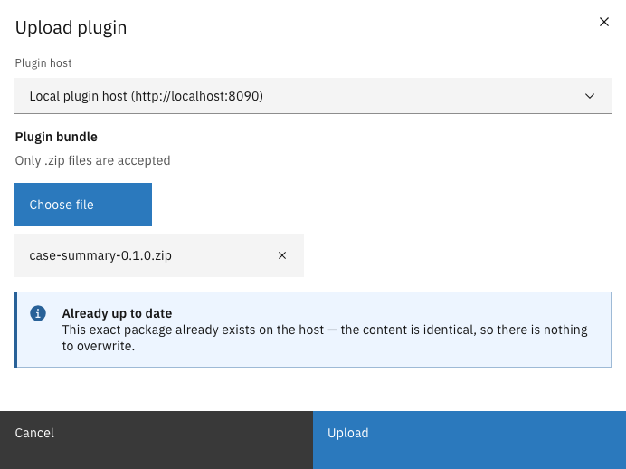

# Upload a plugin

Plugin packages are `.zip` files produced by a plugin developer. Uploading one installs it on a
plugin host, after which the plugin can be [configured](configure-a-plugin.md).


Uploads only apply to plugin hosts. Apps serve their own plugin and accept no uploads.


---

## Uploading a plugin package



Expand **Admin** in the left sidebar and click **Plugins**


Click **Upload plugin**


Select the plugin host, choose the `.zip` file, and click **Upload**

<figure><figcaption>Upload plugin</figcaption></figure>



On success the plugin is installed and can be configured right away. Valtimo records a
fingerprint of the uploaded package: from this moment on, that plugin version means exactly these
bytes.

---

## Possible outcomes

Besides a successful installation, the upload can end in a few deliberate ways:

### The version already exists with identical content

Nothing to do — the exact same package is already installed.

<figure><figcaption>Identical package already installed</figcaption></figure>

### The version already exists with different content

A plugin version is never replaced silently. The modal opens a review dialog showing the full
list of permissions the new package requests — the same review as during activation — with a
warning that overwriting can change behavior for everything already using this version.
Confirming replaces the package and re-applies the newly reviewed permissions to every existing
configuration of this plugin version.


Overwriting a version changes the running code behind existing configurations, process links, and
case tabs. Prefer publishing a new version number and activating it alongside the old one.


### The plugin targets a different Valtimo version

A plugin package can declare which Valtimo versions it supports. If the running environment falls
outside that range, the upload asks for confirmation first, naming the current version and the
range the plugin expects. Compatibility is a warning, not a hard block — a confirmed upload
proceeds, and the plugin then carries an **Incompatible** tag in the list as a standing reminder.
See [Plugin status and reviews](plugin-status-and-reviews.md#incompatible).

### The package is too large

Packages above the accepted size (100 MB by default) are refused before being uploaded, and the
message names both the package's size and the limit. A package that large usually means it bundles
something it should not; send the message to its supplier.

### The host rejects the package

Invalid packages — a broken manifest, disallowed contents, oversized files inside the archive — are
refused with the reason shown in the modal. What a valid package may contain is decided by the
plugin's developer, so pass the message to the plugin's supplier rather than trying to repackage
it.
