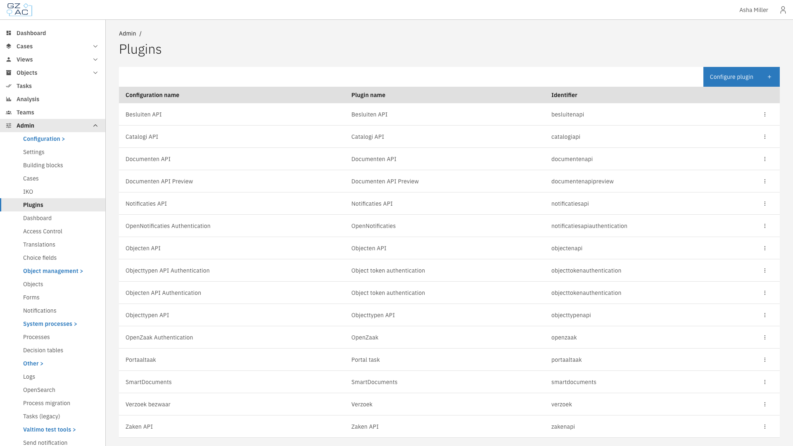
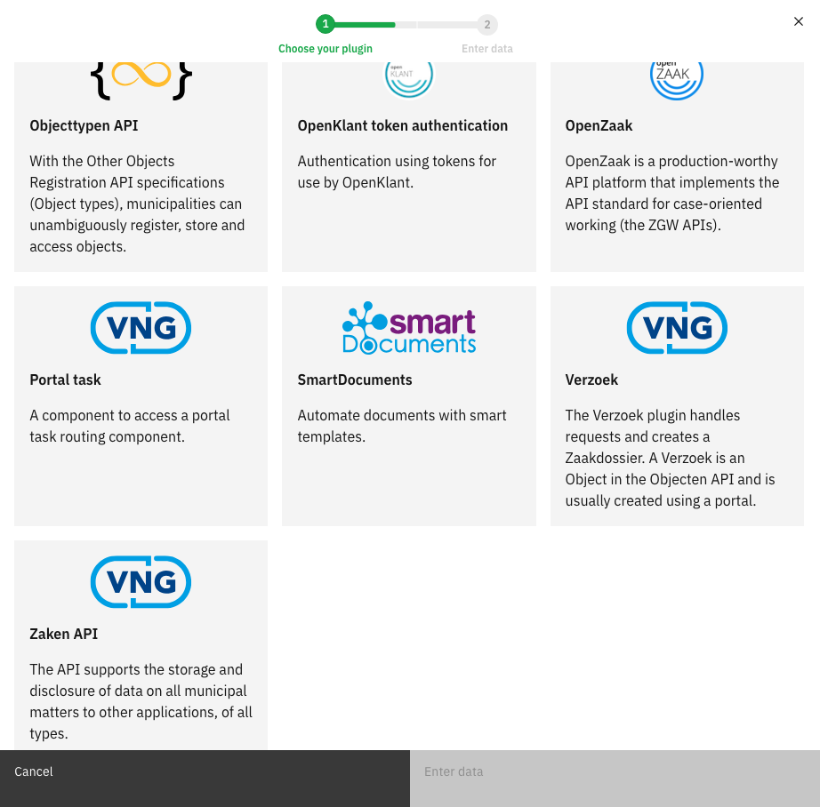
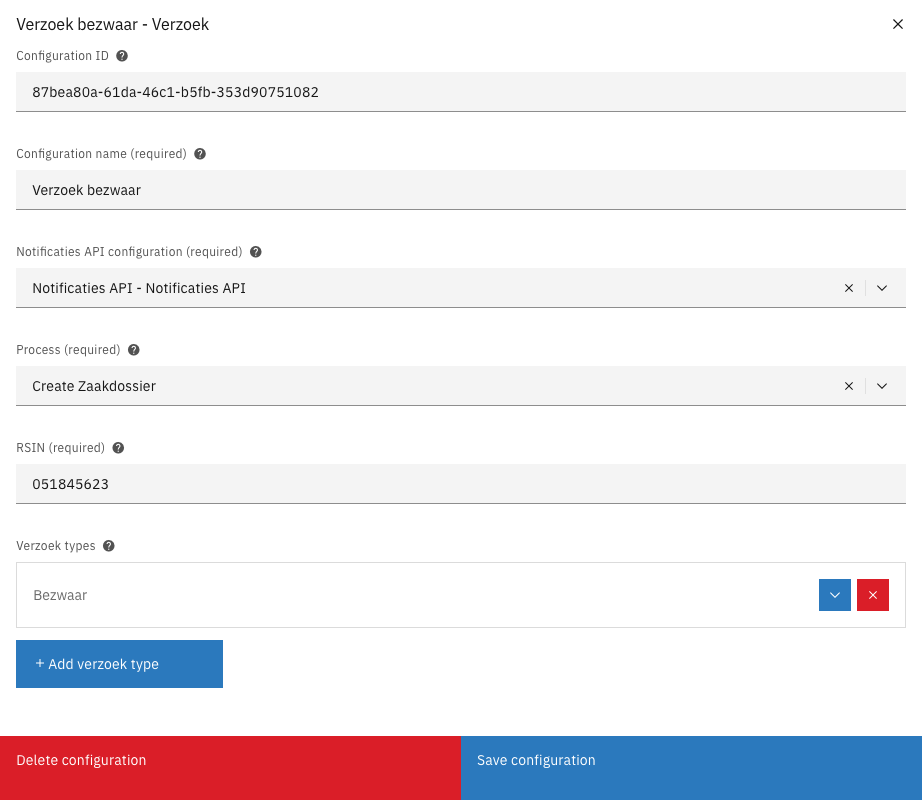
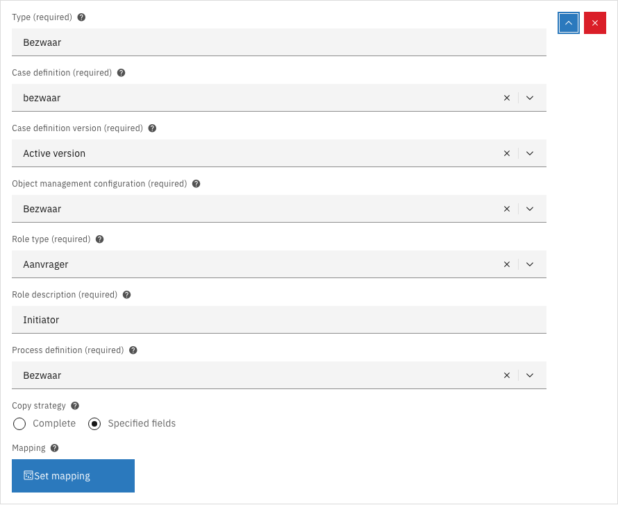
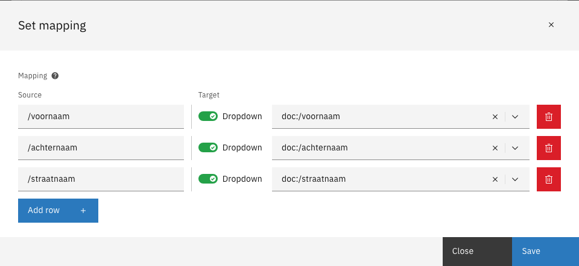
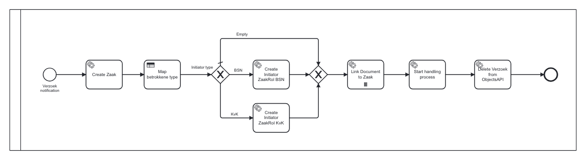

# Verzoek


The Verzoek plugin is a ZGW plugin and can only be used in the GZAC edition.


A verzoek is a request submitted by a citizen or a business, usually through a portal such as Open
Formulieren. The portal stores the request as an object in the Objecten API. The Verzoek plugin
picks that object up and turns it into a case in Valtimo, together with a zaak in the Zaken API.

One plugin configuration can handle several verzoek types. Each type decides which case is created,
which data is copied into it, and which process handles the request further.

---

## How the plugin works



A portal submits a request and stores it as an object in the Objecten API.


The Objecten API publishes a notification on the `objecten` channel of the Notificaties API.


The Verzoek plugin receives the notification and retrieves the verzoek object from the Objecten API.


The plugin reads the `type` field of the verzoek object and looks for a verzoek type with the same
name in its configuration. The comparison ignores capitalization.


The plugin creates a case of the configured case type and fills the case document according to the
copy strategy.


The plugin starts the process configured under **Process**, passing along the verzoek data as
process variables. With the standard **Create Zaakdossier** process, this creates the zaak, links
the initiator and the documents, starts the handling process, and removes the verzoek object.



The plugin only subscribes to notifications for the objecttypes used by its verzoek types, and only
to the `create` action. Notifications for other objecttypes or actions are ignored.

Creating the case and starting the process happen together. If any step fails, nothing is created —
the verzoek object stays in the Objecten API and the notification can be delivered again.

<details>

<summary>What the plugin does step by step</summary>

1. **Check the notification.** The notification is ignored, without an error, unless all of the
   following are true: it carries an `objectType`, its channel is `objecten`, its action is
   `create`, an object management configuration exists for that objecttype, and a Verzoek
   configuration refers to that object management configuration.
2. **Retrieve the object** from the URL in the notification, using the Objecten API plugin linked to
   the object management configuration.
3. **Read the verzoek data** from `record.data` on the object. If it is absent, the plugin reports
   `VerzoekObject /record/data cannot be found!`.
4. **Match the verzoek type.** The `type` field is compared against the configured verzoek types. A
   verzoek without a `type` is ignored. A `type` that matches no configuration is reported as
   `Failed to find verzoek configuration of type <type>.`
5. **Resolve the case type.** The configured case definition is looked up, either at the configured
   version or, when no version is set, at the active version.
6. **Create the case document** from `record.data.data`, following the copy strategy. Targets that
   start with `doc:` are written into the case document here.
7. **Determine the initiator.** A `kvk` field makes the initiator type `kvk`; otherwise a `bsn`
   field makes it `bsn`. Without either, the verzoek has no initiator and the zaakrol is skipped
   later in the process.
8. **Collect the process variables**, including the document URLs taken from `pdf_url` and
   `attachments`. Targets that start with `pv:` are added here.
9. **Start the process** configured under **Process**, with the case as its business key.

</details>

---

## Before you start

The Verzoek plugin builds on several other configurations. Set these up first.

| Prerequisite | Why it is needed |
|---|---|
| An objecttype for the verzoek in the Objecttypen API | Defines the structure of the verzoek object and identifies the notifications the plugin subscribes to |
| An Objecten API and an Objecttypen API plugin configuration | Used to retrieve the verzoek object and its objecttype |
| An object management configuration | Ties the objecttype to those two plugin configurations. Configure it under **Admin** > **Objects** |
| A Notificaties API plugin configuration | Delivers the notification that triggers the plugin |
| A case type | The case that is created for the verzoek. Its document definition determines which `doc:` targets are valid |
| A role type in the Catalogi API | The role the requester is given on the zaak, usually the initiator role |


If the Verzoek plugin does not appear in the plugin catalog, the application is missing the Verzoek
module dependency.


---

## The verzoek object

The plugin reads a fixed set of fields from the verzoek object. Only `type` is required; the rest
are optional and change what the plugin can do.

| Field | Required | Purpose | When it is missing |
|---|---|---|---|
| `type` | Yes | Selects which verzoek type configuration handles this request | The verzoek is ignored |
| `data` | Yes, in practice | The submitted form data. This is what ends up in the case document | The plugin reports that `/record/data/data` cannot be found |
| `bsn` | No | Citizen service number of the requester. Used as the initiator of the zaak | No initiator is recorded, unless `kvk` is present |
| `kvk` | No | Chamber of Commerce number of the requester. Takes precedence over `bsn` | The `bsn` field is used instead |
| `pdf_url` | No | URL of the submission PDF in the Documenten API | The PDF is not linked to the zaak |
| `attachments` | No | List of document URLs in the Documenten API | No attachments are linked to the zaak |

Every other field at the top level of the verzoek object — except `data` — is passed to the process
as a process variable under its own name.

<details>

<summary>Example verzoek object and objecttype schema</summary>

A verzoek object as stored in the Objecten API. The plugin reads the contents of `record.data`. Here
`submission_id` and `language_code` are not fields the plugin knows about — they are passed on to the
process as variables of the same name:

```json
{
  "record": {
    "typeVersion": 1,
    "data": {
      "type": "Bezwaar",
      "bsn": "999999999",
      "pdf_url": "https://openforms.example.nl/media/submission.pdf",
      "attachments": [
        "https://documenten.example.nl/api/v1/enkelvoudiginformatieobjecten/1"
      ],
      "submission_id": "12345-abcde-67890",
      "language_code": "nl",
      "data": {
        "voornaam": "Jan",
        "achternaam": "Pieter",
        "straatnaam": "Hoofdstraat"
      }
    }
  }
}
```

A matching objecttype schema in the Objecttypen API:

```json
{
  "title": "Verzoek",
  "required": ["type"],
  "properties": {
    "type": {
      "type": "string",
      "title": "Type verzoek"
    },
    "data": {
      "type": "object",
      "title": "Object with the submitted form data"
    },
    "bsn": {
      "type": "string",
      "title": "BSN of the requester"
    },
    "kvk": {
      "type": "string",
      "title": "KvK number of the requester"
    },
    "pdf_url": {
      "type": "string",
      "format": "uri",
      "title": "URL of the submission PDF"
    },
    "attachments": {
      "type": "array",
      "items": {"type": "string", "format": "uri"},
      "title": "URLs of the attachments in a Documenten API"
    }
  }
}
```

</details>

---

## Configuring the plugin



Expand **Admin** in the left sidebar


Click **Plugins** under the Configuration section

<figure><figcaption>Plugin overview</figcaption></figure>


Click **Configure plugin** and select the **Verzoek** tile

<figure><figcaption>Verzoek in the plugin catalog</figcaption></figure>


Click **Enter data** and fill in the configuration


Click **Save configuration**



| Property | Description |
|---|---|
| Configuration name | The name under which this configuration is found in the rest of the application |
| Notificaties API configuration | The Notificaties API configuration that delivers the notification |
| Process | The process that is started when a notification is received. Usually the **Create Zaakdossier** system process |
| RSIN | The RSIN of the organization responsible for the zaak. It must meet the same specifications as a BSN |
| Verzoek types | One entry per type of verzoek this configuration handles |

<figure><figcaption>Verzoek plugin configuration</figcaption></figure>

---

## Adding a verzoek type



Open the Verzoek plugin configuration


Click **Add verzoek type**


Fill in the fields and click **Save configuration**

<figure><figcaption>Verzoek type</figcaption></figure>



| Property | Description |
|---|---|
| Type | The value of the `type` field in the verzoek object that this entry handles |
| Case definition | The case type that is created for this verzoek |
| Case definition version | The version of the case type to create. Choose **Active version** to always use the version that is active at the time the verzoek arrives |
| Object management configuration | The object management configuration that describes the verzoek object |
| Role type | The role the requester is given on the zaak, usually the initiator role |
| Role description | Free text describing that role. Defaults to `Initiator` |
| Process definition | The handling process that is started after the zaak has been created |
| Copy strategy | Whether the complete verzoek data or only selected fields end up in the case |


A single plugin configuration can hold several verzoek types, each pointing at a different case type
and handling process. Use one entry per type of request.


---

## Copy strategy

The copy strategy decides what is copied out of the verzoek into the case.

| Option | Effect |
|---|---|
| Complete | The entire `data` object of the verzoek becomes the content of the case document |
| Specified fields | Only the fields listed under **Mapping** are copied |

With **Specified fields**, click **Set mapping** to define the fields.

<figure><figcaption>Set mapping</figcaption></figure>

| Column | Description |
|---|---|
| Source | Points at a value inside the verzoek |
| Target | Says where that value is written |

**Source** is a path inside the `data` object of the verzoek, for example `/voornaam`. Two variations
are available:

- Leave the source empty to copy the complete `data` object to the target.
- Prefix the source with `object:` to read from the verzoek object itself instead of from its data,
  for example `object:/type` for the objecttype URL of the verzoek.

**Target** must start with one of two prefixes:

- `doc:` writes the value into the case document, for example `doc:/voornaam`.
- `pv:` makes the value available as a process variable, for example `pv:voornaam`. A leading slash
  is allowed: `pv:/voornaam` and `pv:voornaam` both produce a variable named `voornaam`.

A source that is not present in the verzoek is skipped for `doc:` targets, and results in an empty
process variable for `pv:` targets.


Mappings are checked when the configuration is saved. A target without a `doc:` or `pv:` prefix is
rejected, and a `doc:` target must point at a property that exists in the document definition of the
selected case type.


---

## The Create Zaakdossier process

Valtimo ships with the **Create Zaakdossier** system process, which performs the ZGW side of a
verzoek. Select it under **Process** in the plugin configuration.

<figure><figcaption>Create Zaakdossier</figcaption></figure>

| Task | What it does | Configuration |
|---|---|---|
| Create Zaak | Creates the zaak in the Zaken API | Process link to the **Create zaak** action of the Zaken API plugin |
| Map betrokkene type | Decides whether the initiator is a natural person or a non-natural person | Decision table, no process link needed |
| Create Initiator ZaakRol BSN | Adds the requester to the zaak as a natural person | Process link to the **Create natuurlijk persoon zaakrol** action |
| Create Initiator ZaakRol KvK | Adds the requester to the zaak as a non-natural person | Process link to the **Create niet-natuurlijk persoon zaakrol** action |
| Link Document to Zaak | Links each document of the verzoek to the zaak | Process link to the **Link document to zaak** action. Repeats over the `documentUrls` variable |
| Start handling process | Starts the process selected under **Process definition** | No process link needed |
| Delete Verzoek from ObjectsAPI | Removes the verzoek object now that it has been processed | Process link to the **Delete object** action of the Objecten API plugin |

The gateway after **Map betrokkene type** routes on the initiator type of the verzoek: a `bsn` takes
the BSN branch, a `kvk` takes the KvK branch, and a verzoek without either skips both and continues
without an initiator zaakrol.

Instead of Create Zaakdossier, a process of your own can be selected under **Process**. It is started
with the same process variables.

<details>

<summary>Process variables available in the process</summary>

| Variable | Contents |
|---|---|
| `RSIN` | The RSIN from the plugin configuration |
| `zaakTypeUrl` | The zaaktype linked to the case type |
| `rolTypeUrl` | The role type from the verzoek type |
| `rolDescription` | The role description from the verzoek type |
| `verzoekObjectUrl` | The URL of the verzoek object in the Objecten API |
| `initiatorType` | `bsn`, `kvk`, or empty when the verzoek has neither |
| `initiatorValue` | The BSN or KvK number of the requester |
| `processDefinitionKey` | The handling process from the verzoek type |
| `documentUrls` | The document URLs from `pdf_url` and `attachments`, in that order. Use it as the collection of a multi-instance task |

On top of these, every field at the top level of the verzoek object except `data` is available under
its own name, as are all `pv:` mappings.

</details>

---

## Troubleshooting

| Message | Cause |
|---|---|
| `VerzoekObject /record/data cannot be found!` | The object in the Objecten API has no data at all |
| `VerzoekObject /record/data/data cannot be found!` | The verzoek has no `data` object holding the submitted form data |
| `Failed to find verzoek configuration of type <type>.` | No verzoek type in the configuration matches the `type` of the verzoek |
| `Verzoek plugin failed to create case: No case found with key <key>` | The configured case type does not exist, or has no active version |
| `Could not create document for case <case type>` | The copied data does not fit the document definition of the case type |
| `Failed to set mapping. Unknown prefix '<prefix>:'.` | A mapping target starts with something other than `doc:` or `pv:` |
| `JsonPointer '<path>' doesn't point to any property inside document definition '<name>'` | A `doc:` target points at a property the document definition does not have |


Nothing happening at all usually means the notification never reached the plugin. Check that the
object management configuration points at the right objecttype, and that the Notificaties API has a
subscription for the `objecten` channel.

