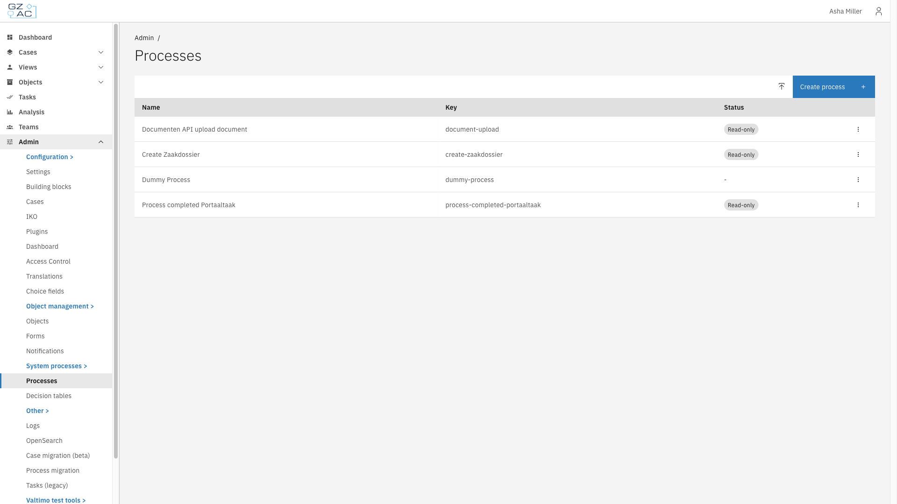
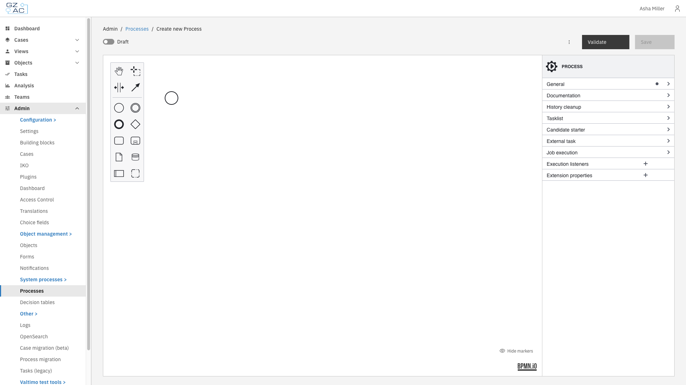
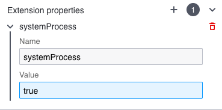
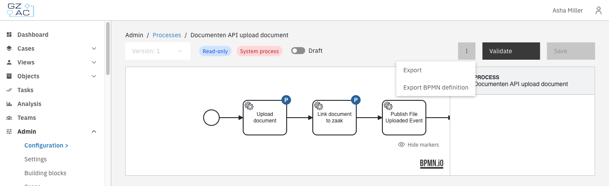
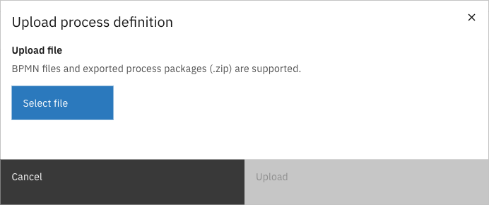

# System processes

System processes are [processes](../../fundamentals/process.md) that stand on their own. Unlike the processes of a [case](../cases/processes.md) or a [building block](../building-blocks/processes.md), they are not tied to a case definition. They handle work that supports the platform as a whole, such as uploading a document to a registration or creating a zaakdossier.

They are managed from **Admin** > **System processes** > **Processes**. The same menu group also contains **Decision tables**, which manages standalone DMN decision tables in the same way.

Some system processes are critical to the functioning of Valtimo itself. Because they must be handled with care, they can be marked as read-only: a read-only process can be used, but not changed.



Expand **Admin** in the left sidebar


Click **Processes** under **System processes**

<figure><figcaption>Processes in the System processes menu</figcaption></figure>



The list shows every standalone process on the environment.

| Column | Description |
|--------|-------------|
| Name | Display name of the process |
| Key | Technical identifier used in BPMN references |
| Status | Shows a **Read-only** tag for a protected system process, and a **Draft** tag for an unpublished process. A dash means neither applies. |

---

## Creating and editing a process

Click **Create process** to add a new process, or click a row to open an existing one. Both open the process in the BPMN modeler, with the palette on the left and the properties panel on the right.

<figure><figcaption>BPMN modeler</figcaption></figure>

The header of the modeler contains the following controls:

| Control | Description |
|---------|-------------|
| Version selector | Selects which version of the process to show. Disabled when only one version exists. |
| **Draft** | When enabled, the process is saved as a draft. Draft processes are not validated and cannot be started. |
| **Validate** | Checks the process for errors and warnings without saving. |
| **Save** | Deploys the process. Enabled once there are unsaved changes. |

---

## Read-only system processes

A process is marked as a system process by adding an extension property named `systemProcess` with the value `true` to the process. Select the process in the diagram so the **PROCESS** properties are shown, then add the property under **Extension properties**.

<figure><figcaption>The systemProcess extension property</figcaption></figure>

| Property | Value | Description |
|----------|-------|-------------|
| `systemProcess` | `true` | Marks the process as a system process. It becomes read-only unless system processes are made updatable on the environment. |

When a process is a system process, the modeler shows a blue **Read-only** tag and a red **System process** tag, and **Save** is unavailable.

The diagram opens in a viewer instead of the modeler. There is no palette, and elements cannot be added, moved, or deleted.

While a process is read-only, the following is not possible:

- Changing the diagram or deploying a new version of it
- Migrating running process instances to it from **Admin** > **Process migration**
- Overwriting it by importing a package (see [Importing a process](#importing-a-process))

Process links are not part of this restriction. Activities of a read-only system process can still be linked and unlinked, and those changes can be saved.


A read-only system process can be used but not modified. To change one, system processes have to be made updatable first.


---

## Exporting a process

A process is exported from the overflow menu in the modeler. Exporting is always allowed, including for a read-only system process.

<figure><figcaption>Export options</figcaption></figure>

| Option | Result |
|--------|--------|
| **Export** | A package (`.zip`) containing the process, its process links, and the sub-processes, decision tables and forms it calls. |
| **Export BPMN definition** | The diagram only, as a `.bpmn` file. Process links are not included. |

The version selected in the version selector is the version that is exported.

A package lets a process keep working after it is imported on another environment, because everything the process refers to travels with it.


Exporting a package fails when a sub-process, decision table or form that the process refers to is not available on this environment. The message reports which elements are missing.


---

## Importing a process



On the **Processes** list, click the upload icon in the top-right corner


Click **Select file** and choose a BPMN file or an exported process package (`.zip`)

<figure><figcaption>Upload process definition</figcaption></figure>


Click **Upload**



A BPMN file is deployed directly. When a process with the same key already exists, a confirmation asks whether to replace it.

A package opens a preview first, so it is clear what the import changes before it runs. When there is nothing to review, the import runs immediately.

### Reviewing what will be replaced

Everything in the package that already exists on this environment is replaced by the import. The preview lists these elements per type, because a decision table or form can be shared with other processes.

The preview also warns about elements the package refers to but does not contain. Sub-processes and decision tables that use a dynamic or deployment binding cannot be included and have to be imported separately. These warnings do not block the import.

### Mapping plugin configurations

When a package contains process links that use plugins, the preview asks which configuration of this environment each plugin configuration in the package corresponds to.

Each row maps a configuration **From the package** to one **On this environment**:

- A matching configuration on this environment is selected automatically when one exists. Otherwise, choose one from the list.
- If the plugin is not installed on this environment, the row shows **Plugin not installed** and no configuration can be selected.
- If it cannot be determined which plugin a configuration belongs to, those links have to be set manually after importing.

### When an import is blocked

Some findings stop the import altogether. **Upload** stays unavailable until they are resolved.

| Message | Meaning |
|---------|---------|
| **Process is managed by configuration** | The process already exists on this environment as a read-only system process and cannot be overwritten. Make system processes updatable first. |
| **Missing forms** | The package refers to forms that do not exist on this environment. Import those forms first. |
| **Form flows are not supported** | Form flows cannot be linked to a process outside a case definition. |

A blocking message and the plugin configuration mapping can appear together. The mapping rows are still shown, but the import is refused until the blocking message is resolved.
