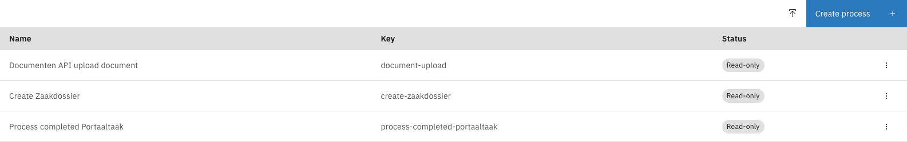
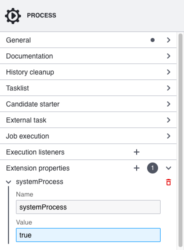
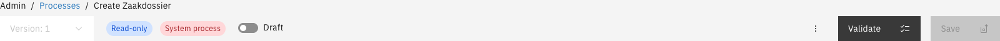
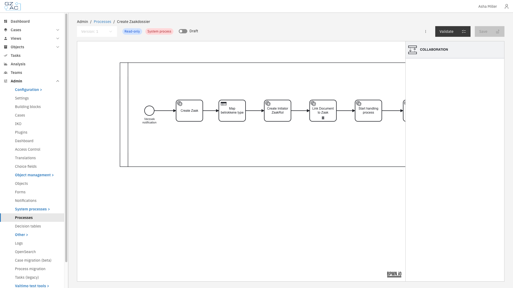
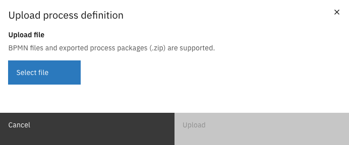
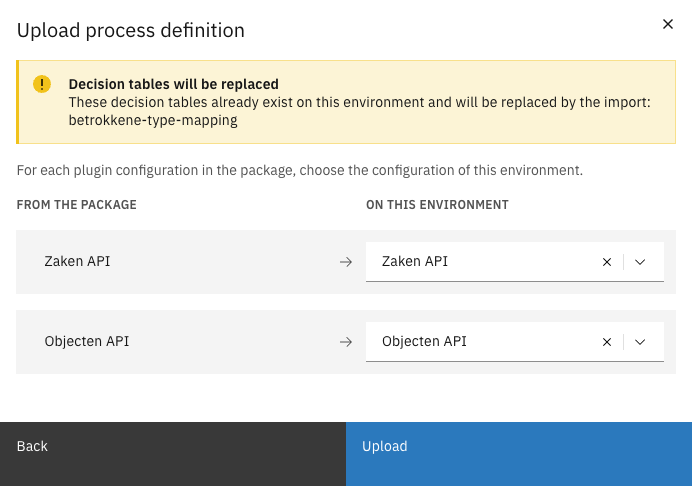

# System processes

System processes are [processes](../../fundamentals/process.md) that are critical to the functioning of Valtimo itself. Because they must be handled with care, they are marked as read-only by default: a read-only process can be used, but it cannot be edited, saved, or overwritten by an import.

System processes are managed from **Admin** > **Processes**, where they are listed with the status **Read-only**.

<figure><figcaption>Processes list with read-only system processes</figcaption></figure>

---

## Marking a process as a system process

A process is marked as a system process by adding an extension property named `systemProcess` with the value `true` to the process.



Go to **Admin** > **Processes** and open the process, or click **Create process** to add a new one.


Select the process in the diagram so the **PROCESS** properties are shown.


Under **Extension properties**, add a property with name `systemProcess` and value `true`.

<figure><figcaption>The systemProcess extension property</figcaption></figure>


Click **Save** to deploy the process.



| Property | Value | Description |
|----------|-------|-------------|
| `systemProcess` | `true` | Marks the process as a system process. It becomes read-only unless system processes are made updatable. |

---

## Read-only behavior

When a process is a system process, the process editor shows a red **System process** tag and a blue **Read-only** tag, and the diagram opens in a viewer that cannot be edited. The **Save** button is disabled.

<figure><figcaption>Read-only and System process tags</figcaption></figure>

While a process is read-only, the following is not possible:

- Editing the diagram or saving (deploying) changes
- Migrating running process instances to it
- Overwriting it by importing a package (see [Import and export](#import-and-export))

<figure><figcaption>A system process in the read-only viewer</figcaption></figure>


A read-only system process can be used but not modified. To change one, make system processes updatable first.


---

## Making a system process updatable

Whether system processes are read-only is controlled by a back-end setting. By default it is off, so system processes are read-only. To allow them to be changed, set the following property in the `application.yml` of the back-end implementation:

```yaml
valtimo:
  process:
    systemProcessUpdatable: true
```

The default value is `false`. When set to `true`, system processes can be edited, saved, migrated to, and overwritten by an import. The process keeps its **System process** tag, but it is no longer read-only.


This is an implementation setting made by a developer. It applies to all system processes on the environment.


---

## Import and export


Exporting and importing a system process as a full package is available since Valtimo `13.43.0`. Before that, only the BPMN definition could be exported.


A system process can always be exported. Use **Export** in the menu of the process to download a package.

A process is imported from the **Admin** > **Processes** list, using the upload icon in the top-right corner (shown in the process list at the top of this page).



On the **Processes** list, click the upload icon in the top-right corner.


Click **Select file** and choose a BPMN file or an exported process package (`.zip`).

<figure><figcaption>Upload process definition</figcaption></figure>


Click **Upload** to open the import preview.



A package cannot overwrite a process that exists on this environment as a read-only system process. In that case the import preview reports **Process is managed by configuration** and the import is blocked. Make the system process updatable first if the import has to replace it.

### Mapping plugin configurations

When a package contains plugin process links, the import preview lists the plugin configurations it uses so they can be connected to this environment, under **For each plugin configuration in the package, choose the configuration of this environment**. Each row maps a configuration **From the package** to one **On this environment**:

<figure><figcaption>Import preview: mapping plugin configurations</figcaption></figure>

- A matching configuration on this environment is selected automatically when one exists. Otherwise, choose one from the list.
- If the plugin is not installed on this environment, the row shows **Plugin not installed** and no configuration can be selected.
- If it cannot be determined which plugin a configuration belongs to, those links have to be set manually after importing.

This lets a process keep working after it is imported, even on an environment that uses different plugin configurations than the environment the package came from.
