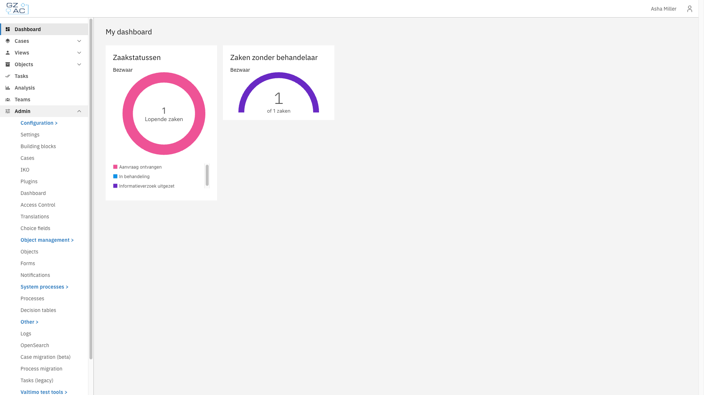
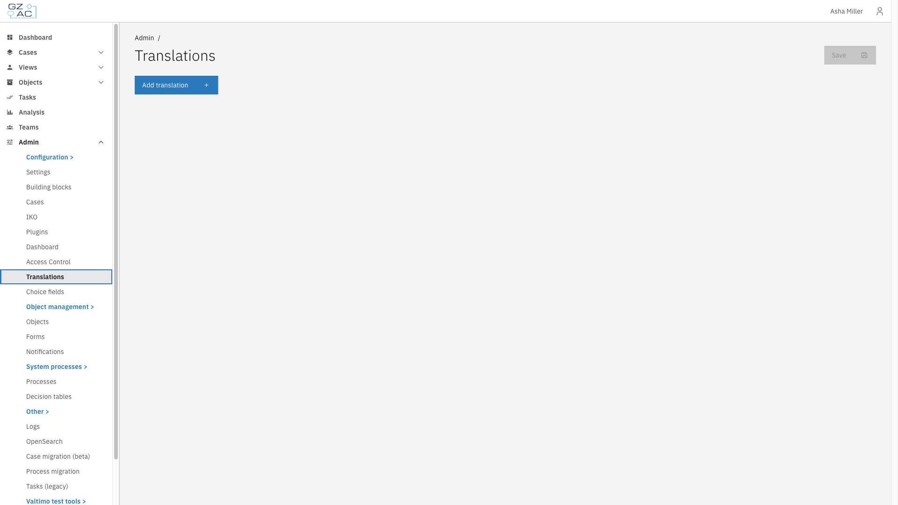
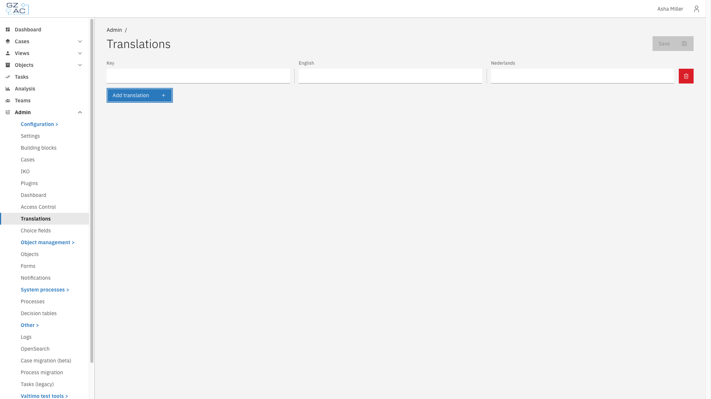
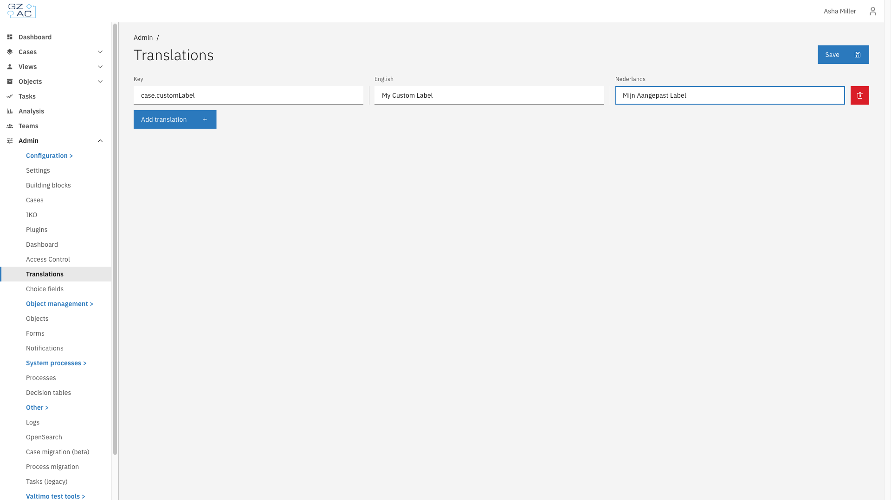
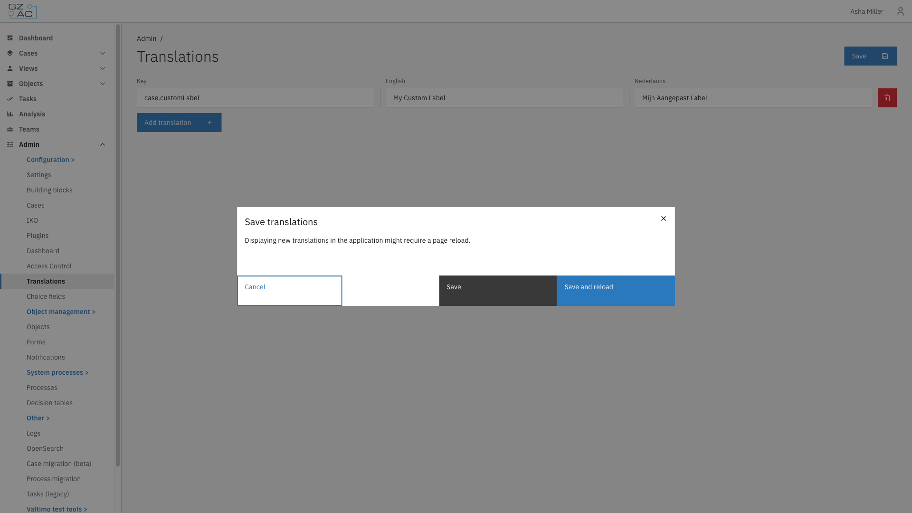

# Translations

Translation Management allows administrators to customize UI labels, messages, and text without code changes. Translations stored in the database override or extend the static translation files bundled with the application.

---

## Accessing Translation Management



Navigate to **Admin** in the sidebar


Click **Translations**

<figure><figcaption>Translation Management in the Admin menu</figcaption></figure>



---

## How translations work

Valtimo uses a two-layer translation system:

1. **Static translations** — Bundled with the application in JSON files (e.g., `en.json`, `nl.json`)
2. **Database translations** — Managed through this UI

When the application loads, database translations are merged with static translations. Database values take precedence, allowing you to override any default text.


To revert a translation to its default value, delete the database entry. The static translation will then be used.


---

## Managing translations

The Translation Management page displays a grid with columns for the translation key and each configured language.

<figure><figcaption>Translation Management overview</figcaption></figure>

### Adding a translation



Click **Add translation** at the bottom of the list

<figure><figcaption>New translation row</figcaption></figure>


Enter the translation key in the **Key** column

Use dot notation for hierarchical keys (e.g., `case.customLabel`).


Enter the translated text for each language

<figure><figcaption>Filled translation row</figcaption></figure>


Click **Save** in the header


Choose a save option in the confirmation modal

<figure><figcaption>Save confirmation modal</figcaption></figure>



### Editing a translation



Locate the translation key in the list


Click the text field for the language you want to modify


Update the text and click **Save**



### Deleting a translation



Click the delete icon (trash) on the row you want to remove


Click **Save** to persist the deletion




Deleting a translation reverts that key to the static file value. If no static value exists, the key itself will be displayed in the UI.


---

## Save options

| Option | Description |
|--------|-------------|
| Save | Saves translations to the database. Changes appear after the next page navigation or browser refresh. |
| Save and reload | Saves translations and immediately reloads the page to apply changes. |


Use **Save and reload** when you want to verify your changes immediately.


---

## Translation key patterns

Understanding common key conventions helps you find and customize the right text.

### Common prefixes

| Prefix | Description | Example |
|--------|-------------|---------|
| `case.` | Case-related labels | `case.title`, `case.tabs.summary` |
| `task.` | Task-related labels | `task.title`, `task.pagination.itemsPerPage` |
| `interface.` | Common UI elements | `interface.save`, `interface.cancel` |
| `listColumn.` | Table column headers | `listColumn.key`, `listColumn.name` |

### Key structure

Translation keys use dot notation to create a hierarchy:

```
domain.feature.element
```

Examples:
- `case.bulkAssign.modal.title` — Title of the bulk assign modal
- `task.pagination.totalItems` — Pagination text for tasks

### Parameterized translations

Some translations include placeholders for dynamic values using double curly braces:

```
{{start}}-{{end}} of {{total}} cases
```

When customizing these translations, preserve the placeholders:

```
Showing {{start}} to {{end}} out of {{total}} cases
```

---

## Use cases

<details>
<summary><strong>Customizing case type names</strong></summary>

To display a custom name for a case type, add a translation using the case definition name as the key:

| Key | EN | NL |
|-----|----|----|
| `loan-application` | Loan Application | Leningaanvraag |
| `energy-subsidy-request` | Energy Subsidy Request | Energiesubsidie Aanvraag |

</details>

<details>
<summary><strong>Translating form field labels</strong></summary>

Form.io forms automatically translate labels. Add keys matching the form field labels exactly:

| Key | EN | NL |
|-----|----|----|
| `First name` | First name | Voornaam |
| `Date of birth` | Date of birth | Geboortedatum |


Form translation matches label text exactly. Use the same capitalization and spacing as the form definition.


</details>

<details>
<summary><strong>Customizing tab names</strong></summary>

Tab names can be translated using the pattern `case.tabs.{tabKey}`:

| Key | EN | NL |
|-----|----|----|
| `case.tabs.summary` | Overview | Overzicht |
| `case.tabs.documents` | Documents | Documenten |

</details>

---

## API reference

For developers integrating with the localization API:

| Endpoint | Method | Description |
|----------|--------|-------------|
| `/api/v1/localization` | GET | Get all localizations |
| `/api/v1/localization/{languageKey}` | GET | Get translations for a language |
| `/api/management/v1/localization/{languageKey}` | PUT | Update translations for a language |
| `/api/management/v1/localization` | PUT | Batch update all translations |


The management endpoints require `ROLE_ADMIN`. Read endpoints are available to all authenticated users.


---

## Troubleshooting

<details>
<summary><strong>Translation not appearing after save</strong></summary>

**Issue:** Changed translations don't appear in the UI.

**Solutions:**
1. Use **Save and reload** instead of **Save**
2. Clear browser cache (Ctrl+Shift+R / Cmd+Shift+R)
3. Verify the translation key matches exactly (case-sensitive)

</details>

<details>
<summary><strong>Translation key displayed instead of text</strong></summary>

**Issue:** The UI shows `case.myKey` instead of the translated text.

**Causes:**
- Translation key doesn't exist in the database or static files
- Key has a typo or incorrect casing
- Translation exists for one language but not the current UI language

**Solution:** Add the translation for all configured languages.

</details>

<details>
<summary><strong>Parameterized text showing placeholders</strong></summary>

**Issue:** Text displays `Hello {{name}}` instead of `Hello John`.

**Cause:** The placeholder name doesn't match what the application expects.

**Solution:** Check existing translations for the correct placeholder syntax and names.

</details>
