# Building blocks

Building blocks let you package a reusable subprocess with its own data model and version it separately from cases.
This allows them to use their own data and configuration. You can use the same building block in multiple case
definitions, independent processes, and across environments, while keeping a clear input and output contract.


This feature is different from the Process Exchange building blocks that you download and copy into projects. For those,
see [Process Exchange building blocks](../../fundamentals/process-exchange/building-blocks.md).


## When to use building blocks

Building blocks are useful when:

* The same subprocess is needed in multiple cases.
* You want one place to update a shared step.
* You want a consistent way to pass data in and get results back.

**Example:** A "Household verification" building block can be used in both subsidy and permit cases. Each case passes in
the citizen data, the building block runs the checks, and the outcome is synced back to the case.

## How building blocks work

1. Create a building block definition (name, version, description).
2. Define the data it needs and the data it produces.
3. Add the processes and choose the main process.
4. Link the building block to a **Call activity** in a case process.
5. Map inputs and outputs, and choose when outputs are synced.

Building blocks are isolated by design. They should not directly read or write case data. Instead, you define the inputs
and outputs when you link them to a case.

## Create a building block

### 1. Create the definition

* Go to **Admin** in the left sidebar.
* Select **Building blocks**.
* Click **Create**.
* Enter a **Name**, **Version**, and (optional) **Description**.
* Click **Save**.

<figure>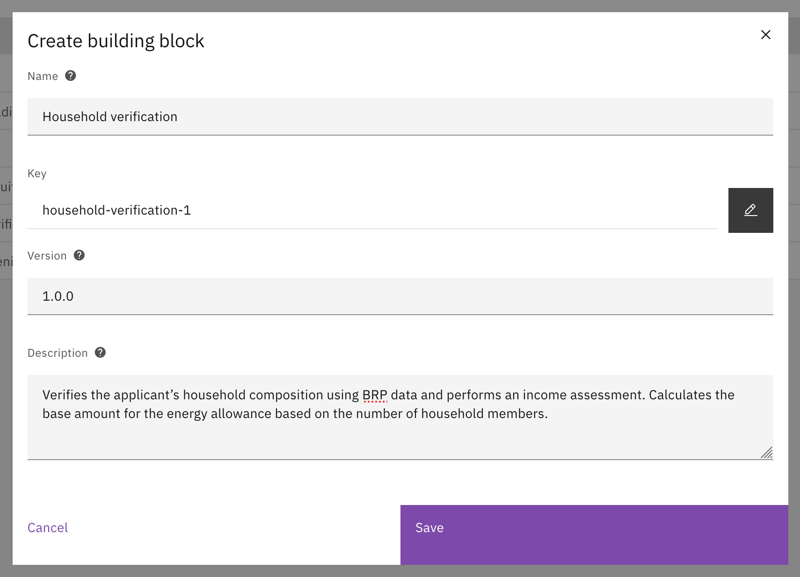<figcaption><p>Create a new building block</p></figcaption></figure>

### 2. Add general information

* Open the **General** tab.
* Optionally upload **Artwork**.
* Review the list of **Plugins used** so you know which plugin types must be configured later. Initially, the list will
  be empty. This will be updated as you add plugins or other building blocks to the processes of your building block.

<figure>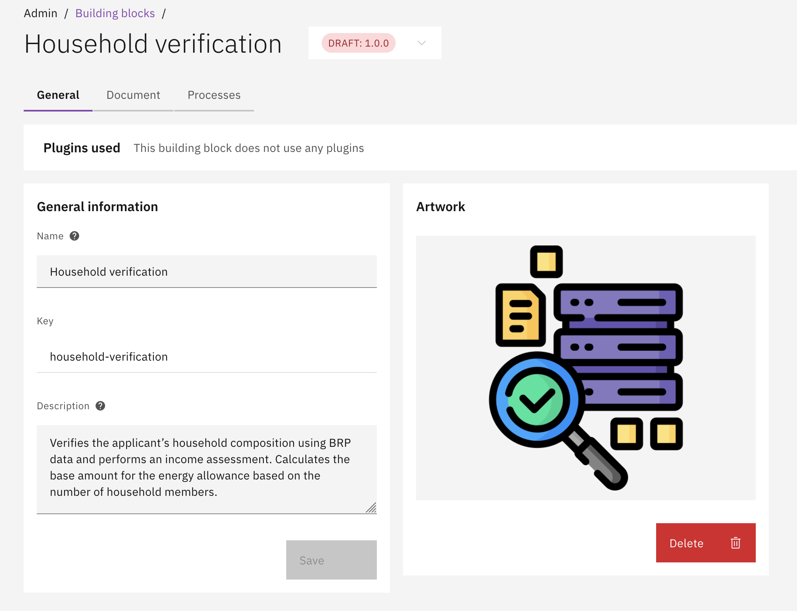<figcaption><p>General information and artwork</p></figcaption></figure>

### 3. Define the data fields

* Open the **Document** tab.
* Add the fields the building block needs (inputs) and may return (outputs) and any other data the building block will
  need to use internally.
* Mark required fields so the case must provide them when using the building block.
* Click **Save**.

<figure>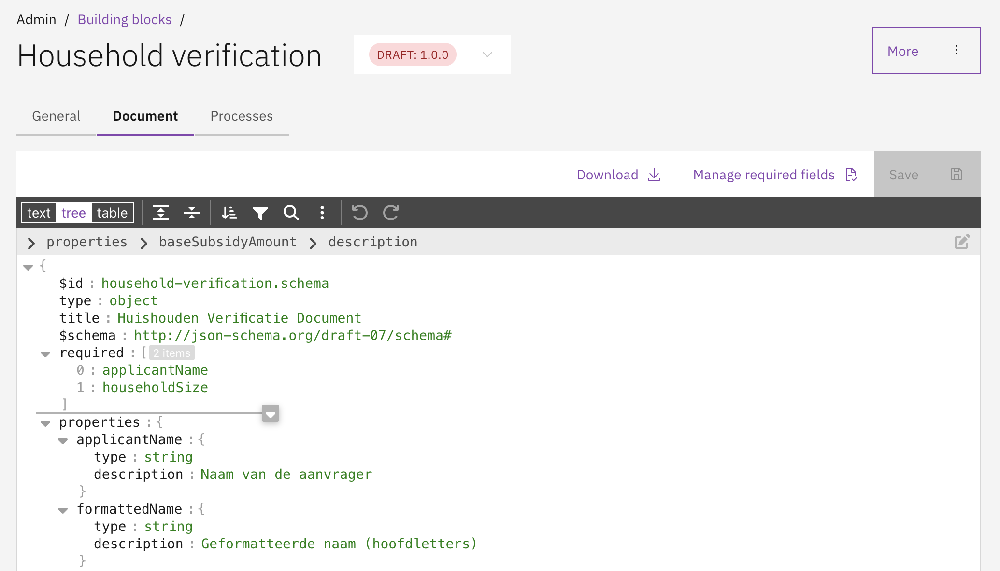<figcaption><p>Define data fields for the building block</p></figcaption></figure>

### 4. Add processes

* Open the **Processes** tab.
* Either **Upload** a BPMN file or **Create** a new process.
* Select which process should be the **Main process** for the building block, or use the process that has been created
  with the building block.
* You can use plugins in these processes just like in case processes, but you select the plugin type instead of a
  specific configuration.

<figure>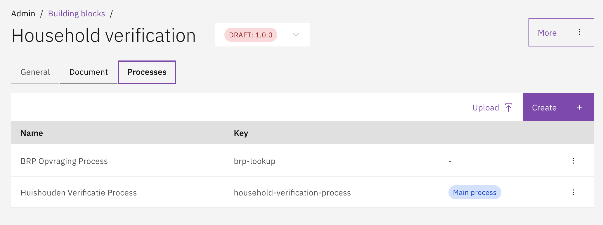<figcaption><p>Processes inside the building block</p></figcaption></figure>

* When a building block has multiple processes, you can create call activities from one process to another. Set the
  process definition key and include a reference to the current building block in the **Version tag** field. The
  version tag has the format `BB:<building-block-key>:<building-block-version>`.

<figure>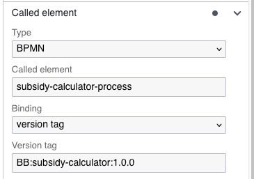<figcaption><p>Link to a different process in the building block</p></figcaption></figure>


Building blocks support user tasks with form and form flow process links. Tasks from building blocks automatically
appear in the case task list and support auto-assignment. To use forms in user tasks, first create them in the
[Forms](forms.md) tab. To use form flows, create them in the [Form flows](form-flows.md) tab. To use decision tables
in business rule tasks, first deploy them in the [Decision tables](decision-tables.md) tab.


### 5. Finalize the version

Building blocks use **draft** and **final** versions, similar to case definitions.

Before you finalize, **test the building block thoroughly**. Final versions cannot be changed.

* In the **More** menu, choose **Make version final** to lock the version.
* To make changes later, create a **new draft** from a final version.

Only **final** building blocks can be used when finalizing a case definition.

<figure>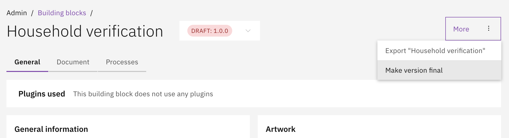<figcaption><p>Finalize a building block version</p></figcaption></figure>

## Use a building block in a case

### 1. Add a Call activity

* Open the case process where you want to use the building block.
* Add a **Call activity** to the process model.

<figure>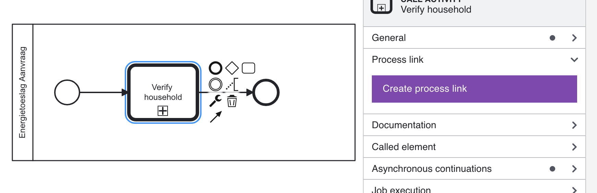<figcaption><p>Call activity in a case process</p></figcaption></figure>

### 2. Link the building block

* Open the **Process link** for the Call activity.
* Choose **Building block** as the link type.
* Choose the **Building block** you want to use.

<figure>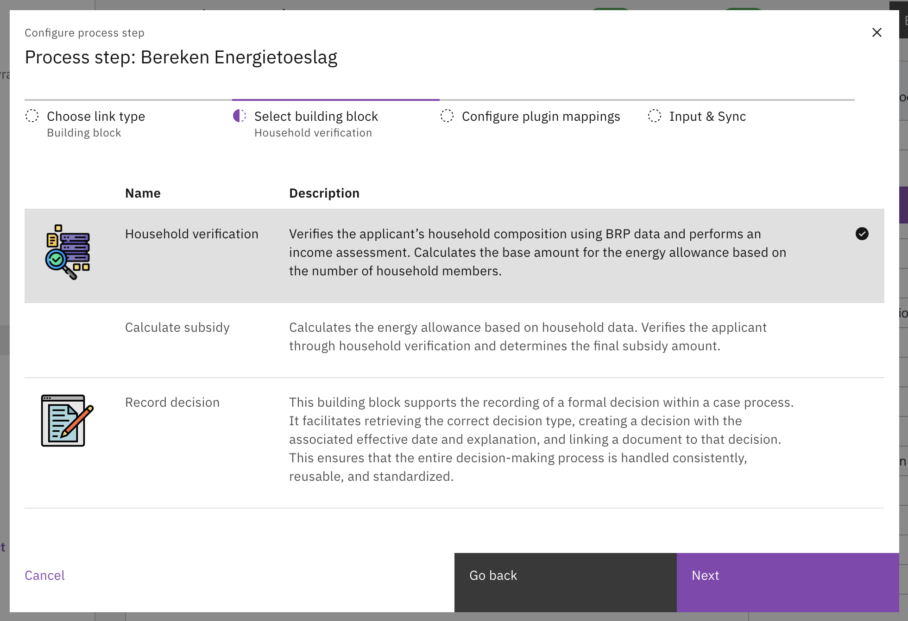<figcaption><p>Select a building block and version</p></figcaption></figure>

### 3. Configure plugin mappings

* Select the building block **Version** you want to use.

If this version uses plugins, you must map each **plugin type** to a **plugin configuration** that already exists in
your environment.

* Select the saved plugin configuration for each plugin type.
* If you are unsure, check the plugin documentation under [Plugins](../plugins/README.md).

<figure>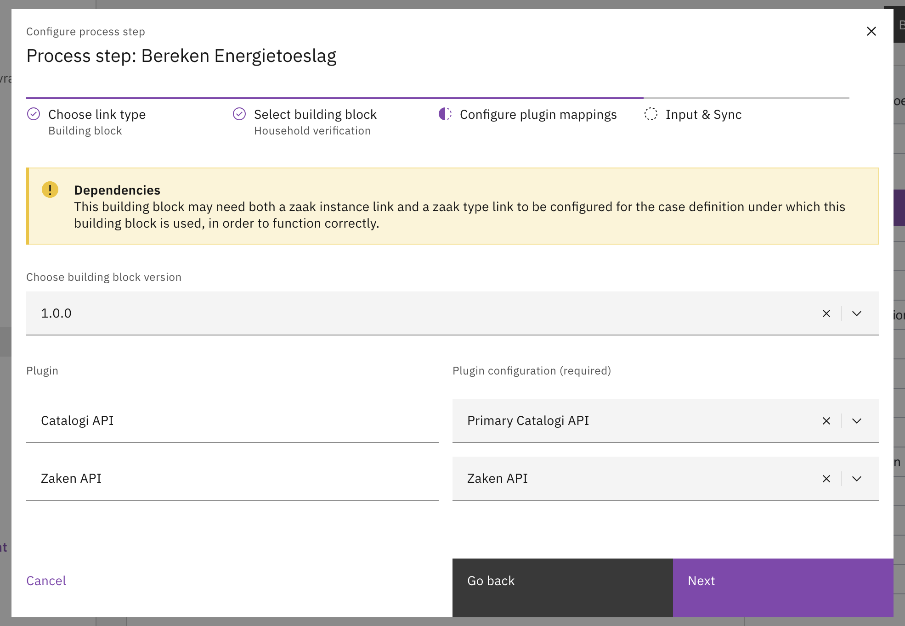<figcaption><p>Configure plugin mappings</p></figcaption></figure>

### 4. Map inputs and sync outputs

* Map **Inputs** from the case data to the building block fields.
    * The required inputs for the building block will be listed by default.
    * Any optional inputs can be added manually by clicking **Add input**.
* Map **Outputs** from the building block back to the case.
    * Fields can be added for syncing by clicking **Add sync**
    * This is one way. Any changes to the case document will not be automatically synced to the building block instance.

<figure>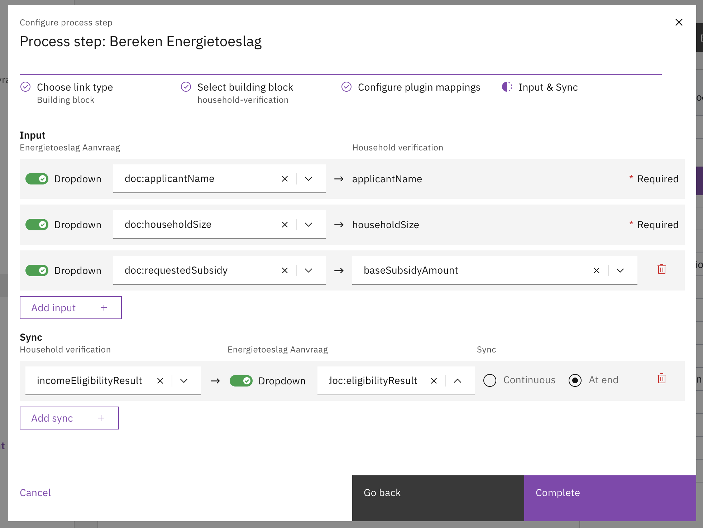<figcaption><p>Input and output mapping</p></figcaption></figure>

### 5. Save and deploy

* Click **Complete** to save the process link.
* Save and deploy the updated case process.

## Use a building block in an independent process

Building blocks can also be used in independent processes that are not associated with a case or a building block. The
setup is the same as described above, except for input and output mappings.

Independent processes use **process variables** instead of document fields for data exchange with building blocks.
Use the `pv:` prefix to indicate a process variable in your mappings.

* **Inputs**: `pv:customerName` maps the process variable `customerName` to a building block input field.
* **Outputs**: A building block output field mapped to `pv:result` writes the value to the process variable `result`.

## Import and export building blocks

Building blocks are automatically included in case definition exports. You can also export or import a building block
separately when you want to move or reuse it on its own.

### Import

* Go to **Admin** → **Building blocks**.
* Click **Upload**.
* Select a `.zip` or `.json` export file and confirm the overwrite warning.
* Follow the steps in the wizard.

<figure>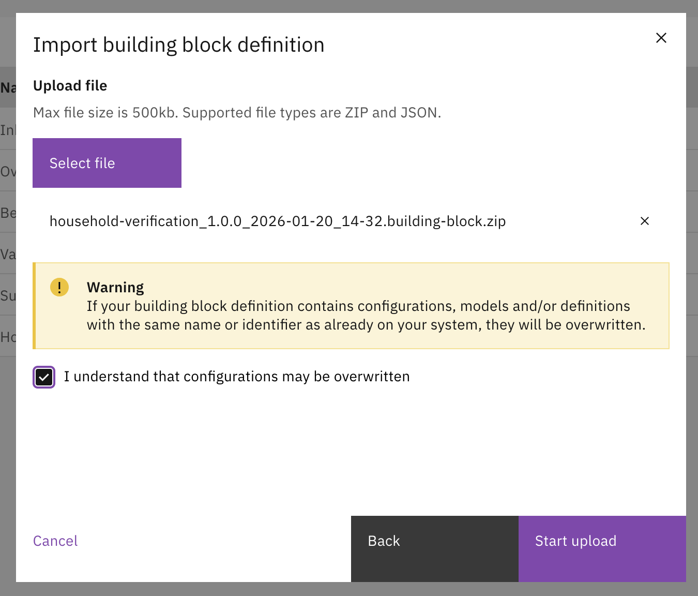<figcaption><p>Import a building block definition</p></figcaption></figure>

### Export

* Open a building block.
* Click **More** → **Export**.

<figure><figcaption><p>Export a building block definition</p></figcaption></figure>


Before importing, make sure any required process definitions or plugin configurations already exist in your environment.


## Auto-deployment

Building blocks can be configured via auto-deployment files in the application resources. These files are loaded at
application startup.

### Building block definition

The building block definition and its related files are placed under:

```
config/building-block/<key>/<version>/
├── building-block/
│   ├── definition/<key>.building-block-definition.json
│   ├── building-block-definition-main-process-definition.json
│   └── building-block-process-definition-links.json  (optional)
├── document/
│   └── definition/<key>.schema.document-definition.json
├── bpmn/
│   └── <process-key>.bpmn
├── dmn/
│   └── <decision-name>.dmn  (optional)
├── form/
│   └── <form-name>.form.json
├── form-flow/
│   └── <form-flow-key>.form-flow.json  (optional)
└── process-link/
    └── <process-key>.process-link.json
```

#### Building block definition file

`<key>.building-block-definition.json` defines the building block metadata:

```json
{
    "key": "household-verification",
    "name": "Household Verification",
    "description": "Verifies the household composition of the applicant.",
    "versionTag": "1.0.0",
    "final": false
}
```

#### Main process definition

`building-block-definition-main-process-definition.json` sets the main process for the building block:

```json
{
    "processDefinitionKey": "household-verification-process"
}
```

### Start form

Building blocks that are started ad-hoc (not from a call activity in a case process) require a **start form**.
This is a Form.io form linked to the `StartEvent` of the building block's main process via a process link.

1. Create a Form.io form definition in the building block's `form/` directory (e.g. `start-form-income-check.form.json`).
2. Add a process link entry in the building block's `process-link/<process-key>.process-link.json` that links the
   `StartEvent` to the form:

```json
[
    {
        "activityId": "StartEvent",
        "activityType": "bpmn:StartEvent:start",
        "processLinkType": "form",
        "formDefinitionName": "start-form-income-check"
    }
]
```

The `formDefinitionName` must match the name of the form file (without the `.form.json` suffix).


The start form is what users see when they manually start a building block instance. Without it, the building block
cannot be started ad-hoc. Building blocks that are only used via call activities from a case process do not require
a start form.


### Linking building blocks to a case

To link building blocks to a case definition via auto-deployment, create a file with the naming pattern
`<name>.case-building-block-links.json` in the case's `building-block-link/` directory:

```
config/case/<case-key>/<version>/
└── building-block-link/
    └── <name>.case-building-block-links.json
```

This file contains an array of building block links, each specifying the building block to use, plugin configuration
mappings, and input/output data mappings:

```json
[
    {
        "buildingBlockDefinitionKey": "income-check",
        "buildingBlockDefinitionVersionTag": "1.0.0",
        "pluginConfigurationMappings": {
            "zakenapi": "3079d6fe-42e3-4f8f-a9db-52ce2507b7ee"
        },
        "inputMappings": [
            {
                "source": "doc:/applicantName",
                "target": "doc:/applicantName"
            },
            {
                "source": "doc:/householdSize",
                "target": "doc:/householdSize"
            }
        ],
        "outputMappings": [
            {
                "source": "doc:/eligibilityResult",
                "target": "doc:/incomeEligibilityResult"
            }
        ]
    }
]
```

| Field                               | Description                                                                                                                     |
|-------------------------------------|---------------------------------------------------------------------------------------------------------------------------------|
| `buildingBlockDefinitionKey`        | The key of the building block definition to link.                                                                               |
| `buildingBlockDefinitionVersionTag` | The version of the building block to use.                                                                                       |
| `pluginConfigurationMappings`       | Maps plugin definition keys used in the building block to specific plugin configuration IDs in the environment.                 |
| `inputMappings`                     | Maps case document fields (`source`) to building block document fields (`target`). Uses `doc:/` prefix for document paths.      |
| `outputMappings`                    | Maps building block document fields (`source`) back to case document fields (`target`). Uses `doc:/` prefix for document paths. |


When building block links are imported, all existing links for the case definition are replaced with the links from
the file. Make sure the file contains all desired building block links for the case.


### Building block process links

Building block processes support the same process link types as case processes. The process link file is placed at
`config/building-block/<key>/<version>/process-link/<process-key>.process-link.json`.

In addition to form and form-flow links, building block processes can include **plugin** and **building block**
process links (for nested building blocks). Plugin process links inside building blocks use `pluginDefinitionKey`
instead of `pluginConfigurationId`, because the actual plugin configuration is resolved at runtime through the
plugin configuration mappings:

```json
[
    {
        "activityId": "StartEvent",
        "activityType": "bpmn:StartEvent:start",
        "processLinkType": "form",
        "formDefinitionName": "start-form-household-verification"
    },
    {
        "activityId": "CallIncomeCheckActivity",
        "activityType": "bpmn:CallActivity:start",
        "processLinkType": "building-block",
        "buildingBlockDefinitionKey": "income-check",
        "buildingBlockDefinitionVersionTag": "1.0.0",
        "inputMappings": [
            {
                "source": "doc:applicantName",
                "target": "applicantName"
            }
        ],
        "outputMappings": [
            {
                "source": "eligibilityResult",
                "target": "doc:incomeEligibilityResult",
                "syncTiming": "END"
            }
        ]
    },
    {
        "activityId": "PatchZaakTask",
        "activityType": "bpmn:ServiceTask:start",
        "processLinkType": "plugin",
        "pluginDefinitionKey": "zakenapi",
        "pluginActionDefinitionKey": "patch-zaak",
        "actionProperties": {
            "explanation": "Verification completed"
        }
    }
]
```


Building block process links for call activities use `doc:` prefix (without leading slash) for source fields and
bare field names for target fields in input mappings. Output mappings use bare field names for source and `doc:`
prefix for target, with an optional `syncTiming` field (`END` by default).

