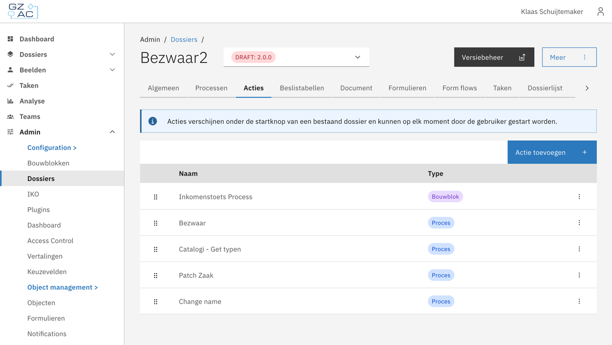

# Actions

Actions are the items that appear under the **Start** button on the case detail page. They let a user start additional
work on a running case — either a [process](processes.md) that is flagged as startable within an existing case, or an
ad-hoc [building block](../building-blocks/README.md).

The **Actions** tab in case configuration is the single place to manage both. From here an administrator can add,
remove, edit, and reorder the actions that end users see in a case.


Actions only cover items that are started _within an existing case_. Processes that start a new case are configured on
the [Processes](processes.md) tab.


## The Actions tab

* Go to **Admin** → **Cases** and open a case definition.
* Open the **Actions** tab.

The tab lists every configured action with its name and type (**Process** or **Building block**). The order of the list
matches the order in which the actions appear under the **Start** button on the case detail page.

<figure><figcaption>
Actions tab on a case definition
</figcaption></figure>

### Add an action

* Click **Add an action**.
* Choose **Process** or **Building block**.
* Select the process or building block (and version, for building blocks) from the list.
    * Processes shown here are those already linked to the case definition on the [Processes](processes.md) tab.
    * Building blocks shown here are building block definitions that are not yet linked to the case definition.
* For a building block, continue the wizard to configure:
    * **Plugin configuration mappings** — for each plugin type used by the building block.
    * **Input mapping** — from case document fields to building block document fields.
    * **Output mapping** — from building block document fields back to case document fields.
* Click **Save**.

## How end users see actions

On the case detail page the **Start** button opens a menu that lists all configured actions in the configured order.

* Clicking the **process** action will open the form configured in the process link configured on the process's start
  event.
* Clicking a **building block** action will open the form configured in the process link configured on the main
  process's start event. The instance runs its main process, and the configured output mapping writes results
  back to the case document.

Running and completed building block instances appear in the case's progress overview alongside the case processes.


A building block can only be used as an ad-hoc action when its main process has a start form process link on the
`StartEvent`. See [Building blocks — Start form](../building-blocks/README.md#start-form).

