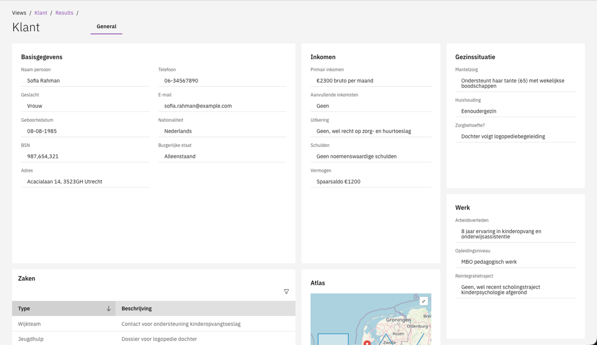

# 👤 IKO Client

The IKO Client module displays integrated customer and object data to case workers and provides a management interface for configuring the presentation.


This module requires an active IKO Server installation. The IKO Server is a separate component that retrieves data from backend sources.


## What is IKO?

IKO stands for **Integraal Klant- en Objectbeeld**. The purpose of IKO is to provide case workers with a complete overview of the customer or object for which a case is running.

IKO consists of two components:

| Component | Description                                                                                                                                              |
|-----------|----------------------------------------------------------------------------------------------------------------------------------------------------------|
| **IKO Server** | A separate application that retrieves data from multiple backend sources to build a complete view. The IKO Server has its own management interface. See the [IKO Server documentation](https://docs.integraal-klant-objectbeeld.nl/). |
| **IKO Client** | Implemented in Valtimo as a module. Displays the aggregated data to the case worker and provides a management interface for configuring the presentation. |

<figure><figcaption>
IKO detail screen with customer information displayed in widgets.
</figcaption></figure>

### Data sources

The IKO Server can retrieve data from various backend sources, such as:

- BRP (Basisregistratie Personen).
- KVK (Kamer van Koophandel).
- ZGW APIs (Zaakgericht Werken APIs).
- Domain registrations.

## Why use IKO?

When handling a case, case workers often need information from multiple systems to make informed decisions. Without IKO, they would need to switch between different applications and manually search for related information.

**Example: Processing a benefit application**

A case worker receives an application for special assistance (bijzondere bijstand). To assess the application, they need to verify:

- Personal details and address from BRP.
- Current income and employment status.
- Other running cases for this citizen (e.g., debt assistance, housing support).
- Previous contact moments and notes.

With IKO, all this information is aggregated and displayed on a single screen. The case worker selects the citizen, and immediately sees all relevant data organized in tabs and widgets.

**Other common use cases:**

- **Permit applications**: View property details, previous permits, and enforcement cases for an address.
- **Youth care**: See family composition, school information, and care history for a child.
- **Objections and appeals**: Review the original decision, related cases, and communication history.

## Accessing the IKO view

Case workers can access the IKO view in two ways:

1. **Manual search**: Via the search screen, the case worker can search using the configured search criteria. For example: BSN, surname + date of birth, or address.
2. **Direct link from case**: On the case detail screen, a widget can be configured with a button that opens the IKO view. The identifier (such as BSN or KVK number) is automatically passed from the case document.


Configuring a link from a case to an IKO view is done through the case detail tab configuration. See the [Case detail tabs](../cases/case-detail/tabs/README.md) documentation.


## In this section

| Page | Description |
|------|-------------|
| [Views](views.md) | Configure IKO Servers and Views. |
| [Search actions](search-actions.md) | Configure search actions for finding customers or objects. |
| [List](list.md) | Configure search result columns. |
| [Tabs](tabs.md) | Organize detail screen information into tabs. |
| [Widgets](widgets.md) | Configure data display widgets within tabs. |

## Quick start

1. Navigate to **Admin → IKO**.
2. Add an IKO Server with the server URL.
3. Create a View (e.g. "Customer BRP").
4. Configure Search Actions, List columns, and Tabs with Widgets.

## Related

* [Case detail tabs](../cases/case-detail/tabs/README.md)
