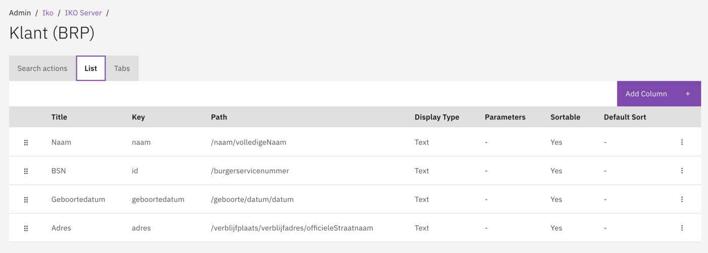
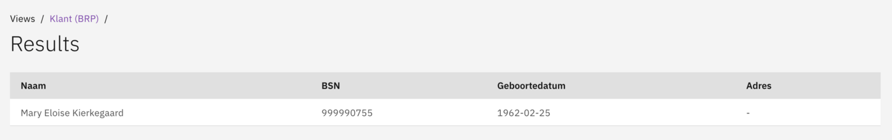

# List

Configure the columns displayed in search results.

## Overview

The List configuration determines which columns are shown in the search results table after a user performs a search. Each column displays data from a specific path in the search results.

## Configuration

### Configuring list columns

1. Navigate to **Admin → IKO**.
2. Select an IKO Server and View.
3. Go to the **List** section.
4. Add or edit columns.

<figure><figcaption>
Configure which columns appear in the search results.
</figcaption></figure>

| Field | Description |
|-------|-------------|
| Title | Column header text. |
| Key | Technical key. |
| Path | Data path (e.g. `/name/fullName`). |
| Display Type | Display type (Text, Date, etc.). |
| Parameters | Additional display parameters. |
| Sortable | Enable sorting on this column. |
| Default Sort | Use as default sort column. |

<figure><figcaption>
Search results displayed to case workers.
</figcaption></figure>

## Display types

| Type | Description |
|------|-------------|
| `text` | Standard text display. |
| `number` | Numeric display. |
| `date` | Date display (configurable format). |
| `datetime` | Date and time display. |
| `boolean` | Yes/No display. |
| `currency` | Currency display. |

## Related

* [Views](views.md)
* [Search actions](search-actions.md)
