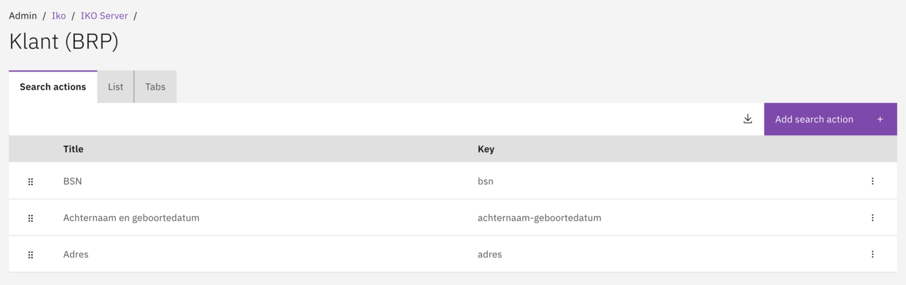
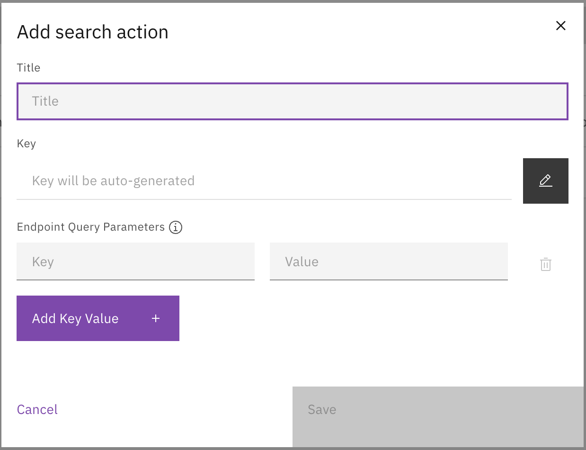
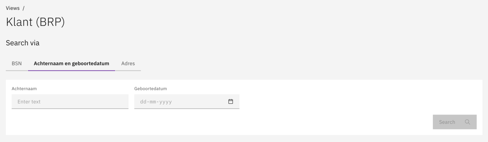

# Search actions

Configure search actions to define how users can search for customers or objects within a View.

## Overview

Search Actions define the available search methods for a View. Each Search Action provides a specific way to find records, such as searching by BSN, by name and date of birth, or by address.

### Examples of search actions

- BSN (search by Burgerservicenummer).
- Surname and date of birth.
- Address.
- KVK number.

## Configuration

### Adding a search action

1. Navigate to **Admin → IKO**.
2. Select an IKO Server and View.
3. Go to the **Search Actions** section.
4. Click **Add Search Action**.
5. Configure the search action and its fields.

<figure><figcaption>
Search actions configured for a View.
</figcaption></figure>

### Configuring search fields

For each Search Action, one or more search fields are configured:

| Field | Description |
|-------|-------------|
| Key | Technical key (e.g. `surname`). |
| Title | Display name (e.g. "Surname"). |
| Path | Data path in the query (e.g. `familyName`). |
| Data type | Type of data (see table below). |
| Field type | Input type (see table below). |
| Required | Whether the field is mandatory. |

<figure><figcaption>
Configure search fields with data type, field type, and validation.
</figcaption></figure>


The order of search fields can be adjusted via drag & drop.


<figure><figcaption>
The search screen as displayed to case workers.
</figcaption></figure>

## Data types

| Value | Description |
|-------|-------------|
| `text` | Text input. |
| `number` | Numeric input. |
| `date` | Date (without time). |
| `datetime` | Date with time. |
| `time` | Time only. |
| `boolean` | Yes/No choice. |
| `bsn` | Burgerservicenummer (with validation). |

## Field types

| Value | Description |
|-------|-------------|
| `single` | Single input field. |
| `range` | Range (from-to). |
| `single-select-dropdown` | Dropdown with single selection. |
| `multi-select-dropdown` | Dropdown with multiple selection. |

## Match types

| Value | Description |
|-------|-------------|
| `exact` | Exact match. |
| `like` | Partial match (contains). |

## Related

* [Views](views.md)
* [List](list.md)
