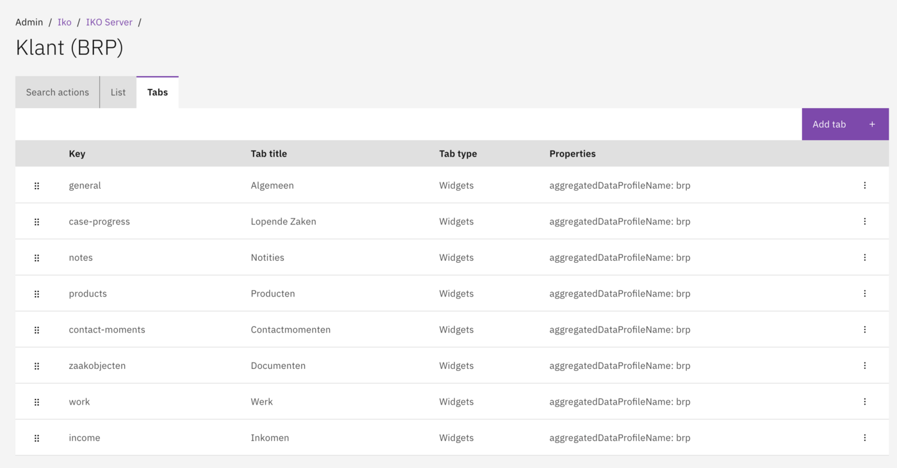
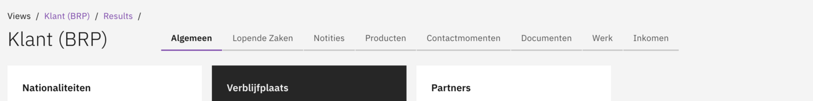

# Tabs

Organize detail screen information into logical groups using tabs.

## Overview

Tabs organize the information on the IKO detail screen into logical groups. Each tab contains one or more widgets that display the actual data. When a user opens a customer or object detail screen, they can navigate between tabs to view different categories of information.

### Examples of tabs

- General.
- Running Cases.
- Notes.
- Products.
- Contact Moments.
- Documents.
- Work.
- Income.

## Configuration

### Creating a tab

1. Navigate to **Admin → IKO**.
2. Select an IKO Server and View.
3. Go to the **Tabs** section.
4. Click **Add Tab**.
5. Configure the tab name.
6. Add widgets to the tab.

<figure><figcaption>
Tabs configured for a View.
</figcaption></figure>


The order of tabs can be adjusted via drag & drop.


<figure><figcaption>
Tabs displayed on the detail screen.
</figcaption></figure>

## Tab properties

| Field | Description                                          |
|-------|------------------------------------------------------|
| Key | Technical key (unique identifier).                   |
| Title | Display name of the tab.                             |
| Type | Tab type (only `widgets` is supported).              |
| Aggregated Data Profile Name | Name of the data profile for aggregation (optional). |

## Tab contents

Each Tab contains one or more Widgets. See [Widgets](widgets.md) for detailed configuration options.

## Related

* [Views](views.md)
* [Widgets](widgets.md)
