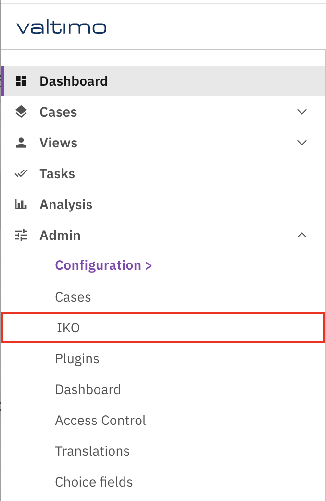
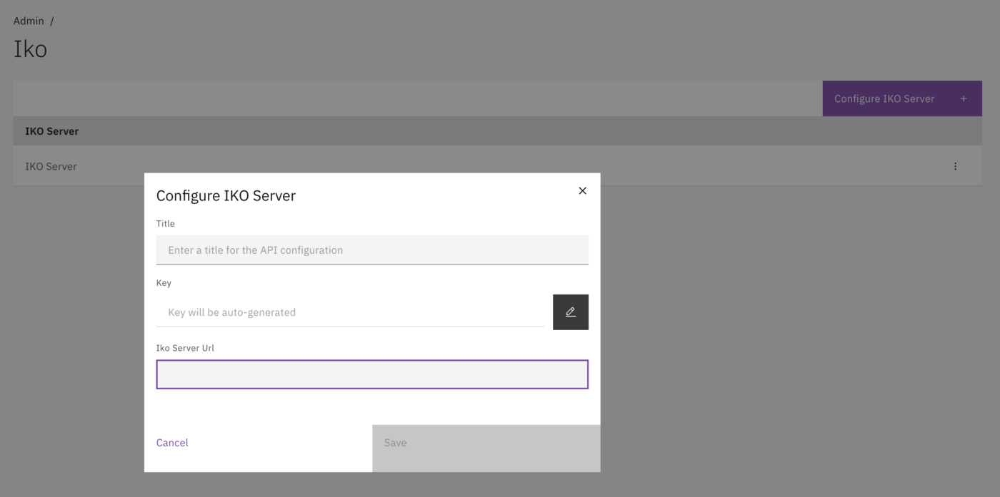
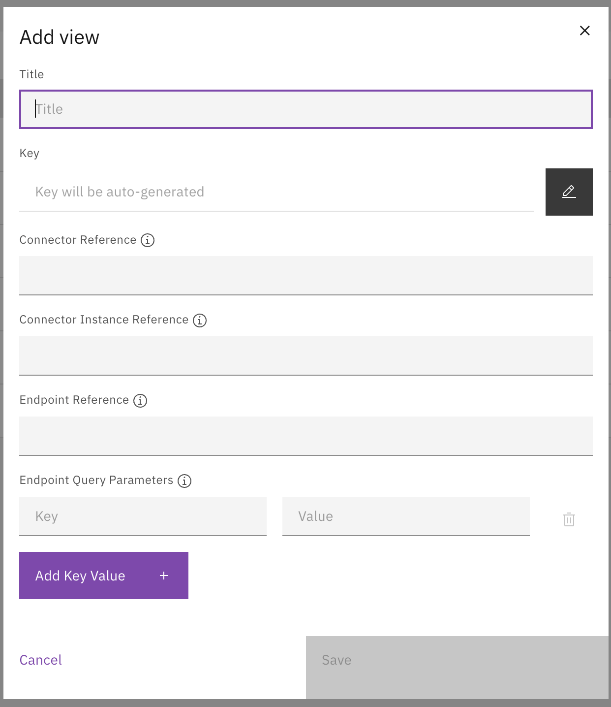

# Views

Configure IKO Servers and Views to connect to backend data sources and define how data is presented.

## Overview

A View represents a type of integrated view, for example "Customer (BRP)", "Object", or "Building". Before creating Views, an IKO Server must be configured. Multiple Views can be configured per IKO Server.

## Configuration

### Adding an IKO Server

1. Navigate to **Admin → IKO**.
2. Click **Add IKO Server**.
3. Configure the server properties.

<figure><figcaption>
Navigate to Admin → IKO to manage IKO Servers and Views.
</figcaption></figure>

| Field | Description |
|-------|-------------|
| Title | Display name for the IKO Server. |
| Key | Technical key (auto-generated, adjustable). |
| IKO Server URL | URL to the IKO Server. |

<figure><figcaption>
Configure the IKO Server connection.
</figcaption></figure>

### Creating a View

1. Select an IKO Server from the list.
2. Click **Add View**.
3. Configure the View properties.

<figure><figcaption>
Configure View properties including connector and endpoint settings.
</figcaption></figure>

## View properties

| Field | Description |
|-------|-------------|
| Title | Display name (e.g. "Customer BRP"). |
| Key | Technical key (e.g. `customer-brp`). |
| Connector Reference | Reference to the connector (e.g. `connector-in-iko`). |
| Connector Instance Reference | Instance reference (e.g. `connector-instance`). |
| Endpoint Reference | API endpoint on the IKO Server (e.g. `list_persons`). |
| Endpoint Query Parameters | Key-Value pairs for query parameters. |

## View components

Each View has three configurable components:

| Component | Description |
|-----------|-------------|
| **Search Actions** | Define how users can search within the View. |
| **List** | Configure columns for the search results table. |
| **Tabs** | Organize detail screen information into tabs with widgets. |

## Related

* [Search actions](search-actions.md)
* [List](list.md)
* [Tabs](tabs.md)
