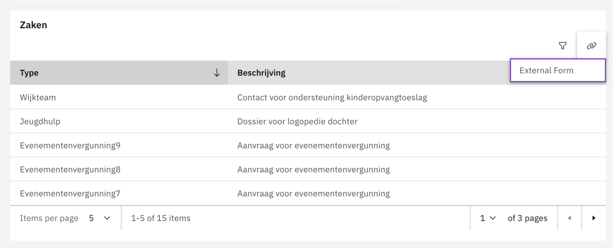
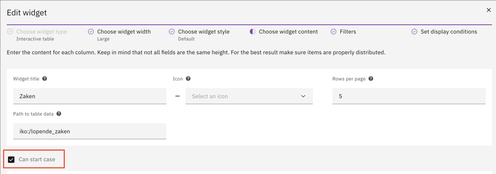
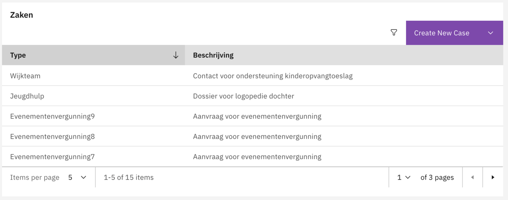

# Widgets

Configure data display widgets within tabs.

## Overview

Widgets display the actual data within a tab. Each widget can be configured with a specific type, layout, and data mapping. Widgets can also have display conditions to control when they are shown, and actions to allow users to perform operations.

The detail screen is divided into 4 columns. Each widget occupies a configurable number of columns, allowing you to create layouts with multiple widgets side by side.

## Widget types

| Type | Description | Example use |
|------|-------------|-------------|
| `fields` | Key-value fields in columns. | Customer data, Address. |
| `collection` | List of items with pagination. | Nationalities, Partners. |
| `table` | Data in table format. | Contact moments. |
| `interactive-table` | Table with sorting and filtering. | Running cases. |
| `map` | Geographic map display. | Location. |
| `divider` | Visual separation between widgets. | Grouping related widgets. |

<figure><figcaption><p>A fields widget displaying customer data.</p></figcaption></figure>

<figure><figcaption><p>An interactive table widget with sorting and a link action.</p></figcaption></figure>

## Configuration

### Widget configuration wizard

The widget configuration goes through 6 steps:

#### Step 1: Choose widget type

Select from: Fields, Collection, Table, Interactive table, or Map.

<figure><figcaption><p>Select the widget type.</p></figcaption></figure>

#### Step 2: Choose widget width

The screen is divided into 4 columns. Select how many columns the widget should span:

| Option | Columns | Description |
|--------|---------|-------------|
| Small | 1 | Quarter width. |
| Medium | 2 | Half width. |
| Large | 3 | Three-quarter width. |
| Extra large | 4 | Full width. |

<figure><figcaption><p>Select the widget width.</p></figcaption></figure>

#### Step 3: Choose widget density

| Option | Description |
|--------|-------------|
| Default | Normal spacing between elements. |
| Compact | Reduced spacing for more content in less space. |

<figure><figcaption><p>Select the widget density.</p></figcaption></figure>

#### Step 4: Choose widget style

| Option | Description |
|--------|-------------|
| Default | Normal display for regular content. |
| High contrast | Inverted colors for emphasis. In light mode the widget appears dark, in dark mode the widget appears light. |

<figure><figcaption><p>Select the widget style.</p></figcaption></figure>

#### Step 5: Choose widget content

Configure the widget title, icon, data path, and fields.

<figure><figcaption><p>Configure the widget content.</p></figcaption></figure>

**Widget properties:**

| Field | Description |
|-------|-------------|
| Widget title | Title displayed above the widget. |
| Icon | Optional icon (select from list). |

**Link action (optional):**

| Field | Description |
|-------|-------------|
| Target URL (with placeholders) | URL for link action. |
| Button label | Label for the link button. |

**Field configuration:**

| Field | Description |
|-------|-------------|
| Title | Label for a field row. |
| Display type | How the field value is displayed (e.g. Text, Date). |
| Value | Data path to the field value. |
| Ellipsis character limit | Maximum characters before truncation (optional). |
| Hide when empty | Hide the field when value is empty. |

#### Step 6: Set display conditions

Configure conditions that determine when the widget is shown. If multiple conditions are configured, all must be met for the widget to display.

<figure><figcaption><p>Configure display conditions.</p></figcaption></figure>

| Field | Description |
|-------|-------------|
| Path | Data path for the condition. |
| Operator | Comparison operator (e.g. Equal to, Not equal to, Greater than). |
| Value | Value to compare against. |

### JSON editor

For advanced configuration, switch to the JSON editor. The JSON editor allows direct editing of the widget configuration.

<figure><figcaption><p>Switch between visual editor and JSON editor.</p></figcaption></figure>

## Widget order

The order of widgets within a tab can be adjusted via drag & drop. Widgets are displayed from left to right, top to bottom, filling the available columns.

<figure><figcaption><p>Reorder widgets via drag & drop.</p></figcaption></figure>

## Dividers

A divider is a special widget type that creates visual separation between groups of widgets. Add a divider from the widget list to create a horizontal line spanning the full width.

<figure><figcaption><p>A divider separating two groups of widgets.</p></figcaption></figure>

## Widget actions

Actions add buttons to a widget that allow users to perform operations. Actions appear in the top-right corner of the widget.

### Action types

| Type           | Description |
|----------------|-------------|
| Link           | Navigate to a URL. |
| Can start case | Show a dropdown with available case definitions. User selects one and the start form opens. |

### Configuring a link action

Link actions navigate the user to a specified URL. The URL can contain placeholders to include dynamic data.

<figure><figcaption><p>Configure a link action with URL and button label.</p></figcaption></figure>
<figure><figcaption><p>Configure a link action with URL and button label.</p></figcaption></figure>

| Field | Description |
|-------|-------------|
| Link-URL (with variables) | The target URL. Use placeholders like `${iko:/person/bsn}` for dynamic values. |
| Button label | The text displayed on the button. |

**Example configuration:**

| Field | Value |
|-------|-------|
| Link-URL (with variables) | `https://example.com/details/${iko:/person/bsn}` |
| Button label | View details |

### Configuring can start case

The "Can start case" action displays a button with a dropdown menu. The dropdown shows all available GZAC case definitions. When the user selects a case definition, the start form for that case opens.

Enable this action by setting `canStartCase` to `true` in the widget properties.

<figure><figcaption><p>Configure a link action with URL and button label.</p></figcaption></figure>
<figure><figcaption><p>Configure a link action with URL and button label.</p></figcaption></figure>

## Display properties (optional)

Display properties control how field values are rendered. If not specified, values are displayed as plain text.

| Type | Parameters | Description |
|------|------------|-------------|
| `text` | `hideWhenEmpty` | Standard text display. |
| `number` | `hideWhenEmpty` | Numeric display. |
| `date` | `format`, `hideWhenEmpty` | Date display. |
| `datetime` | `format`, `hideWhenEmpty` | Date and time display. |
| `boolean` | `hideWhenEmpty` | Yes/No display. |
| `currency` | `hideWhenEmpty` | Currency display. |
| `percent` | `hideWhenEmpty` | Percentage display. |
| `link` | `hideWhenEmpty` | Hyperlink display. |

### Date formats

| Pattern | Description | Example |
|---------|-------------|---------|
| `DD-MM-YYYY` | Day-Month-Year. | 31-12-2024 |
| `YYYY-MM-DD` | Year-Month-Day. | 2024-12-31 |
| `DD/MM/YYYY` | Day/Month/Year. | 31/12/2024 |

## Value resolvers

Values in widgets are retrieved using the `iko:` prefix, which indicates the value should be retrieved from the IKO data context.

| Pattern | Description |
|---------|-------------|
| `iko:/path/to/field` | Absolute path from the root context. |
| `/path/to/field` | Relative path within a collection item. |

**Examples:**

```
iko:/person/name/fullName          → Retrieves full name from person data.
iko:/person/burgerservicenummer    → Retrieves BSN from person data.
/nationality/description           → Retrieves description within a nationality item.
```

## Display conditions

Display conditions determine when a widget is shown based on data values. If multiple conditions are configured, all must be met.

| Field | Description |
|-------|-------------|
| Path | Data path for the condition. |
| Operator | Comparison operator (e.g. Equal to, Not equal to, Greater than). |
| Value | Value to compare against. |

**Example:** Only show a widget when the person has Dutch nationality:

| Field | Value |
|-------|-------|
| Path | `iko:/person/nationality/code` |
| Operator | `==` |
| Value | `NL` |

## Related

* [Tabs](tabs.md)
* [Views](views.md)
