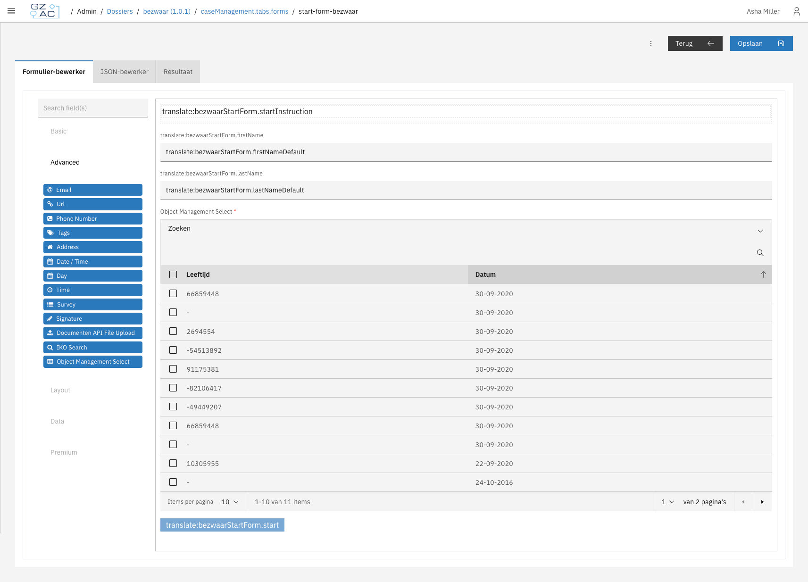
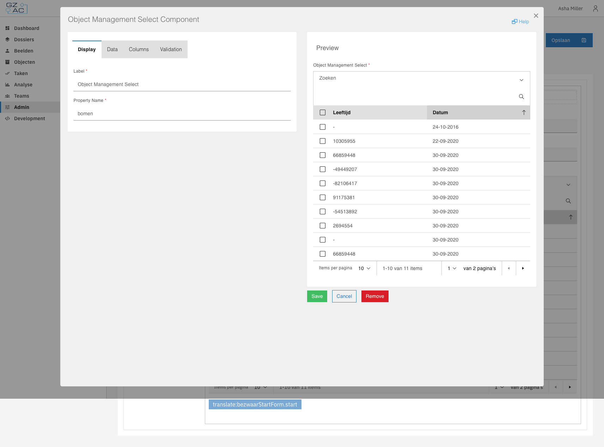
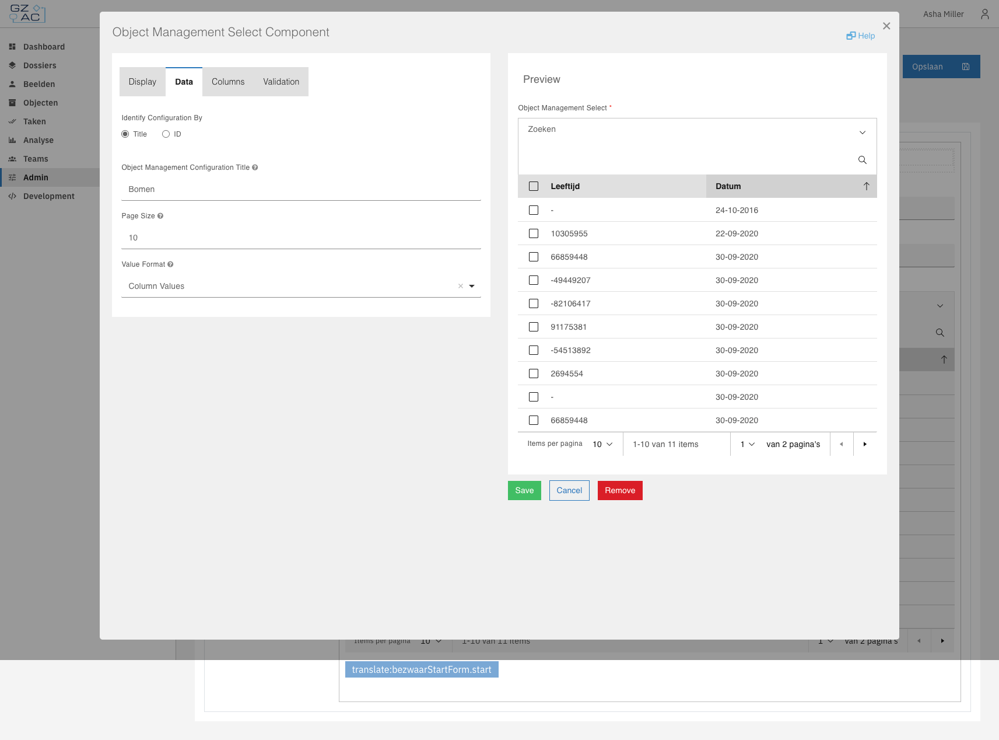
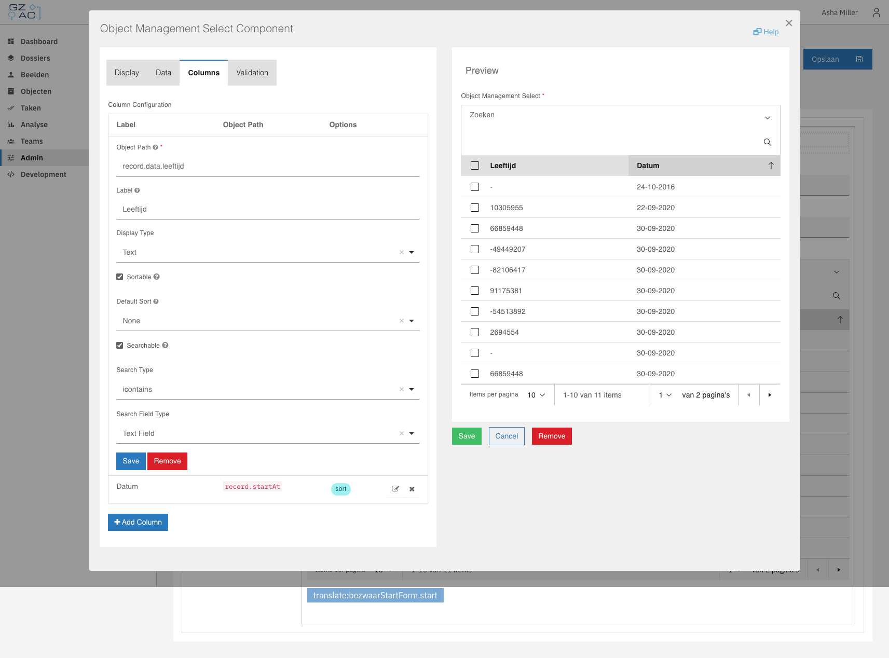
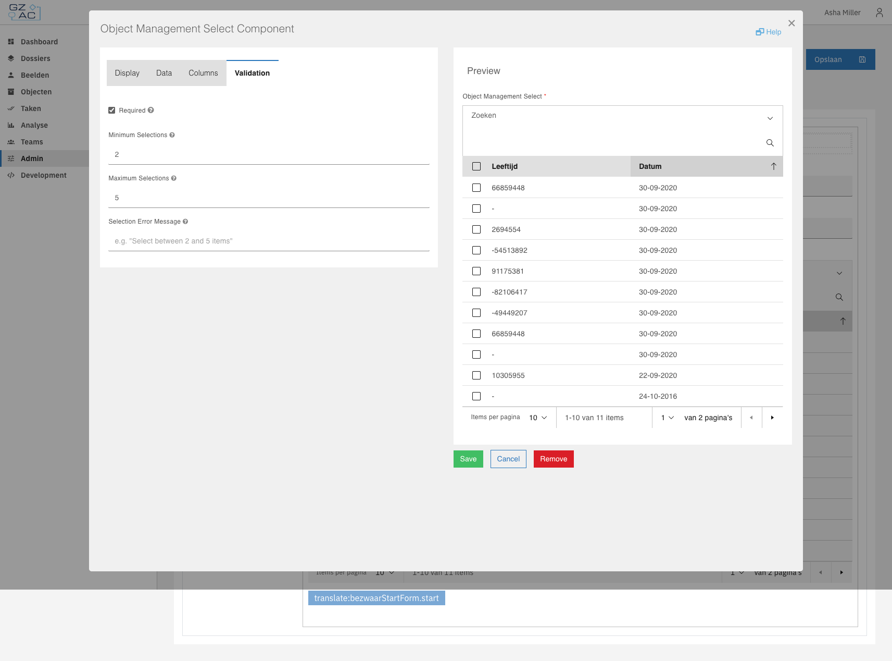
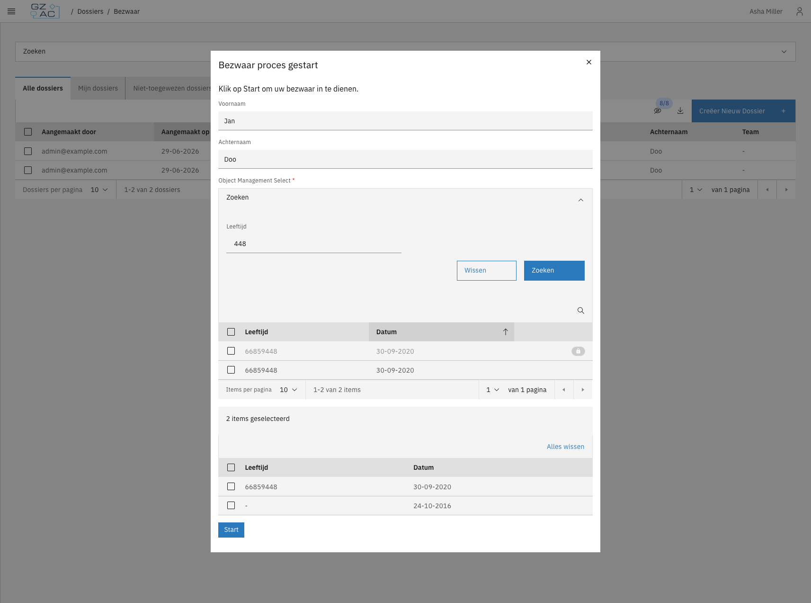

# Object Management Select

The **Object Management Select** component allows users to select one or more objects from an Object Management
configuration directly within a Form.io form.


This component requires:
* An Object Management configuration linked to an Objecten API
* Objects available in the configured Objecten API


## Adding to a form

1. Open a form in the Form.io builder
2. Drag **Object Management Select** from the "Advanced" components panel
3. Configure the component in the edit dialog



## Configuration

The component edit dialog is organized into four tabs: Display, Data, Columns, and Validation.

### Display tab



| Setting | Description |
|---------|-------------|
| **Label** | Field label displayed above the component |
| **Property Name** | Form field key used when submitting data |

### Data tab



| Setting | Description |
|---------|-------------|
| **Identifier Type** | Choose **Title** (configuration title) or **ID** (configuration UUID) |
| **Object Management Title** | Title of the Object Management configuration (when using Title) |
| **Object Management ID** | UUID of the configuration (when using ID) |
| **Page Size** | Number of objects per page (default: 20) |
| **Value Format** | What to store: `id` (UUID only), `full` (entire object), `columns` (configured column values) |

### Columns tab



Configure which object properties to display as table columns.

| Setting | Description |
|---------|-------------|
| **Path** | Object path (e.g., `record.data.name`, `record.startAt`, `uuid`) |
| **Label** | Column header (supports translation keys) |
| **Display Type** | `text`, `date`, or `boolean` |
| **Sortable** | Enable column sorting (only for `record.*` paths) |
| **Default Sort** | Initial sort direction: `none`, `asc`, `desc` |
| **Searchable** | Enable filtering (only for `record.data.*` paths) |
| **Search Type** | Filter operator: `exact`, `icontains`, `gte`, `lte`, `range`. Use `range` only with the `dateRange` field type |
| **Search Field Type** | Input type: `text`, `dropdown`, `date`, `dateRange` |
| **Search Dropdown Options (JSON)** | JSON array of `{"value": ..., "label": ...}` options; shown when Search Field Type is `dropdown` |


Due to Objecten API limitations, sorting is only supported for paths starting with `record.` (e.g., 
`record.data.status`, `record.startAt`) and searching is only supported for paths starting with `record.data.`.


### Validation tab



| Setting | Description |
|---------|-------------|
| **Required** | At least one selection required |
| **Minimum selections** | Minimum number of objects that must be selected |
| **Maximum selections** | Maximum number of objects that can be selected. Once reached, the Add button is disabled |
| **Selection Error Message** | Custom message shown when the minimum/maximum selection requirements are not met |

## Value formats

The **Value Format** setting determines what data is stored when the form is submitted:



Stores only the object UUIDs:
```json
[
  {"id": "095be615-a8ad-4c33-8e9c-c7612fbf6c9f"},
  {"id": "a1b2c3d4-e5f6-7890-abcd-ef1234567890"}
]
```



Stores the complete object wrapper including all record data:
```json
[
  {
    "id": "095be615-a8ad-4c33-8e9c-c7612fbf6c9f",
    "url": "https://objecten.api/objects/095be615...",
    "uuid": "095be615-a8ad-4c33-8e9c-c7612fbf6c9f",
    "type": "https://objecttypen.api/objecttypes/1",
    "record": {
      "index": 1,
      "data": {"name": "Example", "status": "active"},
      "startAt": "2024-01-01",
      "registrationAt": "2024-01-01"
    }
  }
]
```



Stores the object pruned down to only the configured columns, keeping the same nested structure as `full`.
A value bound to a path such as `record.data.name` therefore reads identically whether the format is `full`
or `columns`, and columns sharing a final segment (e.g. `record.data.address.name` and
`record.data.contact.name`) stay distinct:
```json
[
  {"id": "095be615...", "record": {"data": {"name": "Example", "status": "active"}}},
  {"id": "a1b2c3d4...", "record": {"data": {"name": "Another", "status": "pending"}}}
]
```



## Translations

Column labels support translation keys. Enter a key like `objectColumns.name` in the Label field, and it resolves
using the configured translation resources.

## Using the component

When rendered in a form, the component displays two tables:
- **Available objects** — paginated list with sorting and filtering
- **Selected objects** — accumulated selections that will be stored



Objects that are already selected appear with a lock icon in the available objects table and cannot be re-added.

When the **Value Format** is `id`, the selected objects table shows a single **ID** column (only the UUID is stored,
so the configured columns would otherwise be empty). For `full` and `columns` the configured columns are shown.

## Access control

When Object Management Permission Based Access Control (PBAC) is enabled
(`valtimo.object-management.authorization.enabled=true`), the component requires both `view` and `view_list`
permissions on the Object Management configuration. Users without the required permissions see an empty table
(silent denial).

See [Access control](access-control.md) for permission details and configuration.
