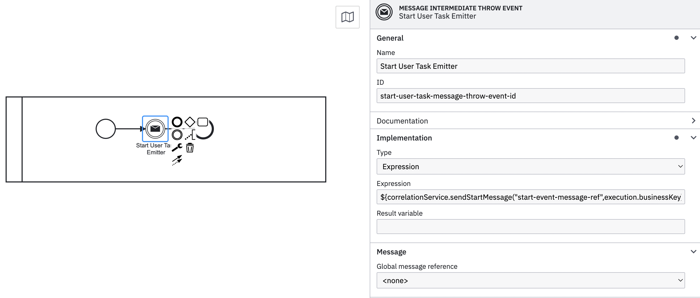
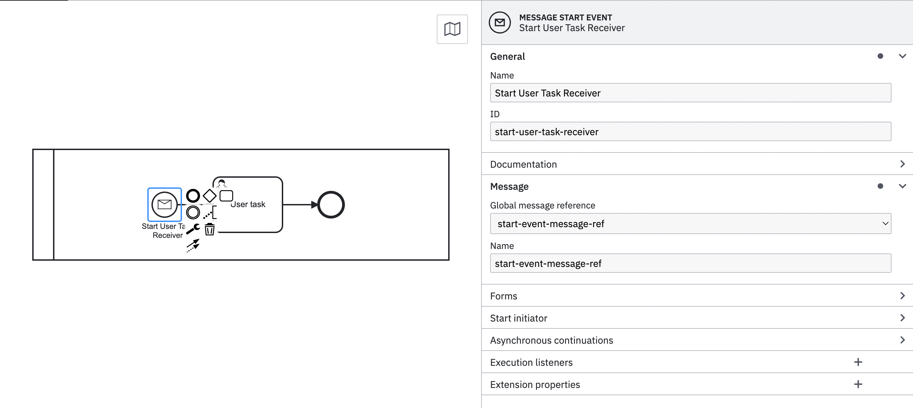

# Correlating messages

When modeling a process, correlating a message (e.g. to start another process) does not do anything by default. Valtimo offers several methods to facilitate message correlation. These can be separated into starting a process (Message Start Events) and receiving messages in a running process (Message Boundary Events and Message Intermediate Catch Events).

## How to use

Valtimo provides several methods that can be used inside a BPMN, accessible through the `correlationService` bean. Which method to use depends on the use case. For more information on the separate use cases see the three sections below.

These methods can be used in expressions applied to message throw events like this:



The first argument is the key of the message that should be sent. In this example, there should also be a message start event that waits for this particular message, like so:



### Correlating start events

As shown in the example above, Valtimo provides a `sendStartMessage` method. The following variations are possible:

```kotlin
fun sendStartMessage(message: String, businessKey: String): MessageCorrelationResult
fun sendStartMessage(message: String, businessKey: String, vararg variables: Any?): MessageCorrelationResult
fun sendStartMessage(message: String, businessKey: String, variables: Map<String, Any?>?): MessageCorrelationResult
fun sendStartMessageWithProcessDefinitionKey(message: String, targetProcessDefinitionKey: String, businessKey: String)
fun sendStartMessageWithProcessDefinitionKey(message: String, targetProcessDefinitionKey: String, businessKey: String, vararg variables: Any?)
fun sendStartMessageWithProcessDefinitionKey(message: String, targetProcessDefinitionKey: String, businessKey: String, variables: Map<String, Any?>?)
```

Variables passed on will be stored as process variables for the process. Providing a target process definition key means the message will be correlated to a process definition matching that process definition key.

### Correlating message catch events

There are different ways to correlate message catch events. Either correlating a single message to a single catch event, or correlating a single message to any number of catch events. These methods correlate within the same case (by business key). To correlate across all cases, see the next section. Valtimo supports both of these ways through the `sendCatchEventMessage` and `sendCatchEventMessageToAll` methods. The following variations are possible:

```kotlin
fun sendCatchEventMessage(message: String, businessKey: String): MessageCorrelationResult
fun sendCatchEventMessage(message: String, businessKey: String, vararg variables: Any?): MessageCorrelationResult
fun sendCatchEventMessage(message: String, businessKey: String, variables: Map<String, Any?>?): MessageCorrelationResult

fun sendCatchEventMessageToAll(message: String, businessKey: String): List<MessageCorrelationResult>
fun sendCatchEventMessageToAll(message: String, businessKey: String, vararg variables: Any?): List<MessageCorrelationResult>
fun sendCatchEventMessageToAll(message: String, businessKey: String, variables: Map<String, Any?>?): List<MessageCorrelationResult>
```

Variables passed on will be stored in the process. The provided business key will correlate the message to events with process instances matching that business key.

### Correlating message catch events globally

To correlate messages across all process instances regardless of which case they belong to, use the `sendGlobalCatchEventMessage` and `sendGlobalCatchEventMessageToAll` methods. These work the same as their non-global counterparts but without a business key filter:

```kotlin
fun sendGlobalCatchEventMessage(message: String): MessageCorrelationResult
fun sendGlobalCatchEventMessage(message: String, vararg variables: Any?): MessageCorrelationResult
fun sendGlobalCatchEventMessage(message: String, variables: Map<String, Any?>?): MessageCorrelationResult

fun sendGlobalCatchEventMessageToAll(message: String): List<MessageCorrelationResult>
fun sendGlobalCatchEventMessageToAll(message: String, vararg variables: Any?): List<MessageCorrelationResult>
fun sendGlobalCatchEventMessageToAll(message: String, variables: Map<String, Any?>?): List<MessageCorrelationResult>
```

Since no business key is provided, these methods will not create a process-document association — though this is only relevant in uncommon cases where a process is started outside the normal flow, in which case managing that association is the responsibility of the caller.

### Correlating to a whole case, including its building blocks

The methods above correlate on a single business key. A building block runs under its own document id as business key, so `sendCatchEventMessageToAll` with the case business key does not reach the building blocks of that case. Use `sendCatchEventMessageToCase` to deliver a message to **every** running process of a case — the case's own processes and all of its building blocks, including nested ones:

```kotlin
fun sendCatchEventMessageToCase(message: String, execution: DelegateExecution): List<MessageCorrelationResult>
fun sendCatchEventMessageToCase(message: String, execution: DelegateExecution, vararg variables: Any?): List<MessageCorrelationResult>
fun sendCatchEventMessageToCase(message: String, execution: DelegateExecution, variables: Map<String, Any?>?): List<MessageCorrelationResult>

fun sendCatchEventMessageToCase(message: String, caseDocumentId: String): List<MessageCorrelationResult>
fun sendCatchEventMessageToCase(message: String, caseDocumentId: String, vararg variables: Any?): List<MessageCorrelationResult>
fun sendCatchEventMessageToCase(message: String, caseDocumentId: String, variables: Map<String, Any?>?): List<MessageCorrelationResult>
```

The `execution` variants derive the case from the sending process, so they work from a case process, an ad-hoc process and from within a building block — letting a building block message its siblings and the case. The `caseDocumentId` variants target a specific case, for example a related one; a building block document id is accepted too and is resolved to the case that owns it.

A building block whose main process starts with a message start event can be started for a case with `sendStartMessageToCase`:

```kotlin
fun sendStartMessageToCase(message: String, execution: DelegateExecution): List<ProcessInstance>
fun sendStartMessageToCase(message: String, execution: DelegateExecution, vararg variables: Any?): List<ProcessInstance>
fun sendStartMessageToCase(message: String, execution: DelegateExecution, variables: Map<String, Any?>?): List<ProcessInstance>

fun sendStartMessageToCase(message: String, caseDocumentId: String): List<ProcessInstance>
fun sendStartMessageToCase(message: String, caseDocumentId: String, vararg variables: Any?): List<ProcessInstance>
fun sendStartMessageToCase(message: String, caseDocumentId: String, variables: Map<String, Any?>?): List<ProcessInstance>
```

Every building block linked to the case definition that declares a start event with that name is started, in the version the case link pins rather than the latest deployed one. Do not use `sendStartMessage` to start a building block: it always resolves the latest version, which may not be the one the case uses.

Delivery is a fan-out, so use a distinct message name per intent and do not reuse a name between a catch event and a start event. When no process of the case is subscribed, an empty list is returned and a warning is logged; the sending process continues.

See the [building block documentation](../building-blocks/README.md#send-a-message-to-a-case) for a worked example.
