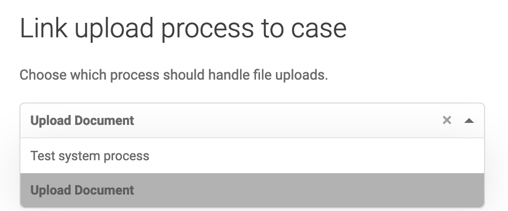
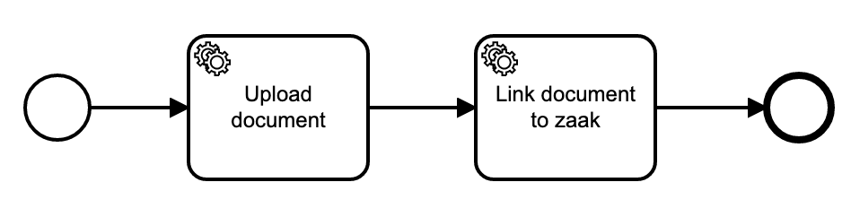
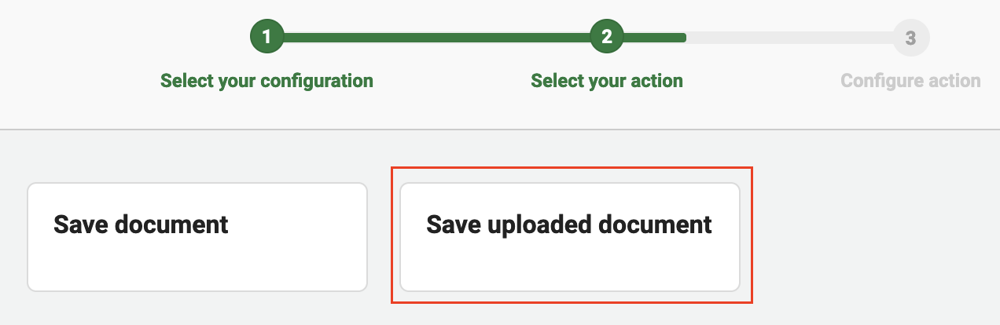
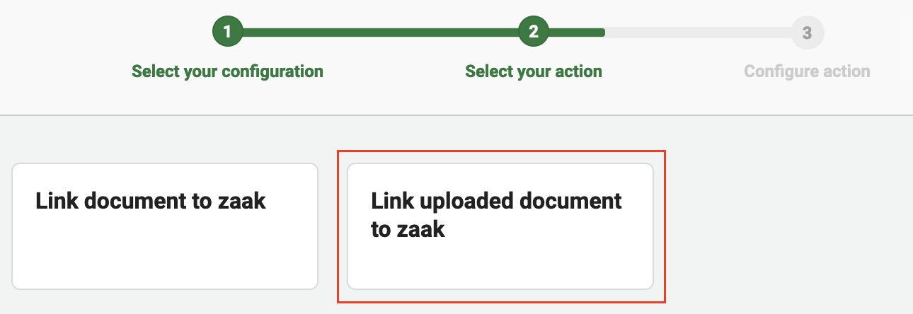
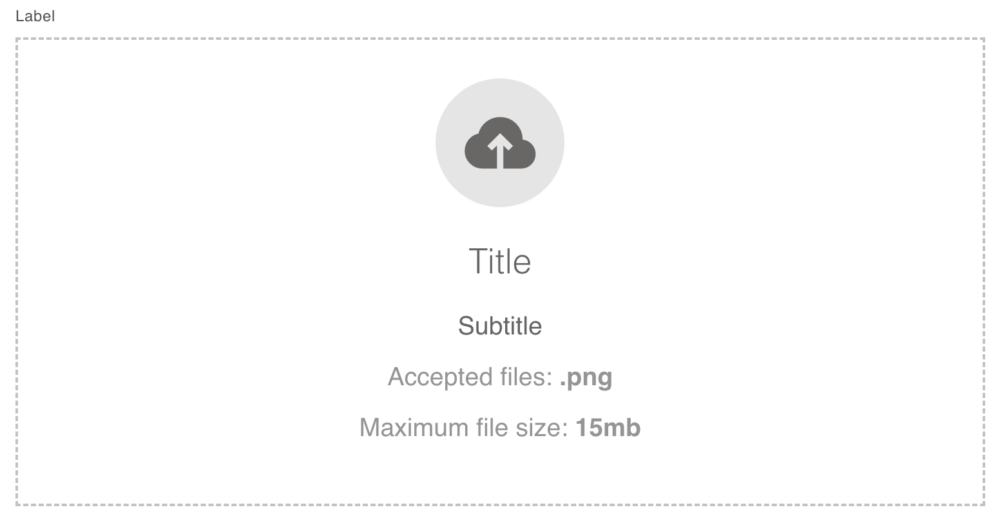
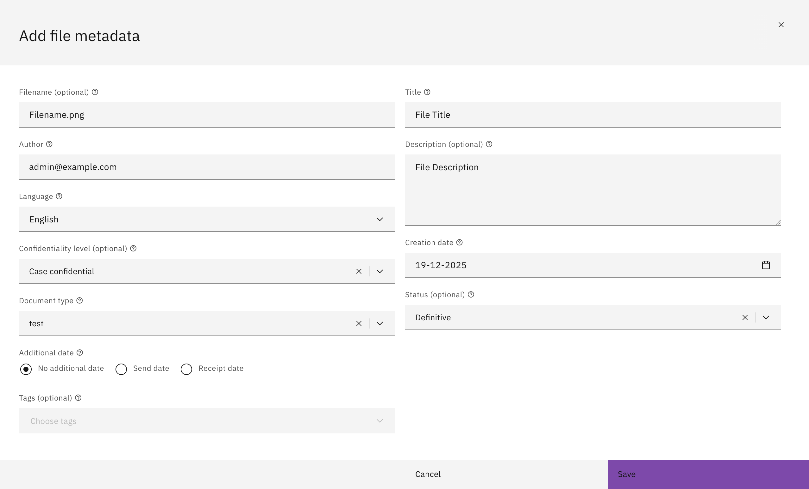

# Uploading to Documenten API with metadata

The Documenten API is an API for storage and disclosure of documents and associated metadata. Valtimo supports uploading files to the Documenten API with the option to input metadata through a dedicated tab on the detail page of a case instance, or through a custom Form.IO component.

## Configuring the Documenten API tab

To enable the dedicated Documenten API tab in an implementation, set `uploadProvider` in the implementation's environment file to `UploadProvider.DOCUMENTEN_API`. The documents tab on a case detail page will now show the Documenten API uploader.

## Configuring the Documenten API Form.IO upload component

In order to make the Documenten API File Upload component available in Form.IO forms in your implementation, import `registerDocumentenApiFormioUploadComponent` from `@valtimo/components` in your app module and move it into the `AppModule` constructor like so:

#### **`app.module.ts`**

```typescript
...
import {
  ...
  registerDocumentenApiFormioUploadComponent,
} from '@valtimo/components';

...
export class AppModule {
  constructor(injector: Injector) {
      ...
      registerDocumentenApiFormioUploadComponent(injector);
  }
}
```

Afterwards, the component is available under the advanced section in the form builder.

## Configuring the Case 'upload process'

When a document is uploaded to a case, the 'upload process' connected to the case definition will be started to handle the upload. The upload process needs to be configured on the case page:

1. Open the menu 'Admin'.
2. Go to the page 'Cases'.
3. Select the case definition you want to configure the upload process to use the Documenten API for.
4. Link the upload process under section 'Link upload process to case'.
5. Select the 'Upload Document', or select any custom process that can handle uploads.



## Required plugins

Make sure that the following plugins are configured.

* An authentication plugin (e.g.: OpenZaak plugin)
* Documenten API plugin
* Zaken API plugin
* Catalogi API plugin

## Configuring the Upload Document process

Every Valtimo implementation comes with a system process called 'Upload Document'. This process is meant to handle most generic document uploads. The Upload Document process look like this:



By default, the Upload Document process does not do anything, so it will not upload anything yet. The process needs to be configured first.

Process links can be used to configure the Upload Document process. The first service task called 'Upload document' can be linked to a Documenten API plugin action called 'Save uploaded document'. Look [here](../zgw-plugins/configure-documenten-api-plugin.md) for more information.



Configuring the first service task of the Upload Document process is enough to let Valtimo users upload their documents to the Documenten API in Valtimo. But the documents will not be visible yet in case information within Valtimo. This is because the document has not been linked to any zaak.

The second service task in the Upload Document process is called 'Link uploaded document to zaak'. The Zaken API plugin can take care of this action. Look [here](../zgw-plugins/configure-zaken-api-plugin.md) for more information.



## Using the Documenten API File Upload FormIO component in user tasks

In the form builder you will find the Documenten API File Upload component under the advanced section.
To use it, simply drag and drop the component into your form and configure the properties as described below.

The following properties can be configured:
### Documenten API File Upload dropzone

This is the dropzone that will be shown to the user in a user task, which can be customized by configuring the following properties:
- **Label**: The label displayed for the component. ***(required)***
- **Required**: Whether the component is required.
- **Property Name**: The path to save the reference to the uploaded document in the case data. ***(required)***
- **Title**: The title of the component, shown in the dropzone of the uploader.
- **Hide Title**: Whether to hide the title of the component.
- **Subtitle**: The subtitle of the component, shown below the title.
- **Maximum file size**: The maximum file size in MB. ***(required)***
- **Hide maximum file size**: Whether to hide the maximum file size.
- **Allow camera uploads**: Whether to allow uploads from a camera connected to the device.
- **Disabled**: Whether the component is disabled.
- **Accepted file types**: The accepted file types in a comma-separated string.
- **Hide accepted file types**: Whether to hide the accepted file types.
- **Document URL**: The process variable name for saving the URL of the uploaded document.
### Metadata modal

When a user uploads a document, a metadata modal is displayed.
This modal allows additional document metadata which can be customized by configuring the following properties:
### Filename
- **Default filename**: The default filename of the uploaded document without file extension.
- **Disable filename input**: Whether to disable the filename input for the upload modal.
- **Hide filename input**: Whether to hide the filename input for the upload modal.
### Document title
- **Default document title**: The default title of the uploaded document.
- **Disable document title input**: Whether to disable the document title input for the upload modal.
- **Hide document title input**: Whether to hide the document title input for the upload modal.
### Author
- **Default author**: The default author of the uploaded document.
- **Disable author input**: Whether to disable the author input for the upload modal.
- **Hide author input**: Whether to hide the author input for the upload modal.
### Description
- **Default description**: The default description of the uploaded document.
- **Disable description input**: Whether to disable the description input for the upload modal.
- **Hide description input**: Whether to hide the description input for the upload modal.
### Language
- **Default language**: The default language of the uploaded document.
- **Disable language input**: Whether to disable the language input for the upload modal.
- **Hide language input**: Whether to hide the language input for the upload modal.
### Confidentiality level
- **Default confidentiality level**: The default confidentiality level of the uploaded document.
- **Disable confidentiality level input**: Whether to disable the confidentiality level input for the upload modal.
- **Hide confidentiality level input**: Whether to hide the confidentiality level input for the upload modal.
### Creation date
- **Disable creation date input**: Whether to disable the creation date input for the upload modal.
- **Hide creation date input**: Whether to hide the creation date input for the upload modal.
### Information object type
- **Default informatieobjecttype url**: The default url of the information object type of the uploaded document.
- **Disable information object type url input**: Whether to disable the information object type url input for the upload modal.
- **Hide information object type url input**: Whether to hide the information object type url input for the upload modal.
### Status
- **Default status**: The default status of the uploaded document.
- **Disable status input**: Whether to disable the status input for the upload modal.
- **Hide status input**: Whether to hide the status input for the upload modal.
### Additional date
- **Hide additional date inputs**: Whether to hide the additional date inputs for the upload modal.
### Tags
- **Default tags**: The default tags of the uploaded document.
- **Hide tags input**: Whether to hide the tags input for the upload modal.

