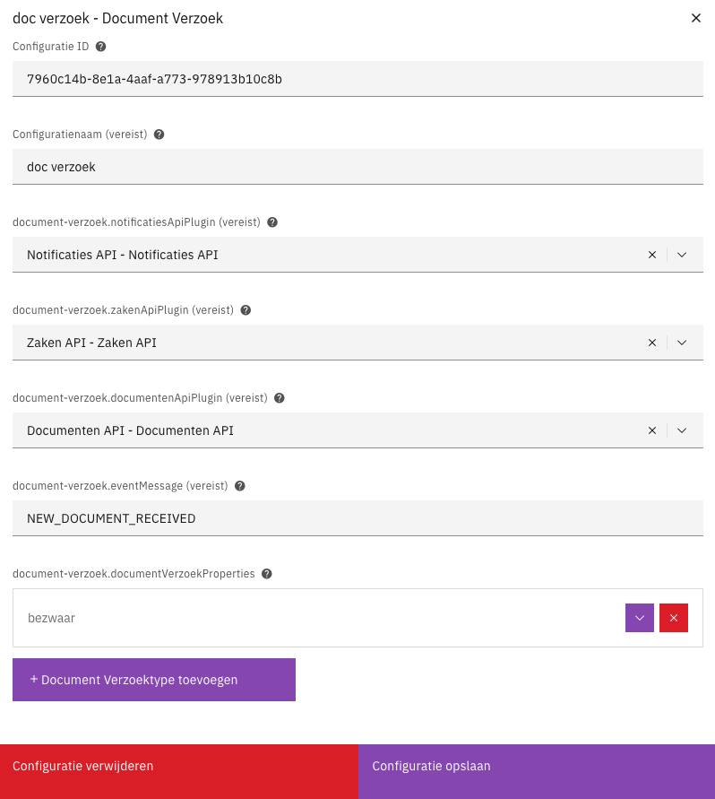
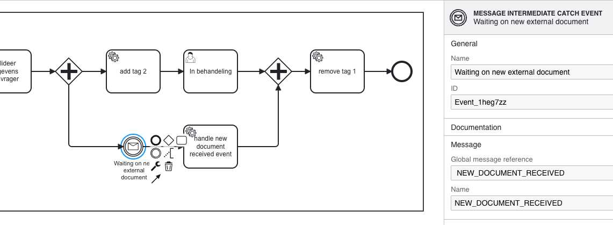

# Verzoek Plugin

The Document Verzoek plugin is used to receive and process events from the Notification API when new documents are added to a GZAC Zaak outside the GZAC application. Once the notification is received, the event message is correlated to the appropriate BPMN message catch event for further processing.
## How does the plugin work

The lifecycle of a verzoek is as follows:

1. An external application (e.g. KOFAX) uploads a document to Open Zaak, links it to a Zaak, and publishes a corresponding notification to the Notification API.
2. Open Notifications forwards the notification to the subscribed applications.
3. In GZAC 
   1. A Notifications Resource in Valtimo receives the notification and triggers a generic event indicating that a notification was received from Open Notificaties.
   2. This event is processed by the DocumentVerzoekPluginEventListener, using the configuration stored in the DocumentVerzoek plugin. 
   3. The DocumentVerzoekPluginEventListener retrieves the ZaakInformatieObject and InformatieObject and includes them in a message correlation. 
   4. The DocumentVerzoekPluginEventListener correlates the message. 
   5. The correlated message is then handled in BPMN by a Message Catch Event.

## Configure the plugin

A plugin configuration is required before the DocumentVerzoekPluginEventListener can be used. A general description on how to configure plugins can be found [here](../../plugins/configure-plugin.md).

If the Document Verzoek plugin is not visible in the plugin menu, it is possible the application is missing a dependency. Instructions on how to add the Document Verzoek Plugin dependency can be found [here](../../../fundamentals/getting-started/modules/zgw/document-verzoek.md).

To configure this plugin the following properties have to be entered:

* **Notification API plugin (`notificatiesApiPluginConfiguration`).** Reference to another plugin configuration that will be used to receive a notification when a new document verzoek is made.
* **Zaken API plugin (`zakenApiPlugin`).** Reference to the Zaken plugin configuration that will be used to retrieve the **ZaakInformatieObject**.
* **Documenten API plugin (`documentenApiPlugin`).** Reference to another plugin configuration that will be used to retrieve the **InformatieObject**.
* **Event Message name (`eventMessage`).** The name of the event message of the verzoek object.
* **Verzoek types (`documentVerzoekProperties`).** The Document verzoek plugin can be configured to handle multiple case types.
  * **Type (`type`).** The type of the document verzoek. This type should match the type that is inside the document verzoek notification verzoek in property `hoofdObject`.

An example of plugin configuration:

## Example process
The process below shows an example how a task can is activated when the Document Verzoek plugin event listener publishes the event that includes the InformatieObject and ZaakInformatieObject.     

* The event includes the following process variables:
  * `pv:informationObject`
  * `pv:zaakInformatieObject`

