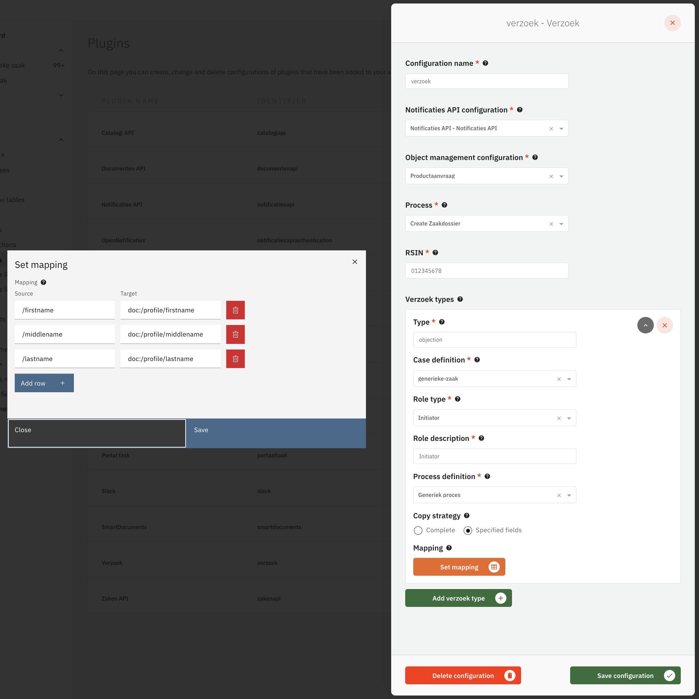
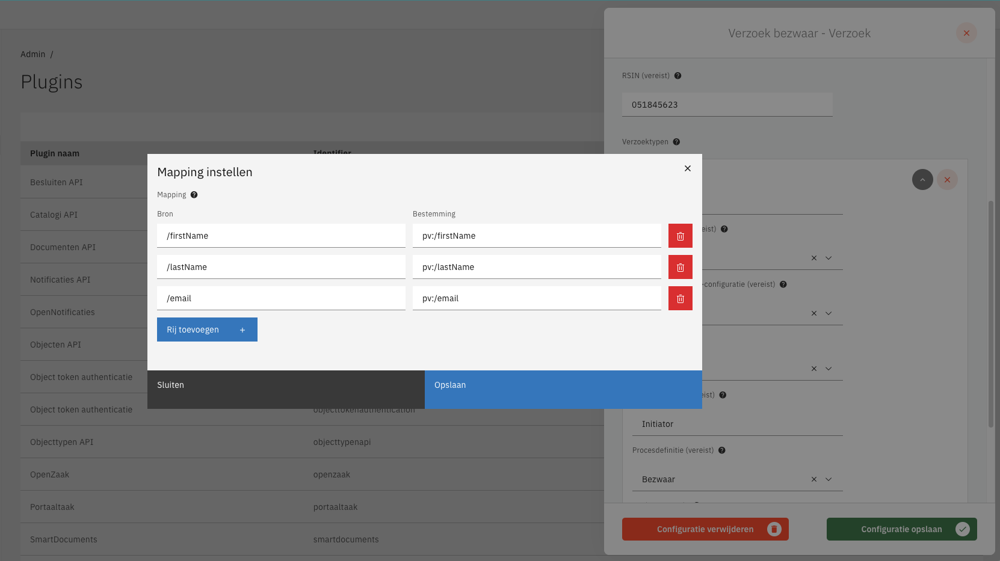
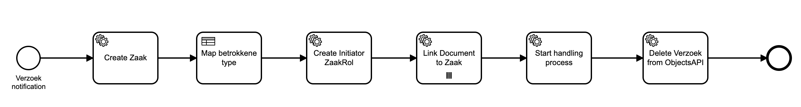
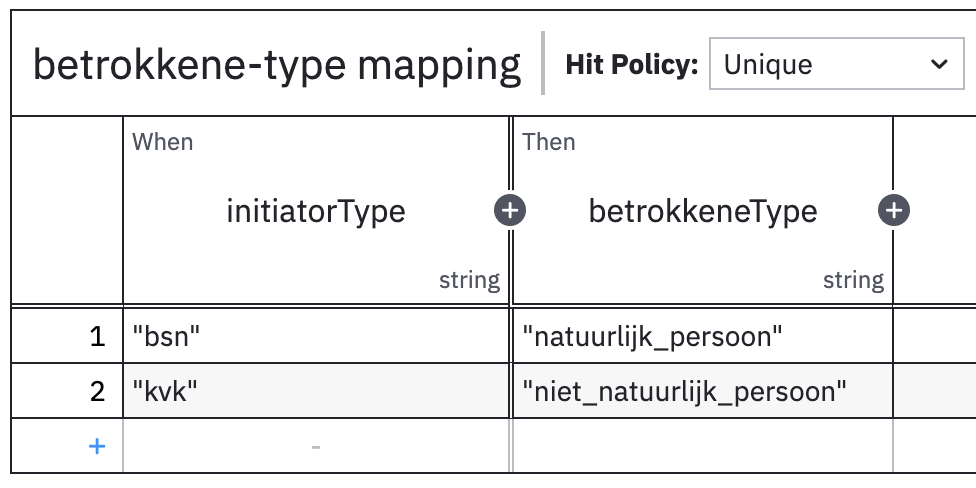
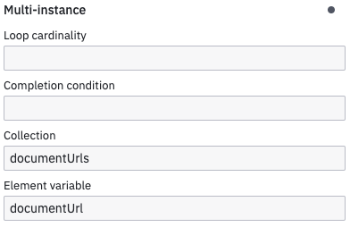
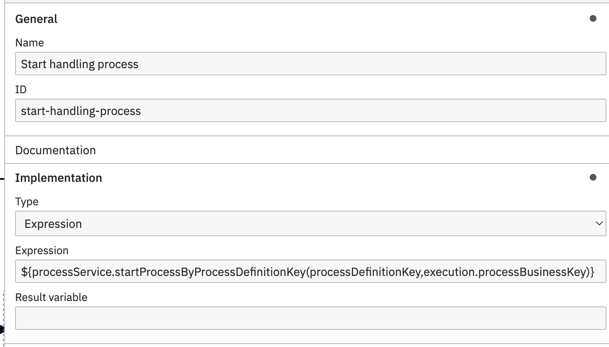

# Verzoek Plugin

The Document Verzoek plugin is used to receive and process events from the Notification API when new documents are added to a GZAC Zaak outside the GZAC application. Once the notification is received, the event message is correlated to the appropriate BPMN message catch event for further processing.
## How does the plugin work

The lifecycle of a verzoek is as follows:

1. An external application (e.g. KOFAX) uploads a document to Open Zaak, links it to a Zaak, and publishes a corresponding notification to the Notification API.
2. Open Notifications forwards the notification to the subscribed applications.
3. In GZAC 
   1. A Notifications Resource in Valtimo receives the notification and triggers a generic event indicating that a notification was received from Open Notificaties.
   2. This event is processed by the DocumentVerzoekPluginEventListener, using the configuration stored in the DocumentVerzoek plugin. 
   3. The DocumentVerzoekPluginEventListener retrieves the ZaakInformatieObject and InformatieObject and includes them in a message correlation. 
   4. The DocumentVerzoekPluginEventListener correlates the message. 
   5. The correlated message is then handled in BPMN by a Message Catch Event.

## Configure the plugin

A plugin configuration is required before the DocumentVerzoekPluginEventListener can be used. A general description on how to configure plugins can be found [here](../../plugins/configure-plugin.md).

If the Document Verzoek plugin is not visible in the plugin menu, it is possible the application is missing a dependency. Instructions on how to add the Document Verzoek Plugin dependency can be found [here](../../../fundamentals/getting-started/modules/zgw/document-verzoek.md).

To configure this plugin the following properties have to be entered:

* **Notification API plugin (`notificatiesApiPluginConfiguration`).** Reference to another plugin configuration that will be used to receive a notification when a new document verzoek is made.
* **Zaken API plugin (`zakenApiPlugin`).** Reference to the Zaken plugin configuration that will be used to retrieve the **ZaakInformatieObject**.
* **Documenten API plugin (`documentenApiPlugin`).** Reference to another plugin configuration that will be used to retrieve the **InformatieObject**.
* **RSIN (`messageEventName`).** The RSIN of the verzoek object.
* **Verzoek types (`verzoekProperties`).** The verzoek plugin can be configured to handle multiple verzoek types. Each verzoek type can be handled in a different way.
  * **Type (`type`).** The type of the verzoek. This type should match the type that is inside the verzoek object from the Objecten API, in property `record.data.type`.
  * **Case definition (`caseDefinitionName`).** The Valtimo case definition that should be created when a verzoek was made.
  * **Object management configuration (`objectManagementId`).** Reference to the object management configuration that describes the verzoek object. If no option is available in this field, an object management configuration has to be created first.
  * **Role type (`initiatorRoltypeUrl`).** The role of the person who created the verzoek. Usually this is the zaak initiator role. The person who created the verzoek is linked to the zaak using this role.
  * **Role description (`initiatorRolDescription`).** This text describes the role of the person who initiated the verzoek.
  * **Process definition (`processDefinitionKey`).** The definition of the handling process. This process is started as a follow-up process to further handle the verzoek.
  * **Copy strategy (`copyStrategy`).** This option determines whether the entire verzoek data is included in the Valtimo case, or only the defined fields.
    * **Mapping (`mapping`).** Determines which fields of the verzoek data are copied to the Valtimo case or to the process variable.
      * **Source (`source`).** A jsonpointer that points to a property inside the verzoek data that should be copied. When this field is left empty, the entire source JSON will be copied to the target location.
      * **Target (`target`).**
        * Starts with a `doc` prefix. A jsonpointer that points to a property inside the Valtimo case where the verzoek data should be pasted.
        * Starts with a `pv` prefix. A process variable where the verzoek data should be saved.

An example of plugin configuration with `doc:` prefix:

An example of plugin configuration with `pv:` prefix:

## Configuring the 'Create Zaakdossier' process

When a verzoek object is created and Valtimo receives the notification, a process is started to handle additional steps needed for creating the zaak.

The process that is started needs to be configured in the plugin properties by setting the 'Process' property. Valtimo is shipped with the `Create Zaakdossier` process which has six tasks.

The Create Zaakdossier process is started with a few process variables that can be used inside the process links. These variables are:

* **RSIN.** The RSIN configured in the Verzoek plugin.
* **zaakTypeUrl.** The URL of the zaak-type that is associated to the document definition.
* **rolTypeUrl.** The URL of the rol-type that is configured in the Verzoek plugin.
* **rolDescription.** The rol description that is configured in the Verzoek plugin.
* **verzoekObjectUrl.** The url from the verzoek object in the Objecten API.
* **initiatorType.** The type of the initiator of this verzoek. Usually has the value 'kvk' or 'bsn'.
* **initiatorValue.** The ID of the initiator. This is usually a BSN or KVK number.
* **processDefinitionKey.** The key of the process-definition that should be started after this process.
* **documentUrls.** A list of document URLs of documents stored in the Documenten API. Can be used as Collection in BPMN multi-instance elements to iterate over the list.

The tasks inside the Create Zaakdossier process need to be configured with process links before the process can be used. The following actions should be configured:

* Create zaak - [Create Zaak](configure-zaken-api-plugin.md#create-zaak) in the Zaken API plugin. This plugin link can be configured using the process variables above. Namely:
  * `pv:RSIN`
  * `pv:zaakTypeUrl`
* Create initiator ZaakRol - [Create ZaakRol](configure-zaken-api-plugin.md#create-zaakrol---natural-person) in the Zaken API plugin. This plugin link can be configured using the process variables above. Namely:
  * `pv:rolTypeUrl`
  * `pv:rolDescription`
  * `pv:initiatorValue`
* Link document to zaak - [Link document to zaak](configure-zaken-api-plugin.md#link-document-to-zaak) in the Zaken API plugin. This plugin link can be configured using the process variables above. Namely:
  * `pv:documentUrl`
* Delete Verzoek from ObjectsAPI - [Delete Verzoek object](configure-objecten-api-plugin.md#delete-object) in the Objects API plugin. This plugin link can be configured using the process variables above. Namely:
  * `pv:verzoekObjectUrl`

The 'Create Zaakdossier' process has several tasks with default configurations:

* Map betrokkene type - a task that uses a DMN table to determine what the zaak initiator type.

* Link Document to zaak - This task links all the documents from the verzoek to the zaak.

* Start handling process - This task starts a follow-up process that further handles the verzoek.

### Custom process

Instead of using the `Create Zaakdossier` process it is possible to create another process that will handle zaak creation in a different way. The verzoek plugin must then be configured to use a custom process in the **Process** field. The custom process will then automatically be started with all necessary process variables.

## Configuring the handling process

The system process `Create Zaakdossier` offers the possibility to start a follow-up process which will further handle the verzoek. This handling process is started by the task `Start handling process`. The verzoek plugin configuration property 'Process definition' decides which BPMN process will be started.
