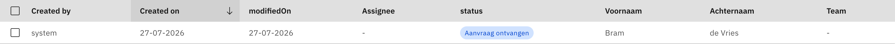
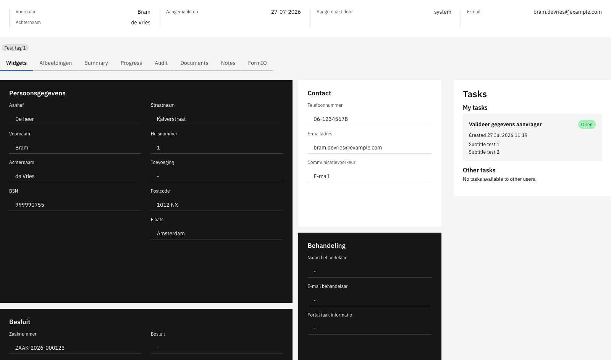

# What is a case?

A case is the central unit of work in Valtimo. It represents a business process — such as an application, request, complaint, or any other workflow your organization handles. Each case contains all the information, history, and tasks related to that specific piece of work.

Cases give organizations a structured way to:

- Track work from start to finish
- Store all relevant data in one place
- Automate progression through processes
- Assign work to the right people

---

## How cases work

Think of a case as a container that holds everything related to a piece of work:

- **Document** — The structured data (applicant details, request info, decisions)
- **Processes** — The workflows driving progress
- **Tasks** — Work items waiting for someone to act
- **Files** — Attached documents and evidence
- **Audit trail** — Complete history of what happened

When someone submits a request, Valtimo creates a case. A process starts automatically, creating tasks for users. As users complete tasks, the process updates the case data and moves forward. Everything stays connected to that one case until the work is done.

### Case definition vs case instance

A **case definition** is the blueprint that describes what a case looks like and how it behaves. It defines:

- What data the case contains (the document schema)
- Which processes can run on the case
- How the case list and detail views are configured
- What statuses the case can have

A **case instance** (or simply "case") is an actual piece of work created from that definition. When someone submits a request or a process creates a new case, Valtimo creates a case instance based on the case definition.

### Case data

Cases store data in several places:

**Document** — The primary data store. A structured JSON object that holds core case information like applicant details, request data, and decisions. The document follows a schema defined in the case definition, which validates data and ensures consistency. Forms write to the document, and widgets display from it.

**Process variables** — Temporary data that exists while a process runs. Useful for workflow decisions and intermediate values that don't need to persist after the process completes. Each process instance has its own variables.

**Files** — Attachments like PDFs, images, or other documents. Files are linked to the case and can be stored locally, in S3, or in an external document management system.

**Notes** — Free-form comments added by users. Notes provide a way to capture observations, decisions, or context that doesn't fit the structured document.

For example, a subsidy request case might have:

- **Document**: Applicant name, requested amount, decision outcome
- **Process variables**: Current review stage, temporary calculation results
- **Files**: Uploaded proof of income, signed agreement
- **Notes**: Reviewer comments about edge cases

### Case lifecycle

Cases progress through a lifecycle:

1. **Creation** — A case can be created manually by a user, through a form submission, via an API call, or automatically by a process
2. **In progress** — Processes run, tasks are completed, and the case data is updated
3. **Completion** — The case reaches its final state when all work is done

---

## Key components

### Status

Each case has a status that indicates where it is in its lifecycle (for example: "Request received", "In review", "Approved"). Statuses help users quickly understand the state of a case and can be used to filter case lists.

<figure><figcaption>Case list with status column</figcaption></figure>

### Assignee

Cases can be assigned to a user or team. This indicates who is responsible for working on the case. Unassigned cases appear in a separate view so they can be picked up.

### Tags

Tags provide a way to categorize cases with labels. They help with organization and can be used to filter or group cases.

### Tasks

Tasks are individual work items within a case. When a process reaches a user task, Valtimo creates a task that appears in the case detail view. Users complete tasks to move the case forward.

<figure><figcaption>Case detail view with tasks</figcaption></figure>

### Tabs

The case detail view is organized into tabs. Common tabs include:

- **Widgets** — Displays case data in a configurable layout
- **Summary** — Shows key case information at a glance
- **Progress** — Visualizes the case's progression through processes
- **Audit** — Lists all events and changes made to the case
- **Documents** — Shows attached files
- **Notes** — Allows users to add comments and observations

---

## Relationship to other concepts

- **[Processes](process.md)** — Automate case progression by defining the steps and logic that move a case forward
- **[Forms](form.md)** — Capture and display case data through user-friendly interfaces
- **[Users, roles and permissions](roles-permissions.md)** — Control who can view, edit, or manage cases

---

## Learn more

- [Tutorial: Setting up a case](../tutorials/setting-up-a-case.md)
- [Configuration guide: Cases](../configuration-guides/cases/README.md)
