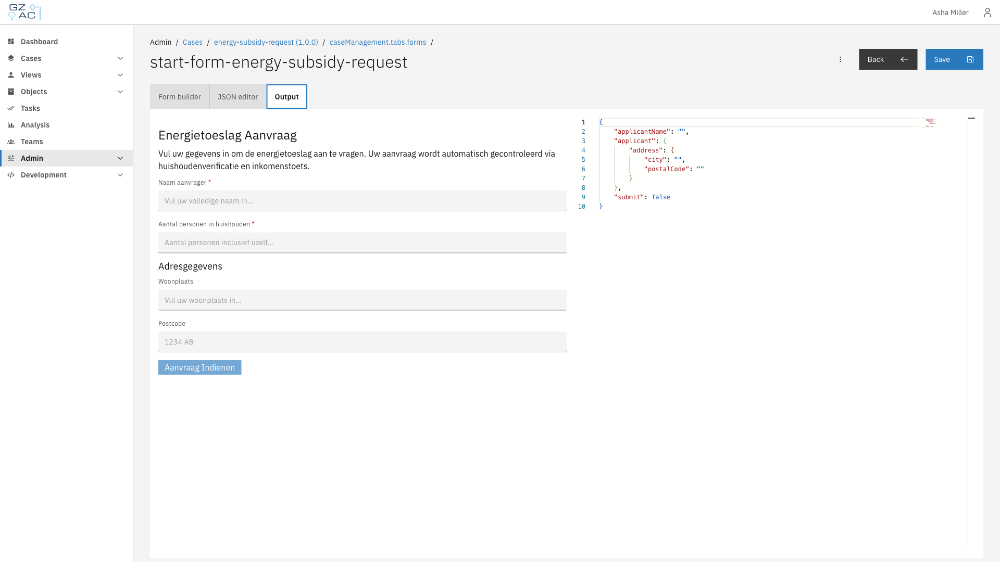
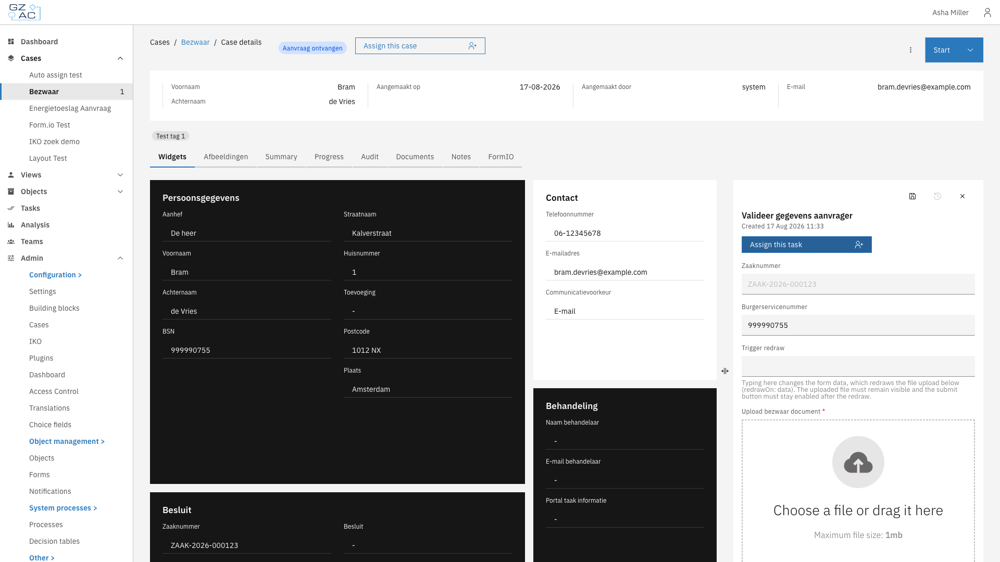
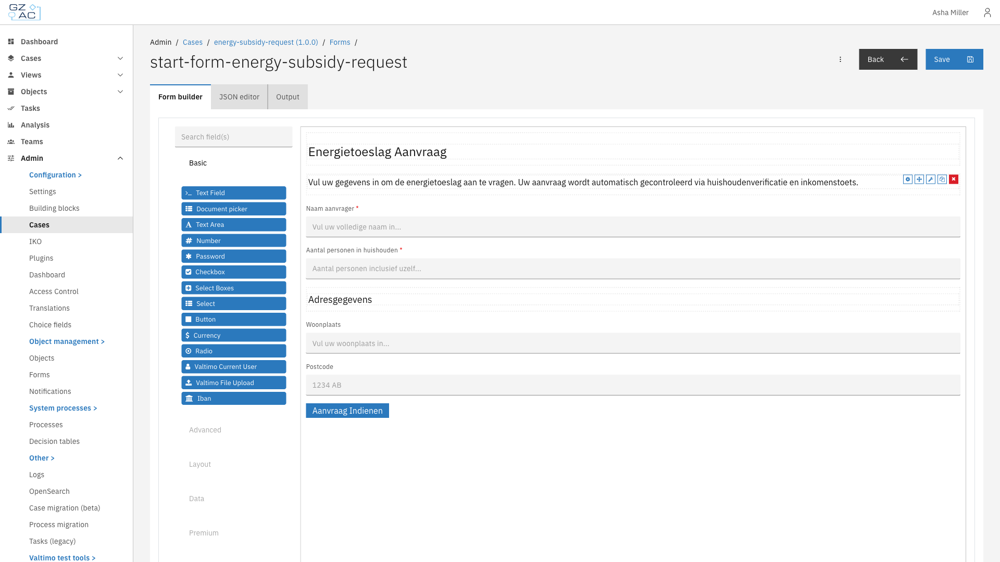

# What is a form?

A form is the user interface for collecting and displaying data in Valtimo. Built using [Form.io](https://form.io), forms provide a visual, drag-and-drop way to create input screens without writing code. When a user completes a task, submits a request, or starts a new case, they typically interact with a form.

Forms give organizations a flexible way to:

- Collect structured data from users at any point in a workflow
- Validate input before it reaches the case document
- Pre-fill fields with existing case data

---

## How forms work

Forms are the bridge between users and case data. When users fill in a form, the data flows directly into the case document. When they open a form, existing (case) data is pre-filled automatically. This two-way connection means forms both capture new information and display what's already known.

Valtimo uses Form.io as its form engine. Each form is defined as a JSON structure that describes:

- Which fields appear (text inputs, dropdowns, checkboxes, file uploads, and more)
- How fields are laid out on the page
- Validation rules (required fields, patterns, min/max values)
- Conditional logic (show or hide fields based on other values)

The JSON definition is what Valtimo stores and deploys. At runtime, Form.io renders the definition into an interactive form that users can fill in.

<figure><figcaption>Form preview with JSON output</figcaption></figure>

### Forms in case workflows

Forms appear at several points in a case's lifecycle:

- **Start forms** — Collect initial data when creating a new case
- **User task forms** — Capture input during a process step that requires human action
- **Case tab display** — Show read-only case information in a structured layout on a case details tab

When a form is submitted, the data flows into the case document. The form's field keys map to paths in the document's JSON structure, ensuring data ends up in the right place.

<figure><figcaption>Form in user task</figcaption></figure>

### Form data

Forms connect to case data through field keys:

**Document fields** — Most form fields write directly to the case document. The field key becomes the path in the document. For example, a field with key `applicant.name` stores its value at that path in the case's JSON document.

**Process variables** — Fields with the `pv:` prefix store data in the running process instead of the document. Use this for temporary values that shouldn't persist after the process ends. For example, `pv:approvalDecision` stores a decision that controls process flow but doesn't need to stay in the case.

When a form opens, Valtimo automatically pre-fills fields with matching data from the case document or process variables. When the form is submitted, the data flows back to update the document and complete the task.

---

## Form builder

The form builder provides a visual editor for creating and modifying forms. A component palette on the left offers field types like:

- Text fields, text areas, and numbers
- Dropdowns, checkboxes, and radio buttons
- File uploads and date pickers
- Layout components (panels, columns, tabs)

Drag components onto the canvas to build your form. Click a component to configure its properties: label, placeholder text, validation rules, and data binding.

<figure><figcaption>Form builder</figcaption></figure>

---

## Form flows

For complex data collection that spans multiple screens, Valtimo offers form flows. A form flow is a wizard-like sequence of forms where:

- Users progress through steps in order
- Conditional branching can show different follow-up forms based on input
- Actions can run when a step opens, completes, or the user navigates back

Form flows are useful when a single form would be too long or when the next questions depend on earlier answers. Like single forms, form flows connect to processes through process links.

---

## Relationship to other concepts

- **[Cases](case.md)** — Forms capture and display case data. When a form is submitted, its values are stored in the case document
- **[Processes](process.md)** — Forms connect to user tasks via process links. When a process reaches a user task with a linked form, Valtimo displays that form to the user

---

## Learn more

- [Configuration guide: Forms](../configuration-guides/cases/forms.md)
- [Configuration guide: Form flows](../configuration-guides/cases/form-flows.md)
