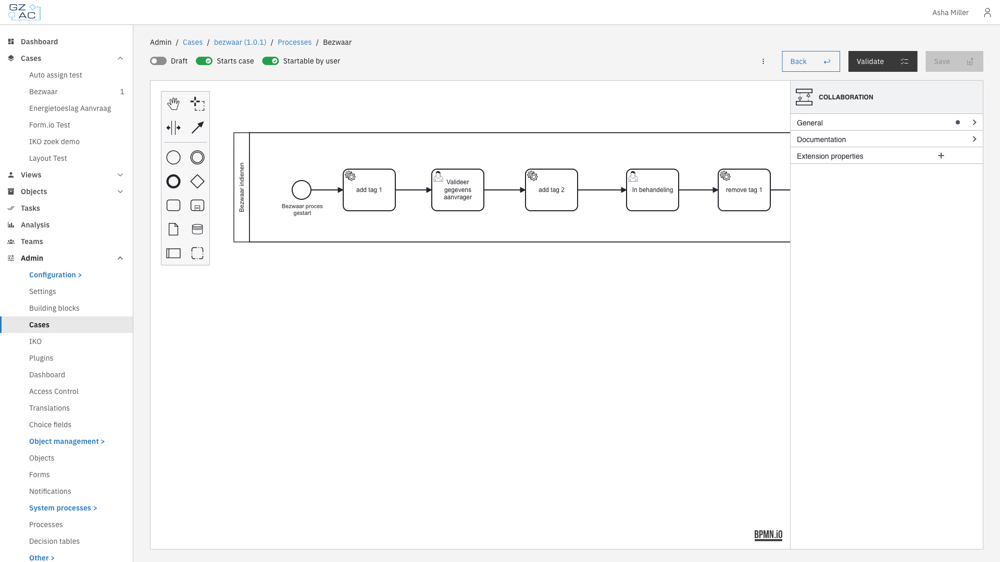
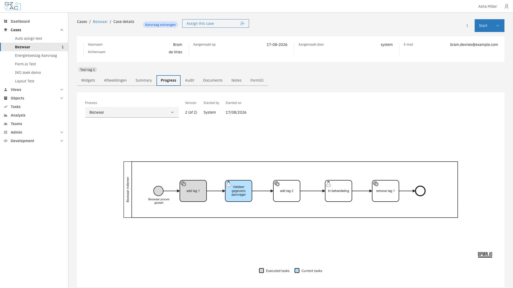

# What is a process?

A process is a workflow that automates how cases move through your organization. Built using BPMN (Business Process Model and Notation), processes define the sequence of steps, decisions, and actions that drive a case from start to finish.

Processes give organizations a way to:

- Automate repetitive tasks and decisions
- Ensure consistent handling of every case
- Integrate with external systems through plugins
- Provide visibility into where each case stands
- Reduce manual handoffs and delays

---

## How processes work

Processes are the engine that drives cases forward. When a case is created, a process typically starts automatically. The process creates tasks for users, makes decisions at gateways, calls external systems, and updates case data along the way.

A case can have multiple processes running at the same time. For example, the main application process might run alongside a separate review process or a notification process. Each process instance is linked to the case and can read from and write to the case document.

### Process definition vs process instance

A **process definition** contains the BPMN diagram with all the activities, gateways, and connections that make up a workflow. It describes the steps to follow, the decisions to make, and the integrations to call.

A **process instance** is a running execution of a process definition. When a case is created or a user starts a process, Valtimo generally creates an instance that follows the defined steps.

### BPMN basics

BPMN is a standard notation for modeling business processes. Valtimo uses it to make workflows visual and understandable. A process diagram consists of:

- **Events** — Starting points, ending points, and triggers (circles)
- **Activities** — Work to be done (rounded rectangles)
- **Gateways** — Decision points and parallel paths (diamonds)
- **Connections** — Arrows showing the flow between elements

<figure><figcaption>Process builder with BPMN diagram</figcaption></figure>

### Process lifecycle

1. **Start** — A process begins when triggered by creating a case, a user action, an API call, or another process
2. **Execute** — The workflow progresses through activities, makes decisions at gateways, and waits at user tasks
3. **End** — The process completes when it reaches one or more end events

### Process data

Processes work with two types of data:

**Process variables** — Temporary values that exist only while the process runs. Use these for workflow decisions, intermediate calculations, or data that doesn't need to persist after the process ends. Each process instance has its own separate variables.

**Case document** — The permanent data store shared across all processes on a case. Processes read from and write to the document using the `doc:` prefix in expressions. Changes to the document persist even after the process completes.

For example, a process might:
- Store a temporary `approvalScore` variable for a gateway decision
- Write the final `approvalStatus` to the document so it's visible on the case

---

## Key components

BPMN offers many element types. Below are some of the more commonly used ones in Valtimo.

### Activities

Activities are the work items in a process:

- **User task** — A step that requires human action. Creates a task that appears in the task list and case detail view
- **Service task** — An automated step that executes a plugin action, calls an API, or performs a calculation
- **Call activity** — Starts another process as a sub-process

### Gateways

Gateways control how the process flows:

- **Exclusive gateway** — Takes one path based on conditions (if/else logic)
- **Parallel gateway** — Splits into multiple paths that execute simultaneously
- **Inclusive gateway** — Takes one or more paths based on conditions

### Events

Events mark significant points in the process:

- **Start event** — Where the process begins
- **End event** — Where the process completes
- **Intermediate event** — A trigger or pause in the middle of the process (timers, messages, signals)

### Process links

Process links connect activities to external handlers. What process links can be configured depends on the selected activity. When a process reaches an activity with a link, Valtimo executes the linked action:

- **Form link** — Opens a form for the user to complete
- **Form flow link** — Starts a multi-step form wizard
- **Plugin action link** — Executes an action from a configured plugin
- **URL link** — Redirects to an external system

---

## Viewing process progress

Users can see how a case is progressing through its process on the Progress tab. The diagram highlights which steps have been completed and which are currently active.

<figure><figcaption>Progress tab showing process execution</figcaption></figure>

---

## Relationship to other concepts

- **[Cases](case.md)** — Processes drive case progression. Each case can have multiple processes running on it
- **[Forms](form.md)** — Forms capture user input at user tasks in the process

---

## Learn more

- [Configuration guide: Processes](../configuration-guides/cases/processes.md)
