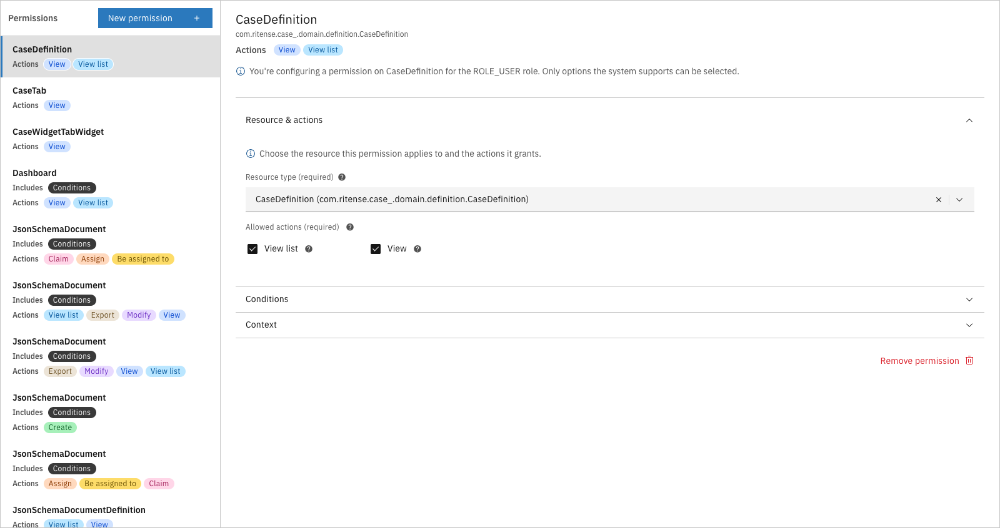

# Users, roles and permissions

Access control determines who can see and do what within Valtimo. It connects users from your identity provider to roles, and roles to permissions that grant access to specific resources and actions.

A well-configured access control setup helps organizations:

- Protect sensitive case data from unauthorized access
- Follow the principle of least privilege — users get only the access they need
- Meet compliance requirements with auditable permission structures
- Support different user groups with different responsibilities

---

## How access control works

Valtimo uses permission-based access control (PBAC). The system evaluates permissions at runtime whenever a user tries to view or act on a resource. If no permission grants access, the request is denied.

When a user opens a case list, for example, Valtimo checks their roles, finds the matching permissions for "view case", applies any conditions, and returns only the cases they're allowed to see. The same check happens for every action: viewing tasks, modifying documents, accessing dashboards, etc.

<figure><figcaption>Roles configured in access control</figcaption></figure>

---

## Key components

### Users

Users exist in Keycloak (or your identity provider), not in Valtimo itself. Keycloak handles authentication, password policies, and role assignments. Valtimo trusts the roles that Keycloak provides when a user logs in.

This separation keeps user management centralized. Add a user to a Keycloak role, and they immediately inherit all permissions configured for that role in Valtimo.

### Roles

A role groups permissions together under a meaningful name. Common examples include:

- **Administrator** — Full access to configuration and all cases
- **Case worker** — Can view and work on assigned cases
- **Manager** — Can view reports and reassign work

Roles in Valtimo must match role names in Keycloak. When you create a role in Valtimo's access control, you're defining what permissions that role grants — not creating the role itself. The role must also exist in Keycloak for users to be assigned to it.

### Permissions

Each permission connects a role to a resource type and one or more actions. A permission answers the question: "Can this role perform this action on this resource?"

<figure><figcaption>Permission editor showing resource and actions</figcaption></figure>

**Resources** are the things users interact with: cases, tasks, documents, dashboards, notes, and more. Each resource type has its own set of available actions.

**Actions** are what users can do: view, create, modify, delete, assign, claim, and others depending on the resource type.

A single permission might grant:
- View and modify actions on cases
- View action on tasks
- Create and delete actions on notes

### Conditions

Permissions can be further restricted with conditions. Instead of granting access to all cases, a condition might limit access to:

- Cases with a specific status (e.g., only "In progress" cases)
- Cases assigned to the current user
- Cases belonging to a specific case definition

Conditions turn broad permissions into precise access rules without creating dozens of separate roles.

<figure><figcaption>Summary showing permissions with conditions</figcaption></figure>

---

## Relationship to other concepts

- **[Cases](case.md)** — Permissions control which cases users can view, create, modify, or delete. Conditions can restrict access based on case status, assignee, or other fields
- **[Processes](process.md)** — Permissions determine who can start processes and view process progress
- **[Forms](form.md)** — While forms themselves don't have permissions, the tasks that display forms do — users only see task forms for tasks they have permission to complete

---

## Learn more

- [Configuration guide: Access control](../configuration-guides/access-control/README.md)
- [Configuration guide: Roles](../configuration-guides/access-control/roles.md)
- [Configuration guide: Permissions](../configuration-guides/access-control/permissions.md)
- [Configuration guide: Conditions](../configuration-guides/access-control/conditions.md)
