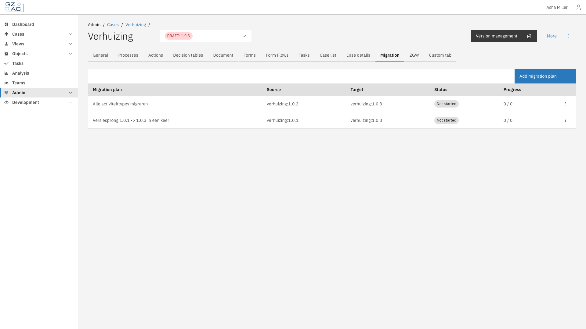

# 13.48.0

Release date: 30-09-2026

---

## New Features

### Case migration

Cases no longer have to stay on the version they were started on. A **migration plan** moves running
cases from an older case definition version onto a newer one — their data, their running process, and
their building blocks — so a configuration change reaches the cases that are already in progress
instead of only the ones started after it.

<figure><figcaption>Migration plans on a case definition version</figcaption></figure>

A plan is configured in the UI on the version cases should end up on, and covers:

- **Which cases move** — a source version to migrate from, narrowed with conditions on any case value.
  A plan can reach several versions back in one step, or migrate the cases of a case definition that
  was renamed or replaced.
- **What changes** — patches that reshape the case data, and instructions that move each running
  process onto the new process model.
- **When it runs** — manually from a button, at a scheduled moment, or after another plan finishes.

Migration is all-or-nothing per case: a case either migrates fully or is left untouched and reported
with the reason, while the rest continue. Fix the cause and run the plan again — cases that already
migrated are skipped.

A run happens in the background, so nothing has to stay open while tens of thousands of cases move.
The Migration tab follows the progress, and a run interrupted by a restart of the application resumes
on its own and continues where it left off.

**[Try it out →](../../../configuration-guides/cases/migration/README.md)**

### Try a migration before running it

A **dry run** goes through exactly the cases a plan would migrate and simulates migrating every one of
them against real data, then rolls it all back. Nothing is changed and nothing is left behind, so it is
safe against production data — and because it performs the real migration rather than a separate
simulation, what it reports is what a real run will do. The report lists the cases that would fail with
the full reason, and the cases that would migrate but where the plan would not do everything it
describes.

**[Try it out →](../../../configuration-guides/cases/migration/running-a-plan.md)**

### Building blocks move with the case

A new case definition version may change how a case is divided into building blocks, not just its data
and process. A migration plan handles that in the same run: it can create building blocks on each
migrated case, taking over a process the case is already running, and dissolve building blocks by
handing their data and processes back.

Existing building blocks follow their case automatically. The case's new version says which building
block version belongs where, and the block is brought up to it — or carried over to a different
building block entirely, which is how one building block replaces another without abandoning the
instances already running. Building block versions have a **Migration** tab of their own for the plans
that describe those steps.

**[Try it out →](../../../configuration-guides/cases/migration/building-blocks.md)**

### Add a trefwoord to an existing document from a process

A new Documenten API plugin action, **Add trefwoord to document**, adds a trefwoord (keyword) to a
document that already exists, from any point in a process. Unlike the trefwoorden set when a
document is created, this action can run on a document at any later step, for example right after
a document has been sent somewhere, so the outcome is visible as a trefwoord in the document
overview afterwards. Running the action again with the same trefwoord does nothing, so it is safe
to place after a step that can retry.


The Documenten API version configured for the plugin must support trefwoorden for this action to
be available.


---

## Enhancements

### Faster widget loading on case tabs

Widget tabs with multiple widgets now load faster.

---

## Bugfixes

| Area | Fix |
|------|-----|
| Area name | New bugfix. |
| Case widgets | A process button on a widget respects access rules based on the case's status, instead of staying hidden while the same process could be started under **Start** |
| Cases | Choosing one of several start processes for a case opens its start form again, instead of sending the user back to the dashboard |
